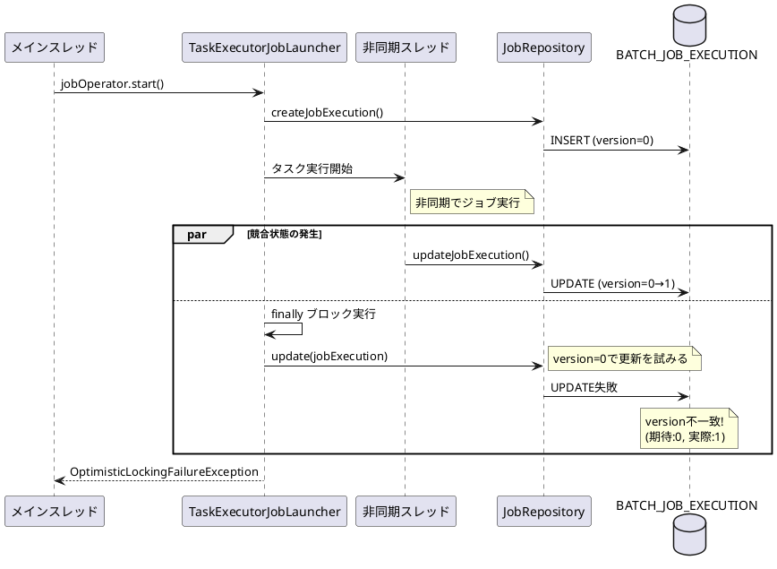
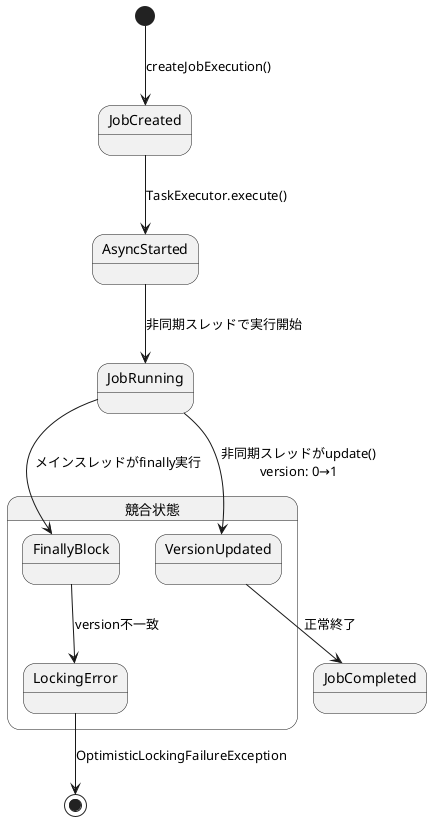

*（このドキュメントは生成AI(Claude Opus 4.5)によって2026年1月18日に生成されました）*

## 課題概要

Spring Batchにおいて、`jobOperator.start()`を非同期タスクエグゼキュータ（`asyncTaskExecutor`）で使用してジョブを開始すると、間欠的に`OptimisticLockingFailureException`が発生するバグです。

**Spring Batchとは**: Javaでバッチ処理を実装するためのフレームワークです。大量データの一括処理やスケジュールされたジョブ実行に使用されます。

**楽観的ロック（Optimistic Locking）とは**: データベースの同時更新制御の方式で、更新時にバージョン番号をチェックし、他のトランザクションによる変更を検出する仕組みです。

### 問題の発生メカニズム



### 状態遷移図



## 原因

`TaskExecutorJobLauncher.launchJobExecution()`メソッドの`finally`ブロックで無条件に`jobRepository.update(jobExecution)`が呼び出されるようになったことが原因です。

- Spring Batch 5.xでは、タスクが`TaskExecutor`に正常に投入できなかった場合のみ更新していた
- Spring Batch 6.0.0で導入されたIssue [#3637](https://github.com/spring-projects/spring-batch/issues/3637) の変更により、`finally`ブロックで常に更新するよう変更された
- これにより、非同期スレッドでのジョブ実行と、メインスレッドでの更新処理が競合する

## 対応方針

### diffファイルの分析結果

[Commit b024116](https://github.com/spring-projects/spring-batch/commit/b024116968ac5dd89ea84a8a3048d0e4a39d7519) での修正内容：

`finally`ブロックを削除し、`jobRepository.update()`を`TaskRejectedException`のcatchブロック内でのみ実行するよう変更されました。

```java
// 修正前（問題のあるコード）
catch (TaskRejectedException e) {
    jobExecution.upgradeStatus(BatchStatus.FAILED);
    if (jobExecution.getExitStatus().equals(ExitStatus.UNKNOWN)) {
        jobExecution.setExitStatus(ExitStatus.FAILED.addExitDescription(e));
    }
}
finally {
    this.jobRepository.update(jobExecution);  // ← 常に実行される（問題）
}

// 修正後
catch (TaskRejectedException e) {
    jobExecution.upgradeStatus(BatchStatus.FAILED);
    if (jobExecution.getExitStatus().equals(ExitStatus.UNKNOWN)) {
        jobExecution.setExitStatus(ExitStatus.FAILED.addExitDescription(e));
    }
    this.jobRepository.update(jobExecution);  // ← 例外時のみ実行
}
// finally ブロック削除
```

この修正により、タスクが正常に投入された場合はジョブスレッド側で`JobExecution`の更新が行われ、競合状態が発生しなくなります。

## バグの発生タイミング

| 項目 | 内容 |
|------|------|
| バグ発生バージョン | Spring Batch 6.0.0, 6.0.1 |
| 原因となったコミット | Issue [#3637](https://github.com/spring-projects/spring-batch/issues/3637) での変更 |
| 修正コミット | [b024116](https://github.com/spring-projects/spring-batch/commit/b024116968ac5dd89ea84a8a3048d0e4a39d7519) |
| 修正予定バージョン | Spring Batch 6.0.2 |
