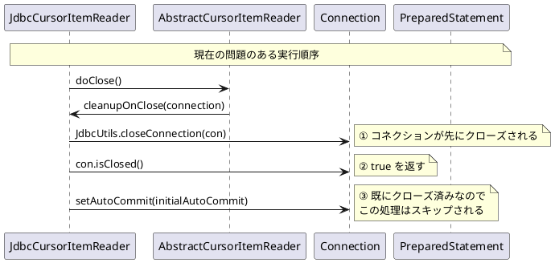
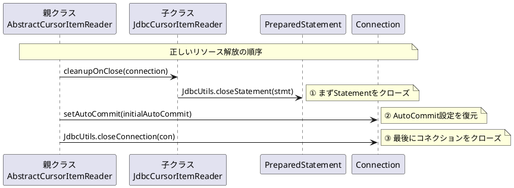

*（このドキュメントは生成AI(Claude Opus 4.5)によって2026年1月18日に生成されました）*

## 課題概要

`AbstractCursorItemReader#doClose`メソッドにおいて、JDBCリソースのクローズ順序が不正であり、一貫性のない動作を引き起こすバグです。

**カーソルベースのItemReaderとは**: Spring Batchでデータベースからデータを読み取る際に、カーソル（結果セットへのポインタ）を使用して逐次的にデータを取得するリーダーです。大量データを効率的にメモリ使用量を抑えて処理できます。

### 問題の発生状況



### 期待される正しいクローズ順序



### 責任の所在の問題

| コンポーネント | リソースの作成 | リソースのクローズ（現状） | リソースのクローズ（期待） |
|---------------|---------------|------------------------|------------------------|
| AbstractCursorItemReader（親） | Connection作成 | - | Connection クローズ |
| JdbcCursorItemReader（子） | PreparedStatement作成 | Connection + Statement クローズ | Statement のみクローズ |

## 原因

子クラス（`JdbcCursorItemReader`等）の`cleanupOnClose()`メソッド内で、親クラスが作成・所有する`Connection`をクローズしていました。これにより：

1. コネクションが先にクローズされる
2. 親クラスで`setAutoCommit()`を実行しようとしても、既にコネクションがクローズ済みのためスキップされる
3. リソースの所有権モデルが混在し、一貫性がない

## 対応方針

### diffファイルの分析結果

[PR #5110](https://github.com/spring-projects/spring-batch/pull/5110) での修正内容：

**JdbcCursorItemReader.java**:
```java
// 修正前
@Override
protected void cleanupOnClose(Connection connection) {
    JdbcUtils.closeStatement(this.preparedStatement);
    JdbcUtils.closeConnection(connection);  // ← 子クラスでConnectionをクローズ（問題）
}

// 修正後
/**
 * Releases JDBC resources associated with this reader.
 * Closes the PreparedStatement used for the cursor.
 * The Connection is not closed here; it is managed by the parent class.
 */
@Override
protected void cleanupOnClose(Connection connection) {
    JdbcUtils.closeStatement(this.preparedStatement);
    // Connection のクローズは親クラスに委譲
}
```

**StoredProcedureItemReader.java**: 同様の修正が適用されています。

この修正により、リソースを作成したコンポーネントがそのリソースのクローズ責任を持つという一貫したモデルになります。

## バグの発生タイミング

| 項目 | 内容 |
|------|------|
| バグ発生バージョン | Spring Batch 6.0.0 |
| 修正PR | [#5110](https://github.com/spring-projects/spring-batch/pull/5110) |
| バックポート対象 | 5.2.x 系 |
