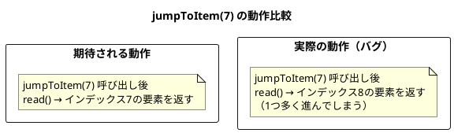
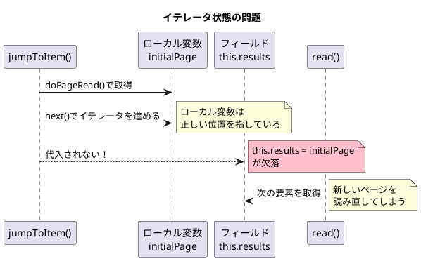

*（このドキュメントは生成AI(Claude Opus 4.5)によって2026年1月18日に生成されました）*

## 課題概要

`AbstractPaginatedDataItemReader`の`jumpToItem(int itemLastIndex)`メソッドが、ステップのリスタート時にリーダーの位置を正しく復元できないバグです。

**ページネーションリーダーとは**: 大量のデータを「ページ」単位で分割して読み取るItemReaderです。例えばページサイズが10の場合、0〜9がページ0、10〜19がページ1となります。

**jumpToItemとは**: ジョブが失敗して再起動された際に、前回処理した位置までスキップするためのメソッドです。

### 問題1: Off-by-oneエラー



| メソッド呼び出し | 期待値 | 実際の結果 |
|----------------|--------|-----------|
| `jumpToItem(7)` → `read()` | 7 | 8 |
| `jumpToItem(0)` → `read()` | 0 | 1 |

### 問題2: イテレータが状態に反映されない



### バグの原因となるコード

```java
// 問題のあるコード
@Override
protected void jumpToItem(int itemLastIndex) throws Exception {
    this.lock.lock();
    try {
        page = itemLastIndex / pageSize;
        int current = itemLastIndex % pageSize;

        Iterator<T> initialPage = doPageRead();

        for (; current >= 0; current--) {  // ← 問題1: >= 0 だと1回多くループ
            initialPage.next();
        }
        // ← 問題2: this.results = initialPage; が欠落
    }
    finally {
        this.lock.unlock();
    }
}
```

## 原因

1. **Off-by-oneエラー**: ループ条件が `current >= 0` となっているため、イテレータが1回多く進んでしまう
2. **状態の未反映**: ローカル変数`initialPage`をフィールド`results`に代入していないため、次の`read()`呼び出しで新しいページが読み込まれ、位置決めが無効になる

## 対応方針

### diffファイルの分析結果

[PR #5137](https://github.com/spring-projects/spring-batch/pull/5137) での修正内容：

```java
// 修正後
@Override
protected void jumpToItem(int itemLastIndex) throws Exception {
    this.lock.lock();
    try {
        page = itemLastIndex / pageSize;
        int current = itemLastIndex % pageSize;

        Iterator<T> initialPage = doPageRead();

        for (; current > 0; current--) {  // ← 修正1: >= を > に変更
            initialPage.next();
        }
        this.results = initialPage;  // ← 修正2: イテレータをフィールドに代入
    }
    finally {
        this.lock.unlock();
    }
}
```

### 修正内容のまとめ

| 問題 | 修正前 | 修正後 |
|------|--------|--------|
| ループ条件 | `current >= 0` | `current > 0` |
| イテレータ代入 | なし | `this.results = initialPage;` |

### 追加されたテストケース

PRには`AbstractPaginatedDataItemReaderTests`と`AbstractPagingItemReaderTests`が追加され、以下のケースがテストされています：

- `jumpToItem(7)` → `read()` で7が返る
- `jumpToItem(0)` → `read()` で0が返る
- `jumpToItem(9)` → `read()` で9が返る（ページ末尾）
- `jumpToItem(10)` → `read()` で10が返る（次ページ先頭）

## バグの発生タイミング

| 項目 | 内容 |
|------|------|
| バグ発生バージョン | Spring Batch 5.x, 6.0.0 |
| 修正PR | [#5137](https://github.com/spring-projects/spring-batch/pull/5137) |
| バックポート対象 | 5.2.x 系 |
