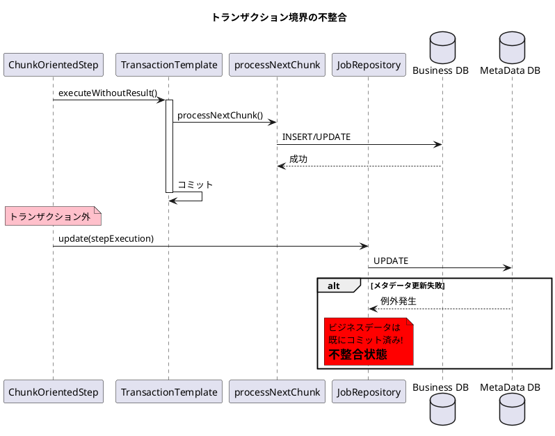
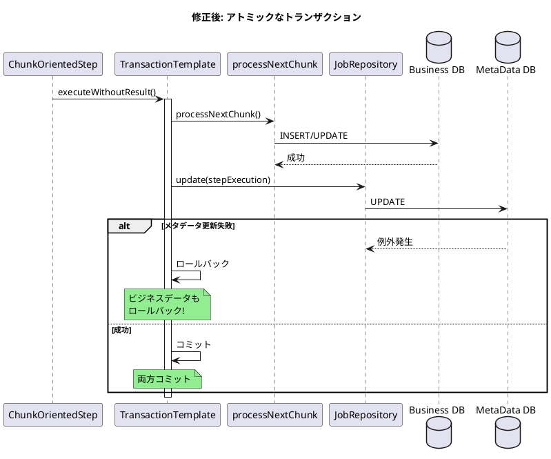

*（このドキュメントは生成AI(Claude Opus 4.5)によって2026年1月18日に生成されました）*

## 課題概要

Spring Batch 6.0の`ChunkOrientedStep#doExecute`において、`JobRepository.update(stepExecution)`がチャンクトランザクションの外で実行されるため、チャンク処理とメタデータ更新がアトミックでなくなるバグです。

**ChunkOrientedStepとは**: Spring Batch 6.0で導入された新しいチャンク指向ステップの実装クラスで、アイテムの読み取り・処理・書き込みをチャンク単位で実行します。

**トランザクション境界の問題とは**: チャンク処理が成功しトランザクションがコミットされた後に`JobRepository.update()`が失敗した場合、ビジネスデータは更新済みだがバッチメタデータが更新されないという不整合が発生します。

### 問題の発生状況



### 問題のあるコード

```java
@Override
protected void doExecute(StepExecution stepExecution) throws Exception {
    while (this.chunkTracker.get().moreItems() && !interrupted(stepExecution)) {
        this.transactionTemplate.executeWithoutResult(transactionStatus -> {
            processNextChunk(transactionStatus, contribution, stepExecution);
        });

        // 問題: トランザクションの外で実行される
        getJobRepository().update(stepExecution);
    }
}
```

## 原因

PR [#5165](https://github.com/spring-projects/spring-batch/pull/5165) での変更において、`JobRepository.update(stepExecution)`がトランザクションブロックの外に配置されました。報告者自身がこの問題に気づき、Issue として報告しています。

従来の`TaskletStep`では、`JobRepository.update()`はトランザクションがコミットされる前に呼び出されており、チャンク処理とメタデータ更新がアトミックでした。

### 期待される動作

| 処理 | 結果 |
|------|------|
| チャンク処理 + メタデータ更新 成功 | 両方コミット |
| チャンク処理 失敗 | 両方ロールバック |
| メタデータ更新 失敗 | **両方ロールバック** (現状は不整合) |

## 対応方針

### diffファイルの分析結果

[PR #5195](https://github.com/spring-projects/spring-batch/pull/5195) での修正が関連しています。

### 提案された修正

```java
// 修正前
this.transactionTemplate.executeWithoutResult(transactionStatus -> {
    processNextChunk(transactionStatus, contribution, stepExecution);
});
getJobRepository().update(stepExecution);  // トランザクション外

// 修正後
this.transactionTemplate.executeWithoutResult(transactionStatus -> {
    processNextChunk(transactionStatus, contribution, stepExecution);
    getJobRepository().update(stepExecution);  // トランザクション内に移動
});
```

### 修正後のトランザクション境界



### 関連Issue

- [#5182](https://github.com/spring-projects/spring-batch/issues/5182): チャンク失敗時も`ExecutionContext`が更新される問題
  - #5199と#5182は同じPR [#5195](https://github.com/spring-projects/spring-batch/pull/5195) で対応
  - 報告者は両方の修正を統合することを提案

### 統合された修正案

```java
@Override
protected void doExecute(StepExecution stepExecution) throws Exception {
    while (this.chunkTracker.get().moreItems() && !interrupted(stepExecution)) {
        this.transactionTemplate.executeWithoutResult(transactionStatus -> {
            processNextChunk(transactionStatus, contribution, stepExecution);
            
            // すべての更新をトランザクション内で実行
            this.compositeItemStream.update(stepExecution.getExecutionContext());
            getJobRepository().updateExecutionContext(stepExecution);
            getJobRepository().update(stepExecution);
        });
    }
}
```

## バグの発生タイミング

| 項目 | 内容 |
|------|------|
| バグ発生バージョン | Spring Batch 6.0.1 |
| 原因となったPR | [#5165](https://github.com/spring-projects/spring-batch/pull/5165) |
| 関連Issue | [#5182](https://github.com/spring-projects/spring-batch/issues/5182) |
| 修正PR | [#5195](https://github.com/spring-projects/spring-batch/pull/5195) |
| 修正予定バージョン | Spring Batch 6.0.2 |
