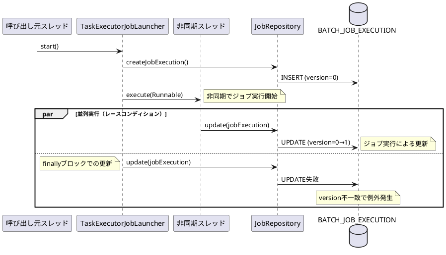

*（このドキュメントは生成AI(Claude Opus 4.5)によって2026年1月15日に生成されました）*

## 課題概要

Spring Batchにおいて、`JobOperator.start()`メソッドで非同期タスクエグゼキュータ（`asyncTaskExecutor`）を使用してジョブを開始すると、間欠的に`OptimisticLockingFailureException`が発生する問題です。

**Spring Batchとは**: Javaでバッチ処理を実装するためのフレームワークです。大量データの処理、定期的なジョブ実行などに使用されます。

**`JobOperator`とは**: Spring Batchでジョブの開始、停止、再起動などの操作を行うためのインターフェースです。

### 問題の発生メカニズム



### 影響を受ける環境

| 項目 | バージョン |
|------|-----------|
| Spring Boot | 4.0.0 |
| Spring Batch | 6.0.0 / 6.0.1 |
| Java | 21 |
| データベース | JDBC / MongoDB |

## 原因

Spring Batch 6.0.0で導入された変更（Issue [#3637](https://github.com/spring-projects/spring-batch/issues/3637)）において、`TaskExecutorJobLauncher.launchJobExecution()`メソッドに`finally`ブロックが追加され、**無条件に**`jobRepository.update(jobExecution)`が呼び出されるようになりました。

これにより、以下のレースコンディションが発生：

1. 非同期タスクエグゼキュータでジョブがサブミットされる
2. 非同期スレッドでジョブが実行され、`JobExecution`のバージョンが更新される
3. 呼び出し元スレッドの`finally`ブロックでも`update()`が実行される
4. バージョン番号の不一致により`OptimisticLockingFailureException`が発生

**補足**: Spring Batch 5.xでは、`finally`ブロックは存在せず、`TaskRejectedException`が発生した場合にのみ更新が行われていました。

## 対応方針

### diffファイルの分析結果

[Commit b024116](https://github.com/spring-projects/spring-batch/commit/b024116968ac5dd89ea84a8a3048d0e4a39d7519)において、以下の修正が行われました：

**変更前（6.0.0/6.0.1）**:
```java
catch (TaskRejectedException e) {
    jobExecution.upgradeStatus(BatchStatus.FAILED);
    if (jobExecution.getExitStatus().equals(ExitStatus.UNKNOWN)) {
        jobExecution.setExitStatus(ExitStatus.FAILED.addExitDescription(e));
    }
}
finally {
    this.jobRepository.update(jobExecution);  // 常に実行される
}
```

**変更後（6.0.2）**:
```java
catch (TaskRejectedException e) {
    jobExecution.upgradeStatus(BatchStatus.FAILED);
    if (jobExecution.getExitStatus().equals(ExitStatus.UNKNOWN)) {
        jobExecution.setExitStatus(ExitStatus.FAILED.addExitDescription(e));
    }
    this.jobRepository.update(jobExecution);  // TaskRejectedExceptionの場合のみ実行
}
// finallyブロックを削除
```

### 修正内容の要点

1. `finally`ブロックを削除
2. `jobRepository.update()`を`TaskRejectedException`のcatchブロック内に移動
3. タスクが正常にサブミットされた場合、呼び出し元スレッドからの更新は行わない（ジョブスレッド側で更新される）

### ワークアラウンド（6.0.2未満のバージョン向け）

6.0.2へのアップグレードができない場合の一時的な対処法：

```java
@Bean
public JobOperatorFactoryBean jobOperator(JobRepository jobRepository) {
    var taskExecutor = new SyncTaskExecutor();  // 同期実行
    var jobOperatorFactoryBean = new JobOperatorFactoryBean();
    jobOperatorFactoryBean.setJobRepository(jobRepository);
    jobOperatorFactoryBean.setTaskExecutor(taskExecutor);
    return jobOperatorFactoryBean;
}
```

**注意**: `SyncTaskExecutor`を使用すると、ジョブは呼び出し元スレッドで同期的に実行されるため、非同期実行のメリットが失われます。
