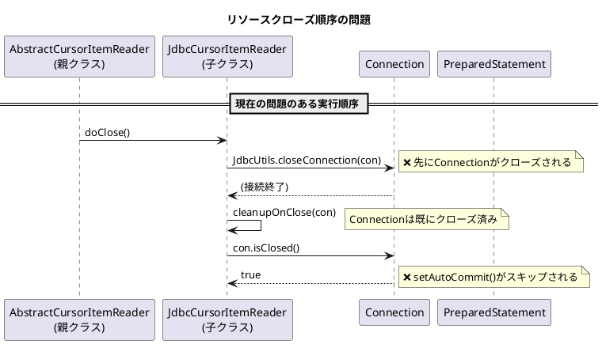
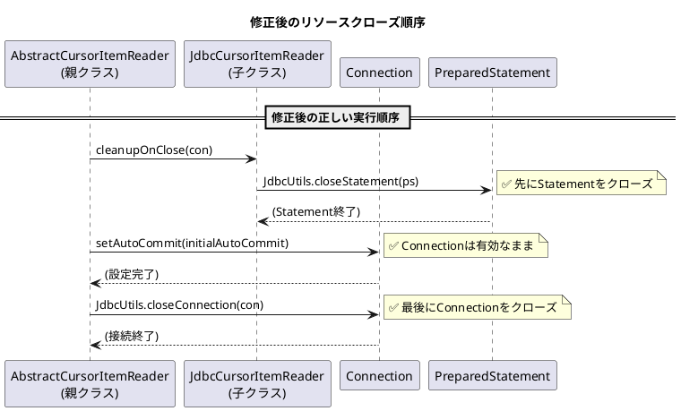

*（このドキュメントは生成AI(Claude Opus 4.5)によって2026年1月15日に生成されました）*

## 課題概要

`AbstractCursorItemReader`の`doClose()`メソッドにおいて、JDBCリソースのクローズ順序が不正であり、一貫性のない動作を引き起こす問題です。

**`AbstractCursorItemReader`とは**: Spring Batchでデータベースからカーソルを使用してデータを読み取るためのリーダーの基底クラスです。`JdbcCursorItemReader`や`StoredProcedureItemReader`の親クラスとして機能します。

### 問題の発生状況



### 現在の問題点

| 実行順序 | 処理内容 | 問題 |
|---------|---------|------|
| 1 | `JdbcUtils.closeConnection(con)` | Connectionがクローズされる |
| 2 | `cleanupOnClose(con)` | 既にクローズされたConnectionを受け取る |
| 3 | `setAutoCommit(initialAutoCommit)` | `con.isClosed() == true`のためスキップ |

### 責任の混在

現在の実装では、リソースの所有権が曖昧になっています：

- **親クラス（`AbstractCursorItemReader`）**: Connectionを作成・オープン
- **子クラス（`JdbcCursorItemReader`等）**: カーソルレベルのクリーンアップを実行
- **しかし**: 子クラスがConnectionもクローズしている（所有権の不整合）

## 原因

`JdbcCursorItemReader.cleanupOnClose()`メソッド内で`JdbcUtils.closeConnection(connection)`を呼び出しており、Connectionの作成者（親クラス）ではなく子クラスがConnectionをクローズしているため、責任範囲が不明確になっています。

## 対応方針

### diffファイルの分析結果

[PR #5110](https://github.com/spring-projects/spring-batch/pull/5110)において、以下の修正が提案されています：

**修正対象ファイル**:
1. `JdbcCursorItemReader.java`
2. `StoredProcedureItemReader.java`

**変更内容**:

`JdbcCursorItemReader`の修正例：

```java
// 変更前
@Override
protected void cleanupOnClose(Connection connection) {
    JdbcUtils.closeStatement(this.preparedStatement);
    JdbcUtils.closeConnection(connection);  // 削除対象
}

// 変更後
/**
 * Releases JDBC resources associated with this reader.
 * Closes the PreparedStatement used for the cursor.
 * The Connection is not closed here; it is managed by the parent class.
 *
 * @param connection the active database connection used for the cursor
 */
@Override
protected void cleanupOnClose(Connection connection) {
    JdbcUtils.closeStatement(this.preparedStatement);
    // JdbcUtils.closeConnection(connection) を削除
}
```

### 修正後のリソースクローズ順序



### 修正の設計思想

| 責任範囲 | 親クラス | 子クラス |
|---------|---------|---------|
| Connectionの作成 | ✅ | - |
| Connectionのクローズ | ✅ | - |
| PreparedStatementのクローズ | - | ✅ |
| ResultSetのクローズ | - | ✅ |

この修正により、「リソースを作成したコンポーネントがそのリソースをクローズする責任を持つ」という設計原則に従った実装となります。
