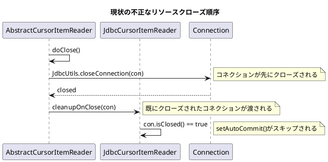
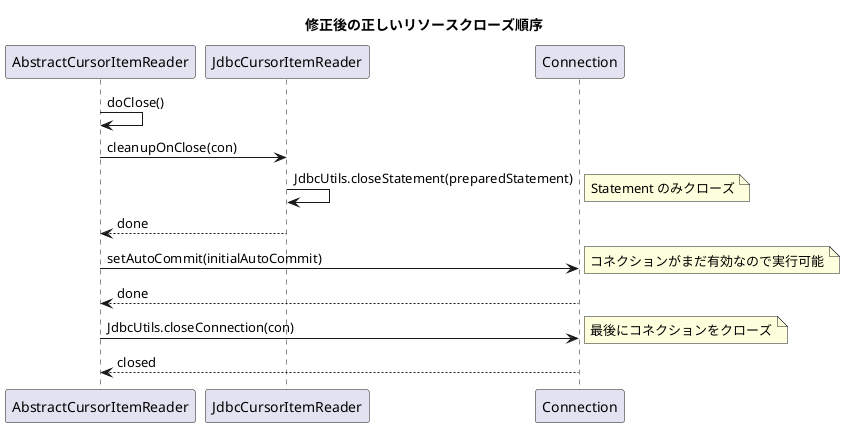

*（このドキュメントは生成AI(Claude Opus 4.5)によって2026年1月14日に生成されました）*

## 課題概要

`AbstractCursorItemReader#doClose()`において、JDBCリソースのクローズ順序が不正で、一貫性のない動作を引き起こすバグです。

### Spring Batchの背景知識

| 用語 | 説明 |
|------|------|
| `AbstractCursorItemReader` | データベースカーソルを使用してデータを読み取る抽象基底クラス |
| `JdbcCursorItemReader` | JDBCカーソルを使用するItemReaderの実装 |
| `StoredProcedureItemReader` | ストアドプロシージャを使用するItemReaderの実装 |
| `Connection` | データベース接続オブジェクト |
| `PreparedStatement` | プリコンパイルされたSQL文を表すオブジェクト |

### 問題の発生状況

以下の順序でリソースがクローズされ、問題が発生します：



### 問題点

1. `cleanupOnClose(connection)`がコネクションクローズ**後**に呼び出される
2. `setAutoCommit(initialAutoCommit)`が実行されない（コネクションが既にクローズ済みのため）
3. 所有権モデルの不整合：親クラスがコネクションを作成するが、子クラスがクローズする混在状態

## 原因

`doClose()`内でのリソースクローズ順序が論理的に逆転しており、コネクションのライフサイクル管理に不整合が生じています。

**期待される所有権モデル**:
- 親クラス（`AbstractCursorItemReader`）: コネクションの作成とクローズを担当
- 子クラス: カーソル関連リソース（`ResultSet`、`PreparedStatement`）のみをクリーンアップ

## 対応方針

### PR [#5110](https://github.com/spring-projects/spring-batch/pull/5110)での修正内容

子クラスの`cleanupOnClose()`からコネクションクローズ処理を削除し、親クラスに任せる設計に変更：

#### JdbcCursorItemReader.java の変更

```diff
 /**
- * Close the cursor and database connection.
- * @param connection to the database
+ * Releases JDBC resources associated with this reader.
+ * Closes the PreparedStatement used for the cursor.
+ * The Connection is not closed here; it is managed by the parent class.
+ *
+ * @param connection the active database connection used for the cursor
  */
 @Override
 protected void cleanupOnClose(Connection connection) {
     JdbcUtils.closeStatement(this.preparedStatement);
-    JdbcUtils.closeConnection(connection);
 }
```

#### StoredProcedureItemReader.java の変更

```diff
 /**
- * Close the cursor and database connection.
- * @param connection to the database
+ * Releases JDBC resources associated with this reader.
+ * Closes the PreparedStatement used for the cursor.
+ * The Connection is not closed here; it is managed by the parent class.
+ *
+ * @param connection the active database connection used for the cursor
  */
 @Override
 protected void cleanupOnClose(Connection connection) {
     JdbcUtils.closeStatement(this.callableStatement);
-    JdbcUtils.closeConnection(connection);
 }
```

### 修正後のリソースクローズ順序



### 関連リンク

- Issue: https://github.com/spring-projects/spring-batch/issues/5109
- PR: https://github.com/spring-projects/spring-batch/pull/5110
