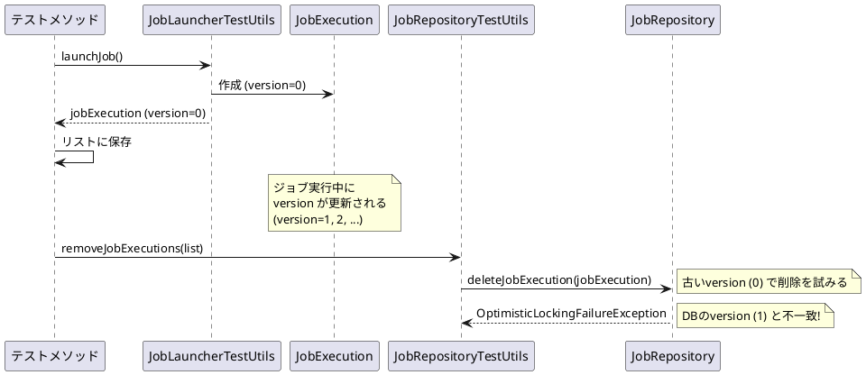
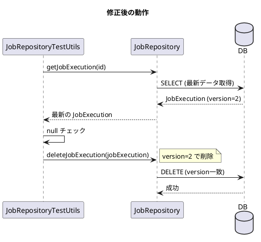

*（このドキュメントは生成AI(Claude Opus 4.5)によって2026年1月18日に生成されました）*

## 課題概要

Spring Batch 5.2.3以降で、`JobRepositoryTestUtils.removeJobExecutions()`をテストのクリーンアップで呼び出すと`OptimisticLockingFailureException`がスローされるバグです。

**JobRepositoryTestUtilsとは**: Spring Batchのテスト用ユーティリティクラスで、テスト実行後にジョブ実行履歴を削除するなどのクリーンアップ処理を提供します。

### 問題の発生状況



### 典型的なテストコード例

```java
@Test
public void testJob() throws Exception {
    JobExecution jobExecution = jobLauncherTestUtils.launchJob(defaultJobParameters());
    jobExecutionList.add(jobExecution);  // version=0 の状態で保存
    
    assertThat(jobExecution.getExitStatus()).isEqualTo(ExitStatus.COMPLETED);
}

@After
public void cleanUp() {
    // 5.2.3以降で OptimisticLockingFailureException が発生
    jobRepositoryTestUtils.removeJobExecutions(jobExecutionList);
}
```

## 原因

Issue [#4793](https://github.com/spring-projects/spring-batch/issues/4793) で導入された変更により、`deleteJobExecution()`がバージョンチェックを行うようになりました。

テスト実行時にリストに保存した`JobExecution`オブジェクトのバージョンは古いままですが、ジョブ実行中にデータベース上のバージョンは更新されます。クリーンアップ時に古いバージョンで削除を試みるため、楽観的ロックエラーが発生します。

## 対応方針

### diffファイルの分析結果

[PR #5173](https://github.com/spring-projects/spring-batch/pull/5173) での修正内容：

```java
// 修正前
public void removeJobExecution(JobExecution jobExecution) {
    this.jobRepository.deleteJobExecution(jobExecution);
}

// 修正後
public void removeJobExecution(JobExecution jobExecution) {
    // 最新バージョンを取得してから削除
    jobExecution = this.jobRepository.getJobExecution(jobExecution.getId());
    if (jobExecution != null) {
        this.jobRepository.deleteJobExecution(jobExecution);
    }
}
```

### 修正のポイント

1. 削除前に`jobRepository.getJobExecution()`で最新バージョンの`JobExecution`を取得
2. nullチェックを追加（既に削除されている場合への対応）
3. 最新バージョンで削除を実行



## バグの発生タイミング

| 項目 | 内容 |
|------|------|
| バグ発生バージョン | Spring Batch 5.2.3, 5.2.4 |
| 原因となった変更 | Issue [#4793](https://github.com/spring-projects/spring-batch/issues/4793) |
| 修正コミット | [12b16b3](https://github.com/spring-projects/spring-batch/commit/12b16b32adbbf35ead57b5e3b8d0ec84c56789ec) |
| 修正予定バージョン | Spring Batch 6.0.2, 5.2.5（バックポート） |
