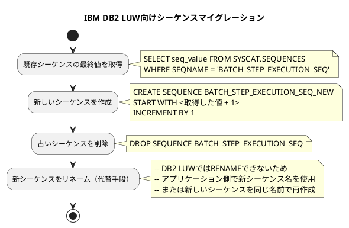

*（このドキュメントは生成AI(Claude Opus 4.5)によって2026年1月15日に生成されました）*

## 課題概要

Spring Batch 6.xへのデータベースマイグレーションスクリプトが、IBM DB2 LUW（Linux, UNIX, Windows版）で正しく動作しない問題です。

**DB2 LUWとは**: IBM社のリレーショナルデータベース管理システムで、Linux、UNIX、Windows上で動作するエディションです。

### 問題のマイグレーションスクリプト

Spring Batchの[マイグレーションスクリプト](https://github.com/spring-projects/spring-batch/blob/98c10cd981b5f4ddc65e7071f6a603a3781514fd/spring-batch-core/src/main/resources/org/springframework/batch/core/migration/6.0/migration-db2.sql)では、シーケンスのリネームを使用しています：

```sql
-- migration-db2.sql
RENAME SEQUENCE BATCH_STEP_EXECUTION_SEQ TO BATCH_STEP_EXECUTION_SEQ_OLD;
-- ...その他のリネーム処理
```

### データベース互換性の問題

| データベース | `RENAME SEQUENCE`サポート |
|------------|--------------------------|
| Informix | ✅ サポートあり |
| IBM DB2 LUW 10.1+ | ❌ サポートなし |

IBM DB2 LUW (バージョン10.1以降) では、`RENAME SEQUENCE`文はサポートされていません。
参照: [IBM DB2 RENAME文ドキュメント](https://www.ibm.com/docs/en/db2/12.1.x?topic=statements-rename)

## 原因

マイグレーションスクリプト`migration-db2.sql`がInformixサーバー向けに作成されており、IBM DB2 LUWでは使用できない`RENAME SEQUENCE`文を含んでいるため。

## 対応方針

**注意**: このIssueにはdiffファイルが存在しないため、公式の修正内容は未確定です。

### 報告者による回避策

報告者が実施したJavaベースのマイグレーション手順：



### 推奨されるマイグレーション手順（IBM DB2 LUW向け）

1. **現在のシーケンス値を取得**:
```sql
SELECT NEXTVAL FOR BATCH_STEP_EXECUTION_SEQ FROM SYSIBM.SYSDUMMY1;
```

2. **古いシーケンスを削除**:
```sql
DROP SEQUENCE BATCH_STEP_EXECUTION_SEQ;
```

3. **新しいシーケンスを作成（取得した値から開始）**:
```sql
CREATE SEQUENCE BATCH_STEP_EXECUTION_SEQ
    START WITH <取得した値 + 1>
    INCREMENT BY 1
    NO CACHE;
```

### 今後の対応

メンテナーの@fmbenhassineは、マイグレーションスクリプトにIBM DB2 LUWユーザー向けの注意事項を追加する予定です。ユーザーは上記のようなJavaベースまたはSQLベースの代替手段を使用して、新しいシーケンスを作成する必要があります。
