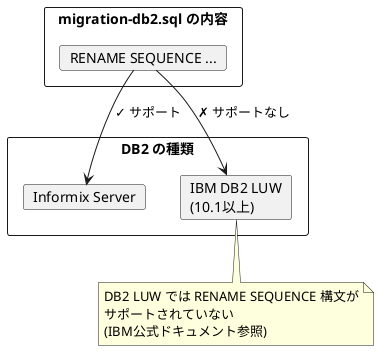
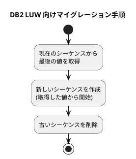

*（このドキュメントは生成AI(Claude Opus 4.5)によって2026年1月18日に生成されました）*

## 課題概要

Spring Batch 6.xへのマイグレーション用SQLスクリプト（`migration-db2.sql`）がIBM DB2 LUW (10.1以上) では動作しないバグです。

**DB2 LUWとは**: IBM DB2 for Linux, UNIX and Windowsの略称で、オンプレミスやクラウド環境で動作するリレーショナルデータベースです。

**マイグレーションスクリプトとは**: Spring Batchのバージョンアップ時に、既存のデータベーススキーマを新バージョンに対応させるためのSQLスクリプトです。

### 問題の詳細

### 該当するマイグレーションスクリプト

[migration-db2.sql](https://github.com/spring-projects/spring-batch/blob/98c10cd981b5f4ddc65e7071f6a603a3781514fd/spring-batch-core/src/main/resources/org/springframework/batch/core/migration/6.0/migration-db2.sql#L2)

このスクリプトはInformixサーバー向けの構文（`RENAME SEQUENCE`）を使用していますが、IBM DB2 LUW (10.1以上) ではシーケンスのリネームがサポートされていません。

## 原因

マイグレーションスクリプトがInformix向けに記述されており、IBM DB2 LUW との互換性が考慮されていませんでした。

IBM DB2 LUW のRENAME文は、以下のオブジェクトのみをサポートしています：
- テーブル
- インデックス
- カラム

シーケンスのリネームはサポートされていません（[IBMドキュメント参照](https://www.ibm.com/docs/en/db2/12.1.x?topic=statements-rename)）。

## 対応方針

diffファイルは存在しません。

### 報告者が実施したワークアラウンド

Javaベースのマイグレーションで以下の手順を実装：

### 今後の対応

メンテナーの@fmbenhassineは、マイグレーションスクリプトにDB2 LUWユーザー向けの注意書きを追加する予定です。

## バグの発生タイミング

| 項目 | 内容 |
|------|------|
| バグ発生バージョン | Spring Batch 6.0.0（マイグレーションスクリプト） |
| 影響を受ける環境 | IBM DB2 LUW 10.1 以上 |
