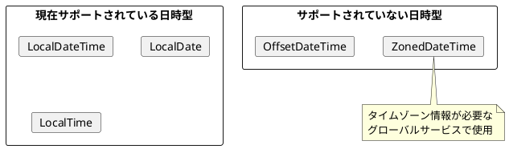
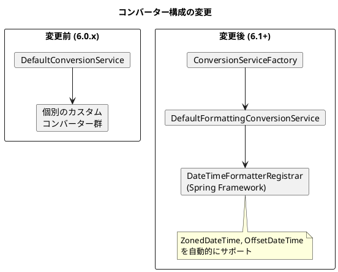

*（このドキュメントは生成AI(Claude Opus 4.5)によって2026年1月18日に生成されました）*

## 課題概要

`JobParametersConverter`に`ZonedDateTime`と`OffsetDateTime`のサポートを追加する機能リクエストです。

**JobParametersとは**: Spring Batchでジョブを起動する際に渡すパラメータです。実行日時や処理対象IDなどを指定できます。

**ZonedDateTime / OffsetDateTimeとは**: Java 8で導入されたタイムゾーン情報を含む日時型です。グローバルサービスで複数のタイムゾーンを扱う場合に重要です。

### 現状の問題



### ユースケース

| シナリオ | 必要な情報 | 現状の対応 |
|---------|----------|----------|
| グローバルサービスでのバッチ実行 | タイムゾーン付き日時 | ❌ 非対応 |
| ログ分析（UTC + ローカル時刻） | オフセット付き日時 | ❌ 非対応 |
| 多国籍サービスでの国別処理 | 国別タイムゾーン | ❌ 非対応 |

### 期待される使用方法

```java
ZonedDateTime scheduleTime = ZonedDateTime.of(
    2023, 12, 25, 10, 30, 0, 0, 
    ZoneId.of("Asia/Seoul")
);

JobParameters parameters = new JobParametersBuilder()
    .addJobParameter("schedule.time", scheduleTime, ZonedDateTime.class, true)
    .toJobParameters();
```

## 原因

（機能リクエストのため、バグではありません）

Spring Batchの`DefaultJobParametersConverter`に`ZonedDateTime`と`OffsetDateTime`用のコンバーターが登録されていませんでした。

## 対応方針

### diffファイルの分析結果

[PR #5186](https://github.com/spring-projects/spring-batch/pull/5186) で大幅なリファクタリングが実施されました。

#### 主な変更点

1. **ConversionServiceFactoryの新規作成**

```java
public final class ConversionServiceFactory {
    public static ConfigurableConversionService createConversionService() {
        FormattingConversionService conversionService = 
            new DefaultFormattingConversionService();
        
        // Date用フォーマッター
        conversionService.addFormatterForFieldType(Date.class, new DateFormatter());
        
        // ISO形式で日時をフォーマット
        DateTimeFormatterRegistrar dateTimeFormatterRegistrar = 
            new DateTimeFormatterRegistrar();
        dateTimeFormatterRegistrar.setUseIsoFormat(true);
        dateTimeFormatterRegistrar.registerFormatters(conversionService);
        
        return conversionService;
    }
}
```

2. **既存コンバーターの非推奨化**

以下のコンバーターは6.1で非推奨となり、6.3以降で削除予定：
- `DateToStringConverter`
- `StringToDateConverter`
- `LocalDateToStringConverter` / `StringToLocalDateConverter`
- `LocalTimeToStringConverter` / `StringToLocalTimeConverter`
- `LocalDateTimeToStringConverter` / `StringToLocalDateTimeConverter`

3. **Spring Frameworkのコンバーターを活用**

`DefaultFormattingConversionService`を使用することで、Spring Frameworkの`DateTimeFormatterRegistrar`が自動的に以下の型をサポート：
- `LocalDate`, `LocalTime`, `LocalDateTime`
- `ZonedDateTime`, `OffsetDateTime` ← **新規サポート**
- `Instant`, `Duration`, `Period`



### リリース計画

| バージョン | 対応内容 |
|-----------|---------|
| 6.0.2 | PR [#5179](https://github.com/spring-projects/spring-batch/pull/5179) - 個別コンバーター追加 |
| 6.1.0 | PR [#5186](https://github.com/spring-projects/spring-batch/pull/5186) - Spring Framework統合 |
| 5.2.x | バックポート対象 |
