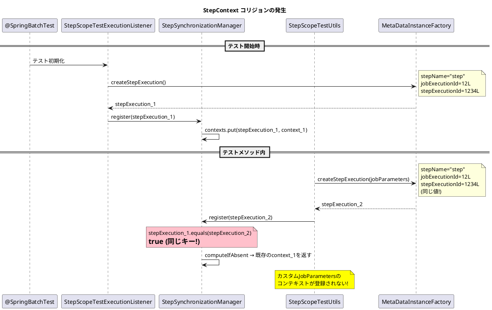
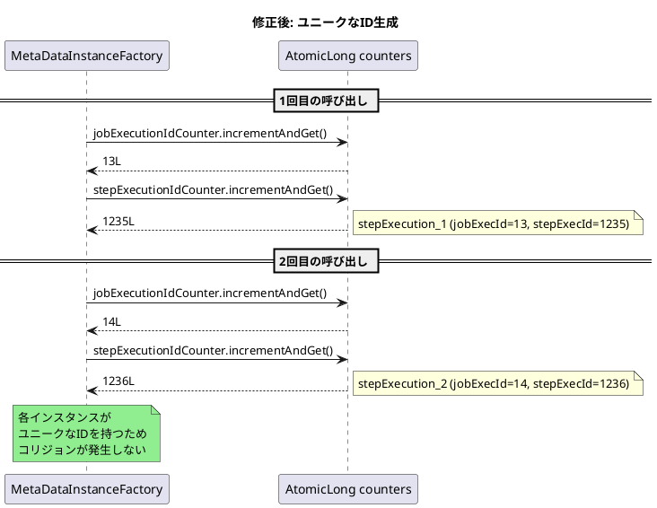

*（このドキュメントは生成AI(Claude Opus 4.5)によって2026年1月18日に生成されました）*

## 課題概要

`@SpringBatchTest`を使用したテスト環境で、`MetaDataInstanceFactory`のデフォルト値が原因で`StepScopeTestUtils`使用時に`StepContext`のコリジョン（衝突）が発生するバグです。

**MetaDataInstanceFactoryとは**: Spring Batchのテスト用ファクトリクラスで、`JobExecution`や`StepExecution`のテストインスタンスを簡単に作成できます。

**StepScopeTestUtilsとは**: `@StepScope`のBeanをテストする際に、任意の`StepExecution`のスコープ内でコードを実行するためのユーティリティです。

### 問題のメカニズム



### 典型的な失敗例

```java
@SpringBatchTest
@SpringBootTest
public class IssueReproductionTest {
    @Autowired
    private Tasklet issueReproductionTasklet;  // @StepScope

    @Test
    void reproduceIdCollisionBug() throws Exception {
        JobParameters jobParameters = new JobParametersBuilder()
                .addString("testParam", "HelloBatch")
                .toJobParameters();

        // 問題: 固定ID 1234L で作成される
        StepExecution stepExecution = MetaDataInstanceFactory.createStepExecution(jobParameters);

        StepScopeTestUtils.doInStepScope(stepExecution, () ->
                issueReproductionTasklet.execute(...)
        );

        // testParam は null になる (リスナーのコンテキストを参照するため)
        String actualValue = stepExecution.getExecutionContext().getString("result");
    }
}
```

## 原因

`StepExecution`の`equals()`/`hashCode()`は以下の3つのフィールドで等価性を判断します：
- `stepName`
- `jobExecutionId`
- `id` (stepExecutionId)

`MetaDataInstanceFactory`はこれらすべてに固定のデフォルト値を使用するため、複数のインスタンスが同一のキーとして扱われ、`StepSynchronizationManager.contexts`マップでコリジョンが発生します。

## 対応方針

### diffファイルの分析結果

[PR #5208](https://github.com/spring-projects/spring-batch/pull/5208) での修正内容：

#### 1. AtomicLongカウンターの導入

```java
public class MetaDataInstanceFactory {
    public static final long DEFAULT_JOB_EXECUTION_ID = 12L;
    public static final long DEFAULT_STEP_EXECUTION_ID = 1234L;

    // 新規追加: ユニークなID生成用のカウンター
    private static final AtomicLong jobExecutionIdCounter = 
        new AtomicLong(DEFAULT_JOB_EXECUTION_ID);
    private static final AtomicLong stepExecutionIdCounter = 
        new AtomicLong(DEFAULT_STEP_EXECUTION_ID);
```

#### 2. createStepExecution()メソッドの修正

```java
// 修正前
public static StepExecution createStepExecution(JobParameters jobParameters) {
    JobExecution jobExecution = createJobExecution(DEFAULT_JOB_NAME, 
        DEFAULT_JOB_INSTANCE_ID, DEFAULT_JOB_EXECUTION_ID, jobParameters);
    StepExecution stepExecution = createStepExecution(jobExecution, 
        DEFAULT_STEP_NAME, DEFAULT_STEP_EXECUTION_ID);
    // ...
}

// 修正後
public static StepExecution createStepExecution(JobParameters jobParameters) {
    Long jobExecutionId = jobExecutionIdCounter.incrementAndGet();
    Long stepExecutionId = stepExecutionIdCounter.incrementAndGet();
    JobExecution jobExecution = createJobExecution(DEFAULT_JOB_NAME, 
        DEFAULT_JOB_INSTANCE_ID, jobExecutionId, jobParameters);
    StepExecution stepExecution = createStepExecution(jobExecution, 
        DEFAULT_STEP_NAME, stepExecutionId);
    // ...
}
```

#### 3. 修正後の動作



#### 4. テストケースの追加

```java
@Test
void testCreateStepExecutionWithJobParametersShouldGenerateUniqueIds() {
    JobParameters params1 = new JobParametersBuilder()
        .addString("key", "value1").toJobParameters();
    JobParameters params2 = new JobParametersBuilder()
        .addString("key", "value2").toJobParameters();

    StepExecution step1 = MetaDataInstanceFactory.createStepExecution(params1);
    StepExecution step2 = MetaDataInstanceFactory.createStepExecution(params2);

    assertNotEquals(step1.getId(), step2.getId());
    assertNotEquals(step1.getJobExecutionId(), step2.getJobExecutionId());
    assertNotEquals(step1, step2);
}
```

## バグの発生タイミング

| 項目 | 内容 |
|------|------|
| バグ発生バージョン | Spring Batch 6.x（おそらく5.2.3以降も） |
| 修正PR | [#5208](https://github.com/spring-projects/spring-batch/pull/5208) |
| 修正予定バージョン | Spring Batch 6.0.2 |

### ワークアラウンド（修正版リリースまで）

テストクラスに`getStepExecution()`メソッドを定義し、ユニークなIDを明示的に指定：

```java
public StepExecution getStepExecution() {
    return MetaDataInstanceFactory.createStepExecution("uniqueStep", -1L);
}
```
