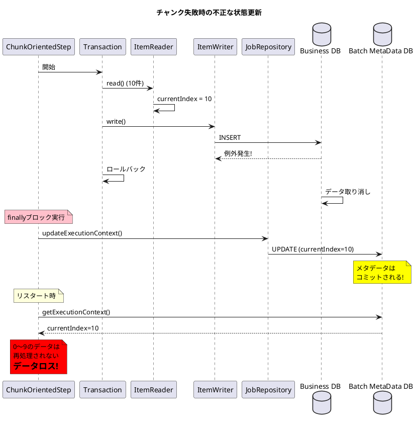
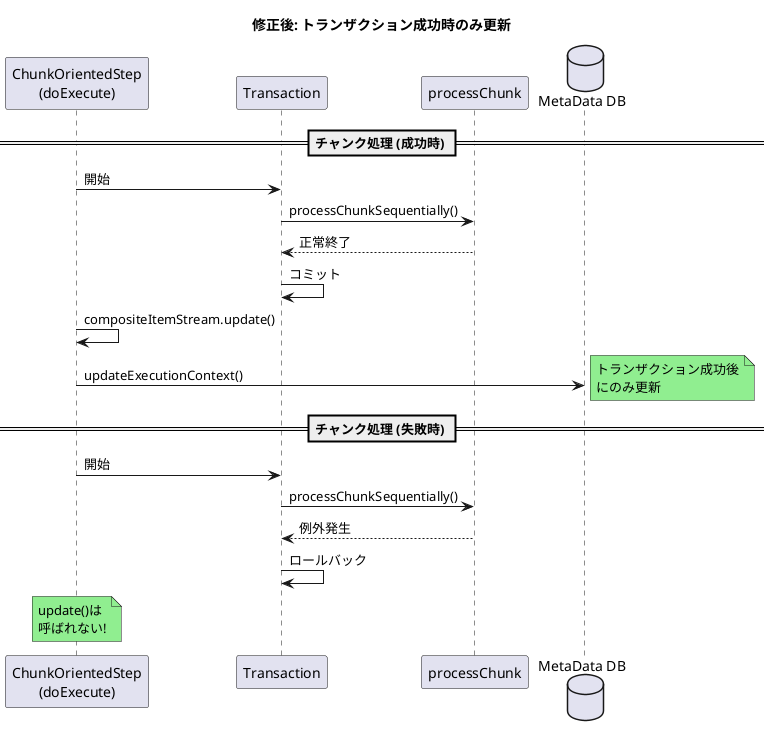

*（このドキュメントは生成AI(Claude Opus 4.5)によって2026年1月18日に生成されました）*

## 課題概要

Spring Batch 6.xの新しい`ChunkOrientedStep`において、チャンク処理が失敗してロールバックした場合でも`ExecutionContext`が更新されてしまい、リスタート時にデータロスが発生するバグです。

**ExecutionContextとは**: Spring Batchがステップの状態（読み取り位置、処理カウントなど）を永続化するためのマップ形式のストレージです。リスタート時にこの情報を使って中断箇所から再開します。

**ChunkOrientedStepとは**: Spring Batch 6.0で導入された新しいチャンク指向ステップの実装クラスです。

### 問題の発生フロー



### コードの比較

#### Spring Batch 5.x (TaskletStep.java) - 正しい実装

```java
// 成功時のみ更新
stream.update(stepExecution.getExecutionContext());
getJobRepository().updateExecutionContext(stepExecution);
stepExecution.incrementCommitCount();
```

#### Spring Batch 6.x (ChunkOrientedStep.java) - バグのある実装

```java
private void processChunkSequentially(...) {
    try {
        // チャンク処理
    } catch (Exception e) {
        throw e;
    } finally {
        // バグ: ロールバック後も必ず実行される!
        this.compositeItemStream.update(stepExecution.getExecutionContext());
        getJobRepository().updateExecutionContext(stepExecution);
    }
}
```

## 原因

`ChunkOrientedStep`の`processChunkSequentially`および`processChunkConcurrently`メソッドで、`ItemStream.update()`と`JobRepository.updateExecutionContext()`が`finally`ブロック内に配置されているため、トランザクションがロールバックしても常に実行されます。

これにより：
1. ビジネスデータはロールバックされる
2. バッチメタデータ（読み取り位置）はコミットされる
3. リスタート時に失敗したチャンクがスキップされる
4. **データロスが発生する**

## 対応方針

### diffファイルの分析結果

[PR #5195](https://github.com/spring-projects/spring-batch/pull/5195) での修正内容：

#### 1. finallyブロックから更新処理を削除

```java
// 修正前: processChunkSequentially
finally {
    stepExecution.apply(contribution);
    compositeItemStream.update(stepExecution.getExecutionContext());
    getJobRepository().updateExecutionContext(stepExecution);
}

// 修正後: processChunkSequentially
finally {
    // apply contribution only
    stepExecution.apply(contribution);
}
```

#### 2. doExecuteメソッドに更新処理を移動

```java
@Override
protected void doExecute(StepExecution stepExecution) throws Exception {
    stepExecution.getExecutionContext().put(STEP_TYPE_KEY, this.getClass().getName());
    
    while (this.chunkTracker.get().moreItems() && !interrupted(stepExecution)) {
        this.transactionTemplate.executeWithoutResult(transactionStatus -> {
            // process next chunk
        });

        getJobRepository().update(stepExecution);
        // 修正: トランザクション成功後にのみ実行
        this.compositeItemStream.update(stepExecution.getExecutionContext());
        getJobRepository().updateExecutionContext(stepExecution);
    }
}
```

### 修正後の動作



#### 3. テストケースの追加

```java
@Test
void testItemStreamUpdateStillOccursWhenChunkRollsBack_bugReproduction() {
    TrackingItemStream trackingItemStream = new TrackingItemStream();
    ItemReader<String> reader = new ListItemReader<>(List.of("item1"));
    ItemWriter<String> writer = chunk -> {
        throw new RuntimeException("Simulated failure");
    };
    
    ChunkOrientedStep<String, String> step = new ChunkOrientedStep<>(...);
    step.registerItemStream(trackingItemStream);
    step.execute(stepExecution);

    // 修正後: チャンク失敗時は更新されない
    assertEquals(0, trackingItemStream.getUpdateCount(),
        "ItemStream should not be updated when chunk transaction fails");
}
```

## バグの発生タイミング

| 項目 | 内容 |
|------|------|
| バグ発生バージョン | Spring Batch 6.0.0, 6.0.1 |
| 影響範囲 | ChunkOrientedStep使用時のリスタート処理 |
| 修正PR | [#5195](https://github.com/spring-projects/spring-batch/pull/5195) |
| 修正予定バージョン | Spring Batch 6.0.2 |

### 関連Issue

- [#5199](https://github.com/spring-projects/spring-batch/issues/5199): `JobRepository.update(stepExecution)`のトランザクション境界の問題
  - #5199の修正が適用される場合、本Issueの修正も調整が必要
