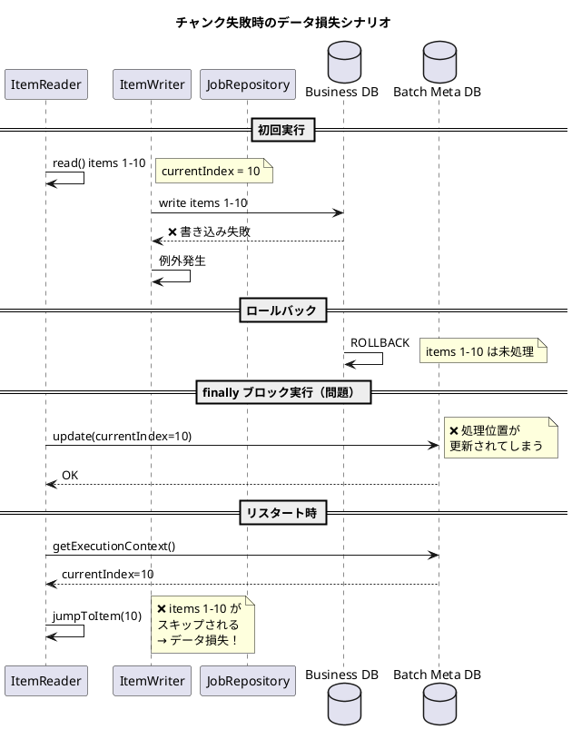
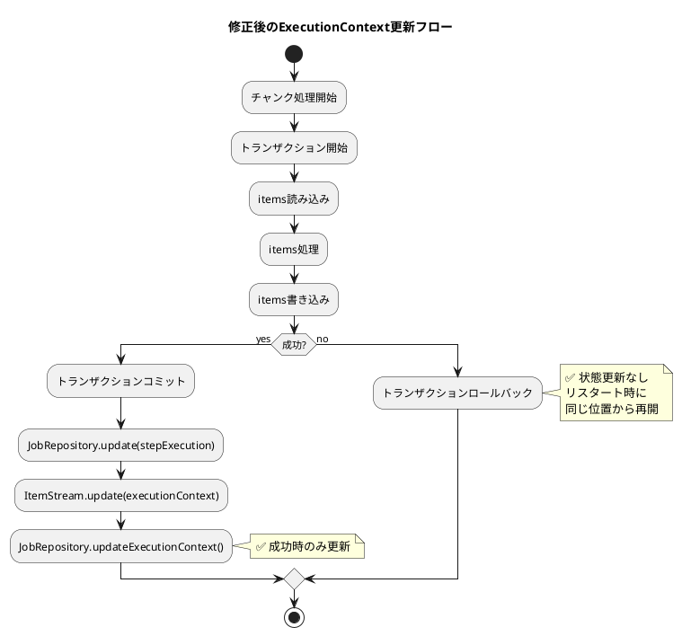

*（このドキュメントは生成AI(Claude Opus 4.5)によって2026年1月15日に生成されました）*

## 課題概要

Spring Batch 6.xで新しく導入された`ChunkOrientedStep`において、チャンク処理が失敗してロールバックされた場合でも、`ExecutionContext`と`ItemStream`の状態が更新されてしまう問題です。これにより、リスタート時にデータ損失が発生する可能性があります。

**`ChunkOrientedStep`とは**: Spring Batch 6.0で新しく導入されたステップ実装で、チャンク指向の処理（読み込み→処理→書き込み）を行います。

**`ExecutionContext`とは**: Spring Batchがジョブ/ステップの実行状態（読み込み位置など）を永続化するためのコンテナです。

**`ItemStream`とは**: リーダーやライターがリスタート時に状態を復元するためのインターフェースです。

### Spring Batch 5.xと6.xの比較

```plantuml
@startuml
title Spring Batch 5.x vs 6.x のExecutionContext更新タイミング

rectangle "Spring Batch 5.x (TaskletStep)" {
    (チャンク処理) --> (成功?)
    (成功?) --> [Yes] (ExecutionContext更新)
    (成功?) --> [No] (更新なし)
    note right of (ExecutionContext更新): 成功時のみ更新\n→ リスタート安全
}

rectangle "Spring Batch 6.x (ChunkOrientedStep) - 問題あり" {
    (チャンク処理2) --> (try/catch)
    (try/catch) --> (finally)
    (finally) --> (ExecutionContext更新2)
    note right of (ExecutionContext更新2): finallyで常に更新\n→ 失敗時も更新される\n→ データ損失の危険
}

@enduml
```

### 問題のあるコード構造

```java
// ChunkOrientedStep.java - 問題のあるコード
private void processChunkSequentially(...) {
    try {
        // チャンク読み込み/処理/書き込み
    } catch (Exception e) {
        // 例外処理
        throw e;
    } finally {
        // ❌ BUG: トランザクションがロールバックされても実行される
        this.compositeItemStream.update(stepExecution.getExecutionContext());
        getJobRepository().updateExecutionContext(stepExecution);
    }
}
```

### データ損失のシナリオ



## 原因

`ChunkOrientedStep`の`processChunkSequentially`および`processChunkConcurrently`メソッドで、`ItemStream.update()`と`JobRepository.updateExecutionContext()`が`finally`ブロック内に配置されているため、チャンク処理の成否に関わらず常に実行されます。

Spring Batch 5.xの`TaskletStep`では、これらの更新はチャンクが成功した場合のみ実行されていました。

## 対応方針

### diffファイルの分析結果

[PR #5195](https://github.com/spring-projects/spring-batch/pull/5195)において、以下の修正が行われました：

**ChunkOrientedStep.java の修正**:

```java
// 変更前: finallyブロック内で更新（常に実行）
private void processChunkSequentially(...) {
    try {
        // ...
    } finally {
        stepExecution.apply(contribution);
        compositeItemStream.update(stepExecution.getExecutionContext());
        getJobRepository().updateExecutionContext(stepExecution);
    }
}

// 変更後: finallyでは apply のみ、update は doExecute で実行
private void processChunkSequentially(...) {
    try {
        // ...
    } finally {
        stepExecution.apply(contribution);
        // update 処理を削除
    }
}

@Override
protected void doExecute(StepExecution stepExecution) throws Exception {
    while (this.chunkTracker.get().moreItems() && !interrupted(stepExecution)) {
        this.transactionTemplate.executeWithoutResult(transactionStatus -> {
            processNextChunk(transactionStatus, contribution, stepExecution);
        });
        getJobRepository().update(stepExecution);
        // ✅ トランザクション成功後にのみ更新
        this.compositeItemStream.update(stepExecution.getExecutionContext());
        getJobRepository().updateExecutionContext(stepExecution);
    }
}
```

### 修正後の状態更新フロー



### 追加されたテストケース

PR #5195では、ロールバック時にItemStreamが更新されないことを確認するテストが追加されています：

```java
@Test
void testItemStreamUpdateStillOccursWhenChunkRollsBack_bugReproduction() throws Exception {
    TrackingItemStream trackingItemStream = new TrackingItemStream();
    ItemWriter<String> writer = chunk -> {
        throw new RuntimeException("Simulated failure");
    };
    // ... 設定 ...
    
    step.execute(stepExecution);
    
    // チャンクがロールバックされた場合、ItemStreamは更新されないべき
    assertEquals(0, trackingItemStream.getUpdateCount(),
        "ItemStream should not be updated when chunk transaction fails");
}
```

### 関連Issue

- [#5199](https://github.com/spring-projects/spring-batch/issues/5199): `JobRepository.update(stepExecution)`のトランザクション境界に関する問題。#5182と合わせて対応することで、より一貫性のある修正が可能。
