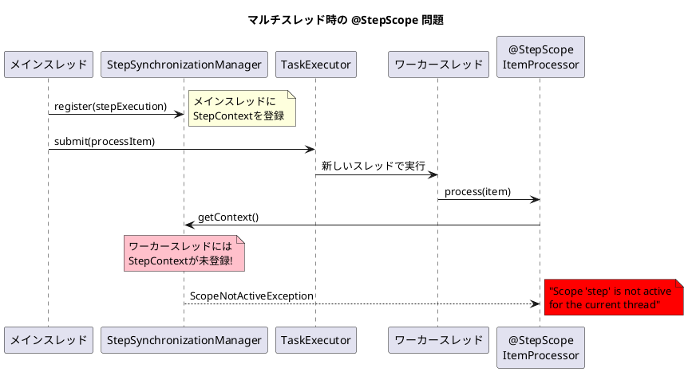
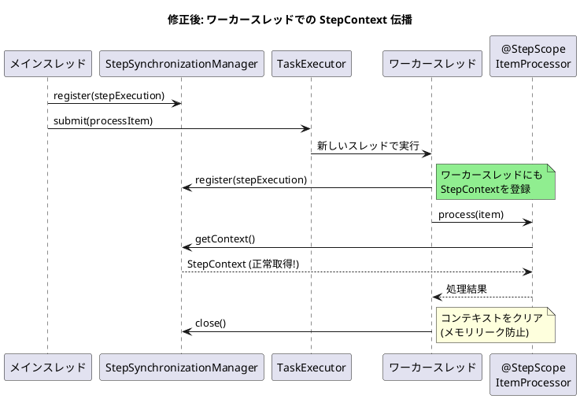

*（このドキュメントは生成AI(Claude Opus 4.5)によって2026年1月18日に生成されました）*

## 課題概要

Spring Batch 6.0の新しい`ChunkOrientedStep`でマルチスレッド処理を使用する際、`@StepScope`で定義された`ItemProcessor`がワーカースレッドで`ScopeNotActiveException`をスローするバグです。

**@StepScopeとは**: Spring Batchが提供するスコープアノテーションで、Beanのインスタンスをステップ実行ごとに生成し、`StepExecution`の情報（JobParametersなど）を遅延バインディングで注入できます。

**ChunkOrientedStepのマルチスレッド処理とは**: `TaskExecutor`を設定することで、アイテムの処理（process/write）を複数のワーカースレッドで並列実行する機能です。

### 問題のシナリオ



### 再現するコード

```java
@Bean
public Step issueReproductionStep(
        JobRepository jobRepository,
        ItemReader<TestItem> reader,
        ItemProcessor<TestItem, TestItem> itemProcessor, // @StepScope
        ItemWriter<TestItem> writer
) {
    return new StepBuilder(jobRepository)
            .<TestItem, TestItem>chunk(1)
            .reader(reader)
            .processor(itemProcessor)
            .writer(writer)
            .taskExecutor(new SimpleAsyncTaskExecutor()) // マルチスレッド有効
            .build();
}

@Bean
@StepScope
public ItemProcessor<TestItem, TestItem> issueReproductionProcessor() {
    return item -> {
        log.info("[Thread: {}] Processing item: {}", 
            Thread.currentThread().getName(), item.getName());
        return item;
    };
}
```

### 発生するエラー

```
Caused by: org.springframework.beans.factory.support.ScopeNotActiveException: 
  Error creating bean with name 'scopedTarget.issueReproductionProcessor': 
  Scope 'step' is not active for the current thread
    at org.springframework.batch.core.step.item.ChunkOrientedStep.doProcess(ChunkOrientedStep.java:655)
    ...
Caused by: java.lang.IllegalStateException: 
  No context holder available for step scope
    at org.springframework.batch.core.scope.StepScope.getContext(StepScope.java:167)
```

## 原因

`ChunkOrientedStep.processChunkConcurrently`メソッドで、`TaskExecutor`を使用してワーカースレッドでアイテム処理を実行する際、`StepExecution`の`StepContext`がワーカースレッドに伝播されていません。

`@StepScope`のBeanはプロキシとして作成され、実際のインスタンス取得時に`StepSynchronizationManager`から`StepContext`を参照します。しかし、ワーカースレッドでは`StepContext`が登録されていないため、`ScopeNotActiveException`が発生します。

## 対応方針

diffファイルは存在しませんが、メンテナーの@fmbenhassineがIssue内で提案された修正を承認しています。

### 提案された修正

```java
// processChunkConcurrently メソッド内
Future<O> itemProcessingFuture = this.taskExecutor.submit(() -> {
    try {
        // ワーカースレッドに StepExecution を登録
        StepSynchronizationManager.register(stepExecution);
        return processItem(item, contribution);
    } finally {
        // メモリリーク防止のためコンテキストをクリア
        StepSynchronizationManager.close();
    }
});
```

### 修正後の動作



### 影響を受けるテスト

@fmbenhassineのコメントによると、以下のテストケースが影響を受けます：

[ChunkOrientedStepIntegrationTests#testConcurrentChunkOrientedStepSuccess](https://github.com/spring-projects/spring-batch/blob/a6a53c46fca3aa920f4f07ac7ddbf39493081f66/spring-batch-core/src/test/java/org/springframework/batch/core/step/item/ChunkOrientedStepIntegrationTests.java)

このテストで使用される[ItemProcessor](https://github.com/spring-projects/spring-batch/blob/a6a53c46fca3aa920f4f07ac7ddbf39493081f66/spring-batch-core/src/test/java/org/springframework/batch/core/step/item/TestConfiguration.java#L56)を`@StepScope`にすると現在は失敗しますが、修正後はパスするようになります。

## バグの発生タイミング

| 項目 | 内容 |
|------|------|
| バグ発生バージョン | Spring Batch 6.0.0, 6.0.1 |
| 影響を受ける構成 | ChunkOrientedStep + TaskExecutor + @StepScope ItemProcessor |
| PRの担当者 | @LeeHyungGeol (アサイン予定) |
| 修正予定バージョン | Spring Batch 6.0.2 |

### 備考

メンテナーはこれを「新実装の見落とし」(oversight) と認識しており、提案された修正で問題が解決することを確認しています。
