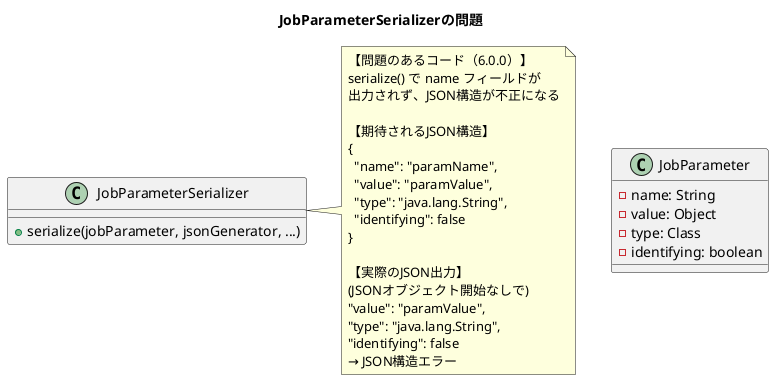

*（このドキュメントは生成AI(Claude Opus 4.5)によって2026年1月15日に生成されました）*

## 課題概要

Spring Batch 5.2.3から6.0.1へのアップグレード後、`Jackson2ExecutionContextStringSerializer`を使用している場合、`JobStep`で`JobParameters`のシリアライズに失敗する問題です。

**`Jackson2ExecutionContextStringSerializer`とは**: Jackson 2.xを使用して`ExecutionContext`をJSON形式で文字列にシリアライズするためのクラスです。Spring Batch 6.0で非推奨となり、Jackson 3.xベースの`JacksonExecutionContextStringSerializer`が推奨されています。

**`JobStep`とは**: Spring Batchにおいて、あるジョブ内から別のジョブを実行するためのステップ実装です。親ジョブの`JobParameters`を子ジョブに渡すことができます。

### エラーの内容

```
Caused by: com.fasterxml.jackson.databind.JsonMappingException: 
    Can not write a field name, expecting a value 
    (through reference chain: java.util.HashMap
        ["org.springframework.batch.core.step.job.JobStep.JOB_PARAMETERS"]
        ->org.springframework.batch.core.job.parameters.JobParameters
        ["parameters"]->java.util.Collections$UnmodifiableSet[0])
```

### 問題の発生箇所



## 原因

Spring Batch 6.0で`JobParameter`クラスの構造が変更されましたが、`Jackson2ExecutionContextStringSerializer`内の`JobParameterSerializer`が適切に調整されていませんでした。

具体的には：
1. `jsonGenerator.writeStartObject()`が呼び出されていない
2. `name`フィールドのシリアライズが欠落
3. JSON構造が不正になり、Jacksonがパース/生成に失敗

## 対応方針

### diffファイルの分析結果

[PR #5193](https://github.com/spring-projects/spring-batch/pull/5193)において、以下の修正が行われました：

**1. Jackson2ExecutionContextStringSerializer.java の修正**:

```java
// 変更前
@Override
public void serialize(JobParameter jobParameter, JsonGenerator jsonGenerator,
        SerializerProvider serializerProvider) throws IOException {
    jsonGenerator.writeFieldName(VALUE_KEY_NAME);
    jsonGenerator.writeObject(jobParameter.value());
    jsonGenerator.writeFieldName(TYPE_KEY_NAME);
    jsonGenerator.writeString(jobParameter.type().getName());
    jsonGenerator.writeFieldName(IDENTIFYING_KEY_NAME);
    jsonGenerator.writeObject(jobParameter.identifying());
}

// 変更後
@Override
public void serialize(JobParameter jobParameter, JsonGenerator jsonGenerator,
        SerializerProvider serializerProvider) throws IOException {
    jsonGenerator.writeStartObject();                    // ✅ 追加
    jsonGenerator.writeFieldName(NAME_KEY_NAME);         // ✅ 追加
    jsonGenerator.writeObject(jobParameter.name());      // ✅ 追加
    jsonGenerator.writeFieldName(VALUE_KEY_NAME);
    jsonGenerator.writeObject(jobParameter.value());
    jsonGenerator.writeFieldName(TYPE_KEY_NAME);
    jsonGenerator.writeString(jobParameter.type().getName());
    jsonGenerator.writeFieldName(IDENTIFYING_KEY_NAME);
    jsonGenerator.writeBoolean(jobParameter.identifying());  // ✅ writeObject→writeBoolean
    jsonGenerator.writeEndObject();                      // ✅ 追加
}
```

**2. JacksonExecutionContextStringSerializer.java の修正（Jackson 3.x用）**:

Jackson 3.xベースのシリアライザにも、`JobParameters`クラス用のMixInを追加：

```java
public JacksonExecutionContextStringSerializer() {
    // ...
    this.jsonMapper = JsonMapper.builder()
        .activateDefaultTyping(polymorphicTypeValidator)
        .addMixIns(Map.of(JobParameters.class, JobParametersMixIn.class))  // ✅ 追加
        .build();
}

private abstract static class JobParametersMixIn {
    @JsonIgnore
    abstract boolean isEmpty();
    
    @JsonIgnore
    abstract Map<String, JobParameter<?>> getIdentifyingParameters();
}
```

### 修正後のJSON出力例

```json
{
    "@class": "java.util.HashMap",
    "org.springframework.batch.core.step.job.JobStep.JOB_PARAMETERS": {
        "@class": "org.springframework.batch.core.job.parameters.JobParameters",
        "parameters": [
            {
                "name": "queueItemId",
                "value": "250702",
                "type": "java.lang.String",
                "identifying": false
            },
            {
                "name": "execType",
                "value": "MANUAL",
                "type": "java.lang.String",
                "identifying": false
            }
        ]
    }
}
```

### 移行に関する注意事項

| バージョン | 推奨シリアライザ | Jackson |
|-----------|-----------------|---------|
| Spring Batch 5.x | `Jackson2ExecutionContextStringSerializer` | Jackson 2.x |
| Spring Batch 6.x | `JacksonExecutionContextStringSerializer` | Jackson 3.x |

**重要**: Spring Batch 5.xから6.xへのアップグレード時は、すべてのジョブを5.xで完了させてからアップグレードしてください。5.xと6.xのシリアライズ形式には互換性がありません。
