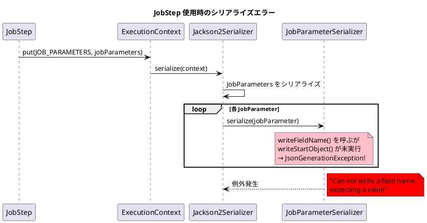
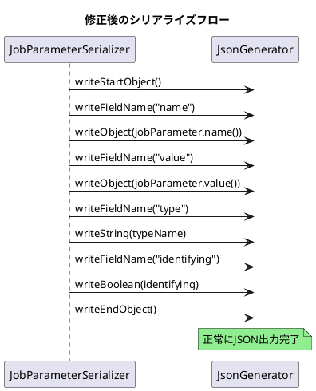

*（このドキュメントは生成AI(Claude Opus 4.5)によって2026年1月18日に生成されました）*

## 課題概要

Spring Batch 5.2.3から6.0.1にアップグレードした環境で、`Jackson2ExecutionContextStringSerializer`を使用した場合に`JobStep`のジョブパラメータのシリアライズが失敗するバグです。

**Jackson2ExecutionContextStringSerializerとは**: `ExecutionContext`をJackson 2（com.fasterxml.jackson）を使用してJSON形式でシリアライズ/デシリアライズするクラスです。Spring Batch 6.0で非推奨となり、Jackson 3を使用する`JacksonExecutionContextStringSerializer`への移行が推奨されています。

**JobStepとは**: あるジョブのステップとして別のジョブを実行する機能です。親ジョブから子ジョブへパラメータを渡す際に`ExecutionContext`にジョブパラメータを保存します。

### エラーの発生状況



### スタックトレース抜粋

```
Caused by: com.fasterxml.jackson.core.JsonGenerationException: 
  Can not write a field name, expecting a value
    at ...UTF8JsonGenerator.writeFieldName(UTF8JsonGenerator.java:217)
    at ...Jackson2ExecutionContextStringSerializer$JobParametersModule
       $JobParameterSerializer.serialize(Jackson2ExecutionContextStringSerializer.java:213)
```

## 原因

Spring Batch 6.0で`JobParameter`クラスが`record`型に変更されました（パラメータ名が`JobParameter`自体のフィールドになった）。しかし、`Jackson2ExecutionContextStringSerializer`の`JobParameterSerializer`はこの変更に対応しておらず：

1. `writeStartObject()` が呼ばれていない状態で `writeFieldName()` を実行
2. パラメータ名（`name`フィールド）のシリアライズ処理が欠落

## 対応方針

### diffファイルの分析結果

[PR #5193](https://github.com/spring-projects/spring-batch/pull/5193) での修正内容：

#### 1. Jackson2ExecutionContextStringSerializer の修正

```java
// 修正前
public void serialize(JobParameter jobParameter, JsonGenerator jsonGenerator,
        SerializerProvider serializerProvider) throws IOException {
    jsonGenerator.writeFieldName(VALUE_KEY_NAME);  // ← エラーの原因
    jsonGenerator.writeObject(jobParameter.value());
    jsonGenerator.writeFieldName(TYPE_KEY_NAME);
    jsonGenerator.writeString(jobParameter.type().getName());
    jsonGenerator.writeFieldName(IDENTIFYING_KEY_NAME);
    jsonGenerator.writeObject(jobParameter.identifying());
}

// 修正後
public void serialize(JobParameter jobParameter, JsonGenerator jsonGenerator,
        SerializerProvider serializerProvider) throws IOException {
    jsonGenerator.writeStartObject();  // ← オブジェクト開始を追加
    jsonGenerator.writeFieldName(NAME_KEY_NAME);
    jsonGenerator.writeObject(jobParameter.name());  // ← name フィールド追加
    jsonGenerator.writeFieldName(VALUE_KEY_NAME);
    jsonGenerator.writeObject(jobParameter.value());
    jsonGenerator.writeFieldName(TYPE_KEY_NAME);
    jsonGenerator.writeString(jobParameter.type().getName());
    jsonGenerator.writeFieldName(IDENTIFYING_KEY_NAME);
    jsonGenerator.writeBoolean(jobParameter.identifying());
    jsonGenerator.writeEndObject();  // ← オブジェクト終了を追加
}
```

#### 2. JacksonExecutionContextStringSerializer (Jackson 3) の修正

不要なフィールドをシリアライズしないようMixInを追加：

```java
public JacksonExecutionContextStringSerializer() {
    // ...
    this.jsonMapper = JsonMapper.builder()
        .activateDefaultTyping(polymorphicTypeValidator)
        .addMixIns(Map.of(JobParameters.class, JobParametersMixIn.class))
        .build();
}

private abstract static class JobParametersMixIn {
    @JsonIgnore
    abstract boolean isEmpty();

    @JsonIgnore
    abstract Map<String, JobParameter<?>> getIdentifyingParameters();
}
```

### 修正後のシリアライズ結果

```json
{
    "@class": "java.util.HashMap",
    "org.springframework.batch.core.step.job.JobStep.JOB_PARAMETERS": {
        "@class": "org.springframework.batch.core.job.parameters.JobParameters",
        "parameters": [
            {
                "name": "queueItemId",
                "value": "250702",
                "type": "java.lang.String",
                "identifying": false
            },
            {
                "name": "user",
                "value": "system",
                "type": "java.lang.String",
                "identifying": false
            }
        ]
    }
}
```



#### 3. テストケースの追加

```java
@Test
void testJobParametersSerialization() throws IOException {
    Jackson2ExecutionContextStringSerializer serializer = 
        new Jackson2ExecutionContextStringSerializer();
    
    JobParameters jobParameters = new JobParametersBuilder()
        .addJobParameter("date", LocalDate.now(), LocalDate.class)
        .addJobParameter("foo", "bar", String.class, false)
        .toJobParameters();
    
    Map<String, Object> map = new HashMap<>();
    map.put("jobParameters", jobParameters);

    // シリアライズ
    ByteArrayOutputStream outputStream = new ByteArrayOutputStream();
    serializer.serialize(map, outputStream);
    
    // デシリアライズ
    InputStream inputStream = new ByteArrayInputStream(outputStream.toByteArray());
    Map<String, Object> deserializedContext = serializer.deserialize(inputStream);

    // 検証
    JobParameters deserializedJobParameters = 
        (JobParameters) deserializedContext.get("jobParameters");
    assertNotNull(deserializedJobParameters.getParameter("date"));
    assertNotNull(deserializedJobParameters.getParameter("foo"));
}
```

## バグの発生タイミング

| 項目 | 内容 |
|------|------|
| バグ発生バージョン | Spring Batch 6.0.0, 6.0.1 |
| 影響を受けるコンポーネント | Jackson2ExecutionContextStringSerializer, JacksonExecutionContextStringSerializer |
| 影響を受けるユースケース | JobStep使用時 |
| 修正PR | [#5193](https://github.com/spring-projects/spring-batch/pull/5193) |
| 修正予定バージョン | Spring Batch 6.0.2 |

### 備考

- `Jackson2ExecutionContextStringSerializer`は6.0で非推奨ですが、Jackson 3への移行に時間が必要なユーザー向けに引き続き機能する必要があります
- 5.2.xブランチへのバックポートについては、具体的なユースケースがあれば対応される可能性があります
