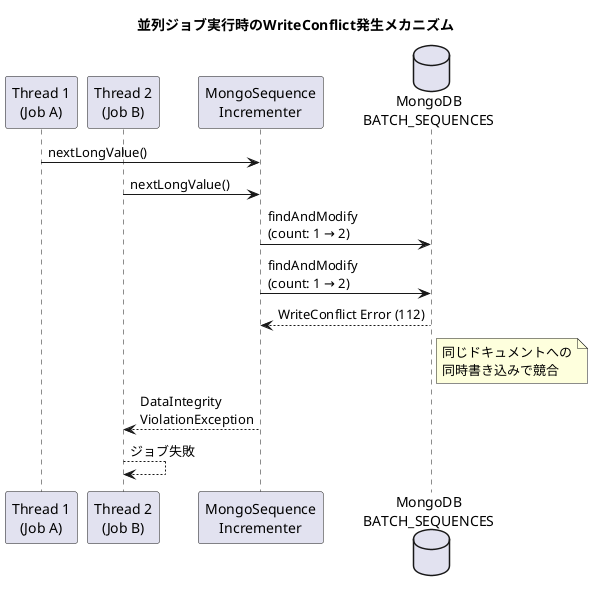
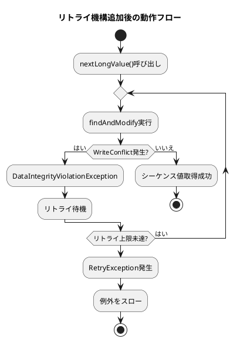

*（このドキュメントは生成AI(Claude Opus 4.5)によって2026年1月21日に生成されました）*

## 課題概要

### 問題の背景

Spring Batchでは、ジョブの実行情報を管理するために**JobRepository**を使用します。MongoDBをバックエンドとして使用する場合、`MongoDBJobRepository`がジョブインスタンスIDやジョブ実行IDなどのシーケンス値を生成します。

**シーケンス生成の仕組み**:
- `MongoSequenceIncrementer`クラスが`BATCH_SEQUENCES`コレクションを使用
- `findAndModify`操作でアトミックにカウンターをインクリメント
- 複数のジョブが同時に実行されると、同じシーケンスドキュメントへの同時アクセスが発生

### 問題の内容

複数のSpring Batchジョブを並列実行すると、MongoDBの**WriteConflict（書き込み競合）エラー**が発生し、ジョブが`DataIntegrityViolationException`で失敗します。



### 影響範囲

| 項目 | 内容 |
|------|------|
| 影響を受けるコンポーネント | `MongoSequenceIncrementer`, `MongoJobInstanceDao` |
| 発生条件 | 複数スレッドからの並列ジョブ実行 |
| エラーコード | MongoDB WriteConflict (Error 112) |
| 例外 | `DataIntegrityViolationException` |

---

## 原因

`MongoSequenceIncrementer`の`findAndModify`操作が、並行アクセスパターンを適切に処理できていませんでした。

MongoDBでは、同一ドキュメントに対する複数の書き込み操作が同時に発生すると、WriteConflict（エラーコード112）が発生します。これは一時的なエラーであり、リトライすることで解決できるケースがほとんどですが、元の実装にはリトライ機構がありませんでした。

---

## 対応方針

### 修正内容（PR [#5145](https://github.com/spring-projects/spring-batch/pull/5145)）

`MongoSequenceIncrementer`クラスに**リトライ機構**を追加しました。

#### 変更のポイント

1. **`RetryTemplate`の導入**: Spring Coreの`RetryTemplate`を使用してリトライ処理を実装
2. **リトライ対象例外の指定**: `DataIntegrityViolationException`をリトライ対象として設定
3. **例外ハンドリングの改善**: `RetryException`をキャッチし、適切な例外に変換

```java
// 追加されたRetryTemplate
private final RetryTemplate retryTemplate = new RetryTemplate(
    RetryPolicy.builder().includes(DataIntegrityViolationException.class).build());

// リトライ付きのnextLongValue()実装
@Override
public long nextLongValue() throws DataAccessException {
    try {
        return retryTemplate.execute(() -> 
            mongoTemplate.execute("BATCH_SEQUENCES", collection -> collection
                .findOneAndUpdate(
                    new Document("_id", sequenceName), 
                    new Document("$inc", new Document("count", 1)),
                    new FindOneAndUpdateOptions().returnDocument(ReturnDocument.AFTER))
                .getLong("count")));
    } catch (RetryException e) {
        Throwable cause = e.getCause();
        if (cause instanceof DataAccessException ex) {
            throw ex;
        } else {
            throw new RuntimeException("Failed to retrieve next value of sequence", e);
        }
    }
}
```

### 修正後の動作フロー



### 2つのPRの方針比較

| 項目 | PR [#5145](https://github.com/spring-projects/spring-batch/pull/5145) | PR [#5144](https://github.com/spring-projects/spring-batch/pull/5144) |
|------|------|------|
| アプローチ | リトライ機構の追加 | TSID（Time-Sorted ID）の導入 |
| 後方互換性 | ✅ 維持 | ⚠️ 破壊的変更 |
| 採用バージョン | 6.0.2 / 5.2.5 | v7（将来） |
| 効果 | 競合を「緩和」 | 競合を「排除」 |

最終的に、後方互換性を維持する[#5145](https://github.com/spring-projects/spring-batch/pull/5145)が6.0.2にマージされ、5.2.5にもバックポートされました。

---

## バグの発生タイミング

| 項目 | 内容 |
|------|------|
| バグ発生バージョン | Spring Batch 5.2.0以降（MongoDB対応が追加されたバージョン） |
| 報告されたバージョン | Spring Batch 5.2.2 |
| 修正バージョン | Spring Batch 6.0.2 / 5.2.5 |
| 関連コミット | [d0aef64](https://github.com/spring-projects/spring-batch/commit/d0aef64e33ae3f9189ac447bed730c2c714bd82b), [eac1ff5](https://github.com/spring-projects/spring-batch/commit/eac1ff5e85b5b22d841dcfce62afc87e233ce762), [efbce13](https://github.com/spring-projects/spring-batch/commit/efbce13f0faf512f22281f8e54c3d637b2eacd5c) |
