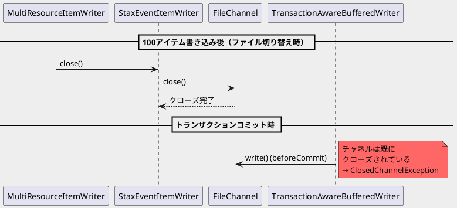
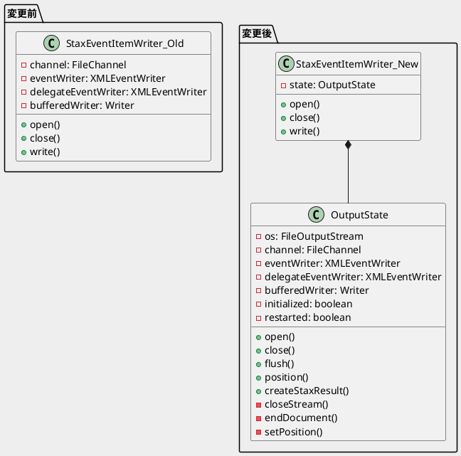

*（このドキュメントは生成AI(Claude Opus 4.5)によって2026年1月22日に生成されました）*

## 課題概要

`StaxEventItemWriter`と`MultiResourceItemWriter`を組み合わせて使用した際に、`ClosedChannelException`が発生するバグです。

### 背景知識

| コンポーネント | 説明 |
|--------------|------|
| `StaxEventItemWriter` | XMLファイルにデータを書き込むためのItemWriter。StAX（Streaming API for XML）を使用 |
| `MultiResourceItemWriter` | 複数ファイルに分割して書き込むためのラッパー。指定件数ごとに新しいファイルを作成 |
| `TransactionAwareBufferedWriter` | トランザクション対応のバッファ付きライター。コミット時にファイルに書き込む |

### 問題のシナリオ



### 期待される動作 vs 実際の動作

| 項目 | 期待される動作 | 実際の動作 |
|------|--------------|-----------|
| 出力 | 100個のXMLファイルが作成される | `ClosedChannelException`で失敗 |
| `.transactional(false)`設定時 | - | 正常に動作 |

## 原因

`StaxEventItemWriter`と`MultiResourceItemWriter`を組み合わせた場合、以下の問題が発生していました：

1. `MultiResourceItemWriter`がファイル切り替え時に`StaxEventItemWriter.close()`を呼び出す
2. `close()`でファイルチャネルがクローズされる
3. しかし、トランザクション対応モードでは`TransactionAwareBufferedWriter`がトランザクションコミット時（`beforeCommit`）にバッファ内容をファイルに書き込もうとする
4. この時点でチャネルは既にクローズされているため、`ClosedChannelException`が発生

**根本原因**: ファイル出力に関連する状態（チャネル、ライター、イベントライター）がクラスのフィールドとして管理されており、`MultiResourceItemWriter`による複数回のopen/closeサイクルを適切に処理できなかった。

## 対応方針

### diffファイル分析結果

コミット [5dc40a6](https://github.com/spring-projects/spring-batch/commit/5dc40a6b97dfb2dd3f556913d5ec60f0ba94acfb) で、`StaxEventItemWriter`のアーキテクチャが大幅にリファクタリングされました。

#### 主な変更内容

**1. 新しい内部クラス`OutputState`の導入**

ファイル出力に関する状態を専用クラスにカプセル化：

```java
protected class OutputState {
    private @Nullable FileOutputStream os;
    private @Nullable FileChannel channel;
    private @Nullable Writer bufferedWriter;
    private @Nullable XMLEventWriter eventWriter;
    private @Nullable XMLEventWriter delegateEventWriter;
    private boolean initialized = false;
    private boolean restarted = false;
    
    // メソッド: open(), close(), flush(), position(), createStaxResult() など
}
```

**2. 状態管理の変更**

| 変更前 | 変更後 |
|--------|--------|
| `channel`, `eventWriter`, `delegateEventWriter`, `bufferedWriter`がクラスフィールド | `OutputState`インスタンスとして管理 |
| `close()`でフィールドは残存 | `close()`で`state = null`に設定 |
| 複数回のopen/closeで状態が混在 | 各open/closeサイクルで独立した状態 |

**3. リソース管理の改善**

- `FileOutputStream`も明示的に管理・クローズ
- `closeStream()`メソッドで`channel`と`os`の両方をクローズ
- `endDocument()`メソッドを`OutputState`クラス内に移動

**4. 初期化チェックの強化**

```java
// 変更前
if (!this.initialized) {
    throw new WriterNotOpenException(...);
}

// 変更後
if (!initialized || state == null || !state.isInitialized()) {
    throw new WriterNotOpenException(...);
}
```

#### テストの追加

`TransactionalStaxEventItemWriterTests`に新しいテストケースが追加されました：
- `shouldWriteThreeSeparateFilesWhenMultipleOpenCloseAndResourceSwitchInSingleTransaction`
- 1つのトランザクション内で複数回のopen/close/リソース切り替えが正しく動作することを検証

### アーキテクチャの変更（図解）



## バグの発生タイミング

- **発生バージョン**: Spring Batch 5.2.3、5.2.4、6.0.0（複数バージョンで再現）
- **修正コミット**: [5dc40a6](https://github.com/spring-projects/spring-batch/commit/5dc40a6b97dfb2dd3f556913d5ec60f0ba94acfb)
- **バックポート対象**: 5.2.xブランチ（ラベル: `for: backport-to-5.2.x`）
- **関連Issue**: [#5176](https://github.com/spring-projects/spring-batch/issues/5176)（詳細分析）、[#5177](https://github.com/spring-projects/spring-batch/issues/5177)（修正PR）

### 回避策（修正前のバージョン）

`.transactional(false)`を設定することで、問題を回避できます：

```java
new StaxEventItemWriterBuilder<Foo>()
    .name("fooWriter")
    .marshaller(marshaller())
    .rootTagName("foos")
    .transactional(false)  // 回避策
    .resource(new FileSystemResource("foo/foo.xml"))
    .build();
```
