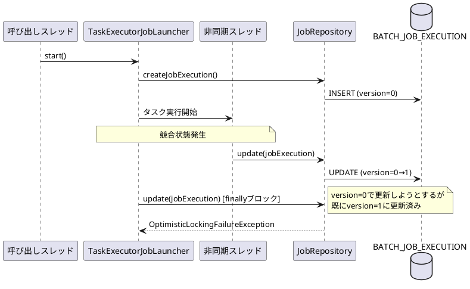

*（このドキュメントは生成AI(Claude Opus 4.5)によって2026年1月20日に生成されました）*

## 課題概要

Spring Batchで`JobOperator.start()`を使用し、`asyncTaskExecutor`（非同期タスク実行器）でジョブを起動する際に、断続的に`OptimisticLockingFailureException`（楽観的ロック失敗例外）が発生するバグです。

### Spring Batchとは
Spring Batchは、大量データのバッチ処理を行うためのフレームワークです。ジョブ（Job）はバッチ処理の単位で、`JobOperator`はジョブの起動・停止などを管理するコンポーネントです。

### 問題の詳細

`TaskExecutorJobLauncher`が非同期でジョブを実行する際、以下のレースコンディション（競合状態）が発生します：



| バージョン | 問題 |
|------------|------|
| Spring Batch 5.x | finallyブロックがなく、問題なし |
| Spring Batch 6.0.0/6.0.1 | #3637の変更でfinallyブロックが追加され、レースコンディション発生 |

## 原因

#3637で追加されたfinallyブロック内の`jobRepository.update(jobExecution)`が、非同期タスク実行スレッドと競合するため。非同期スレッドが先にジョブ実行状態を更新すると、呼び出しスレッドのfinallyブロックで古いバージョンで更新しようとして例外が発生します。

## 対応方針

**修正コミット**: [b024116](https://github.com/spring-projects/spring-batch/commit/b024116968ac5dd89ea84a8a3048d0e4a39d7519)

`TaskExecutorJobLauncher.java`のfinallyブロックを削除し、`jobRepository.update(jobExecution)`の呼び出しを`TaskRejectedException`のcatchブロック内のみに限定しました。

```java
// 修正前
catch (TaskRejectedException e) {
    jobExecution.upgradeStatus(BatchStatus.FAILED);
    if (jobExecution.getExitStatus().equals(ExitStatus.UNKNOWN)) {
        jobExecution.setExitStatus(ExitStatus.FAILED.addExitDescription(e));
    }
}
finally {
    this.jobRepository.update(jobExecution);  // ← 常に実行されレースコンディション発生
}
```


// 修正後
catch (TaskRejectedException e) {
    jobExecution.upgradeStatus(BatchStatus.FAILED);
    if (jobExecution.getExitStatus().equals(ExitStatus.UNKNOWN)) {
        jobExecution.setExitStatus(ExitStatus.FAILED.addExitDescription(e));
    }
    this.jobRepository.update(jobExecution);  // ← 拒否された場合のみ更新
}
// finallyブロック削除
```

これにより、正常にタスクがスケジュールされた場合は非同期スレッド側でのみジョブ実行状態が更新され、レースコンディションが解消されます。

## バグの発生タイミング

- **バグが発生したSpring Batchのバージョン**: 6.0.0, 6.0.1
- **バグが発生したコミット**: #3637に関連する変更（finallyブロックの追加）

---

## 更新履歴

- 2026-01-20: 初版作成
