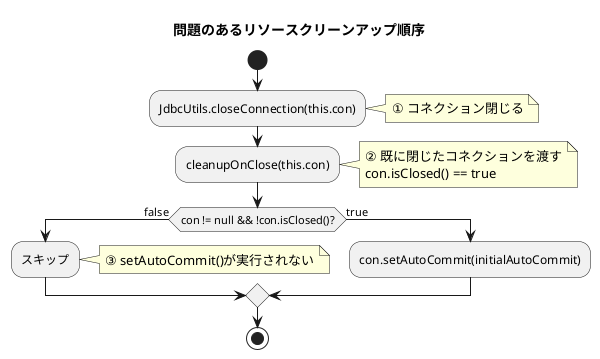

*（このドキュメントは生成AI(Claude Opus 4.5)によって2026年1月20日に生成されました）*

## 課題概要

`AbstractCursorItemReader`の`doClose()`メソッドで、JDBCリソースのクリーンアップ順序が不正であり、一貫性のない動作を引き起こすバグです。

### AbstractCursorItemReaderとは
Spring Batchが提供するカーソルベースのItemReaderの抽象クラスです。大量データを効率的に読み取るため、データベースカーソルを使用してデータを1件ずつ取得します。

### 問題の詳細

`doClose()`メソッドでリソースを閉じる際、以下の順序で処理が行われていました：



| 処理順序 | 問題 |
|----------|------|
| 1. `closeConnection()` | コネクションが先に閉じられる |
| 2. `cleanupOnClose()` | 閉じたコネクションに対して呼び出される |
| 3. `setAutoCommit()` | コネクションが閉じているためスキップされる |

### 責任の所在の問題

現在の実装では、コネクションの所有権が混在しています：

- 親クラス（`AbstractCursorItemReader`）がコネクションを作成
- 子クラス（`JdbcCursorItemReader`等）がカーソルレベルのクリーンアップを実行
- しかし子クラスがコネクションも閉じてしまう

リソースを作成したコンポーネントがそのリソースを閉じるべきという原則に反しています。

## 原因

`cleanupOnClose()`メソッド内で`JdbcUtils.closeConnection()`が呼び出されており、親クラスが管理すべきコネクションを子クラスが閉じてしまうため。

## 対応方針

**修正PR**: [#5110](https://github.com/spring-projects/spring-batch/pull/5110)

`JdbcCursorItemReader`と`StoredProcedureItemReader`の`cleanupOnClose()`メソッドから`JdbcUtils.closeConnection()`の呼び出しを削除し、コネクション管理を親クラスに委ねるよう変更しました。

```java
// 修正前
@Override
protected void cleanupOnClose(Connection connection) {
    JdbcUtils.closeStatement(this.preparedStatement);
    JdbcUtils.closeConnection(connection);  // ← 削除
}
```

```java
// 修正後
/**
 * Releases JDBC resources associated with this reader.
 * Closes the PreparedStatement used for the cursor.
 * The Connection is not closed here; it is managed by the parent class.
 *
 * @param connection the active database connection used for the cursor
 */
@Override
protected void cleanupOnClose(Connection connection) {
    JdbcUtils.closeStatement(this.preparedStatement);
    // コネクションは親クラスで管理
}
```

これにより、リソースの所有権モデルが明確になり、正しい順序でリソースがクリーンアップされます。

## バグの発生タイミング

- **バグが発生したSpring Batchのバージョン**: 6.0.0

---

## 更新履歴

- 2026-01-20: 初版作成
