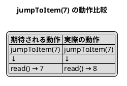
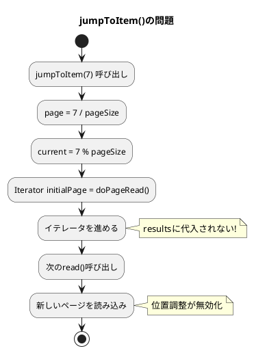

*（このドキュメントは生成AI(Claude Opus 4.5)によって2026年1月20日に生成されました）*

## 課題概要

`AbstractPaginatedDataItemReader`の`jumpToItem(int itemLastIndex)`メソッドが、ステップの再起動時に正しくリーダーの位置を復元しないバグです。

### AbstractPaginatedDataItemReaderとは
Spring Batchが提供するページング方式のItemReaderの抽象クラスです。大量データをページ単位で読み取り、メモリ効率を向上させます。`jumpToItem()`メソッドは、再起動時に前回の読み取り位置にスキップするために使用されます。

### 問題の詳細

#### 問題1: Off-by-one（ずれ1）エラー

ループ条件が`current >= 0`のため、イテレータが1回多く進んでしまいます：

```java
// 問題のあるコード
for (; current >= 0; current--) {
    initialPage.next();
}
```

| 呼び出し | 期待される結果 | 実際の結果 |
|----------|----------------|------------|
| `jumpToItem(7)` → `read()` | 7 | 8 |



#### 問題2: イテレータがリーダー状態に保存されない

`jumpToItem()`内でイテレータを進めても、`results`フィールドに代入されません。次の`read()`呼び出し時に新しいページが読み込まれ、位置調整が無効になります。



## 原因

1. ループ条件`current >= 0`が1回多くイテレータを進める
2. 進めたイテレータを`results`フィールドに代入していない

## 対応方針

**修正PR**: [#5137](https://github.com/spring-projects/spring-batch/pull/5137)  
**修正コミット**: [d5fbb54](https://github.com/spring-projects/spring-batch/commit/d5fbb5493b78844fc8f8cf03a5eaafca380b34e1)

以下の2点を修正：

```java
// 修正前
for (; current >= 0; current--) {
    initialPage.next();
}
// resultsへの代入なし
```

```java
// 修正後
for (; current > 0; current--) {  // >= を > に変更
    initialPage.next();
}
this.results = initialPage;  // イテレータを保存
```

### 修正内容の詳細

| 修正箇所 | 修正前 | 修正後 |
|----------|--------|--------|
| ループ条件 | `current >= 0` | `current > 0` |
| イテレータ保存 | なし | `this.results = initialPage` |

また、以下のテストケースが追加されました：

- `jumpToItem_shouldReadExactItem_afterJump()` - 通常のジャンプ
- `jumpToItem_zeroIndex()` - インデックス0へのジャンプ
- `jumpToItem_lastItemInPage()` - ページ末尾へのジャンプ
- `jumpToItem_firstItemOfNextPage()` - 次ページ先頭へのジャンプ

## バグの発生タイミング

- **バグが発生したSpring Batchのバージョン**: 5.x, 6.0.0

---

## 更新履歴

- 2026-01-20: 初版作成
