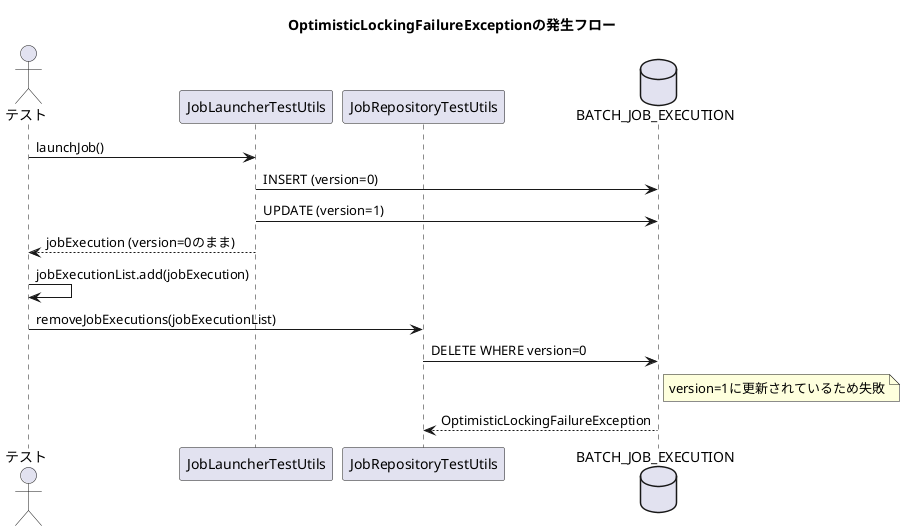

*（このドキュメントは生成AI(Claude Opus 4.5)によって2026年1月20日に生成されました）*

## 課題概要

Spring Batch 5.2.3以降で、テストのクリーンアップ時に`JobRepositoryTestUtils.removeJobExecutions()`を呼び出すと`OptimisticLockingFailureException`（楽観的ロック失敗例外）がスローされるバグです。

### JobRepositoryTestUtilsとは
Spring Batchのテストモジュールが提供するユーティリティクラスで、テスト後にジョブ実行履歴を削除するなど、バッチジョブのテストを支援します。

### 問題の詳細

テスト実行後のクリーンアップで`removeJobExecutions()`を呼び出すと、以下の例外が発生します：

```
org.springframework.dao.OptimisticLockingFailureException: 
Attempt to delete step execution id=95106 with wrong version (1)
```



| バージョン | 動作 |
|------------|------|
| Spring Batch 5.2.2以前 | 問題なく削除可能 |
| Spring Batch 5.2.3以降 | 楽観的ロック例外発生 |

この変更は#4793で導入されましたが、ドキュメントや移行ガイドには記載されていませんでした。

## 原因

#4793の変更により、ジョブ実行中にバージョンが更新されるようになりましたが、テストで保持している`JobExecution`オブジェクトは古いバージョン番号のままです。削除時にバージョン番号の不一致が発生します。

## 対応方針

**修正コミット**: [1d9536c](https://github.com/spring-projects/spring-batch/commit/1d9536cfbabf54b921f5a522beef62e5d0793a97)、[12b16b3](https://github.com/spring-projects/spring-batch/commit/12b16b32adbbf35ead57b5e3b8d0ec84c56789ec)  
**修正PR**: [#5173](https://github.com/spring-projects/spring-batch/pull/5173)

`removeJobExecution()`メソッドで、削除前に最新のバージョンを取得するよう修正しました：

```java
// 修正前
public void removeJobExecution(JobExecution jobExecution) {
    this.jobRepository.deleteJobExecution(jobExecution);
}
```

```java
// 修正後
public void removeJobExecution(JobExecution jobExecution) {
    // query latest version of JobExecution to avoid OptimisticLockingFailureException
    jobExecution = this.jobRepository.getJobExecution(jobExecution.getId());
    if (jobExecution != null) {
        this.jobRepository.deleteJobExecution(jobExecution);
    }
}
```

また、古いバージョン番号でも正しく削除できることを確認するテストケースが追加されました。

## バグの発生タイミング

- **バグが発生したSpring Batchのバージョン**: 5.2.3, 5.2.4, 6.0.0, 6.0.1
- **バグが発生したコミット**: #4793に関連する変更

---

## 更新履歴

- 2026-01-20: 初版作成
