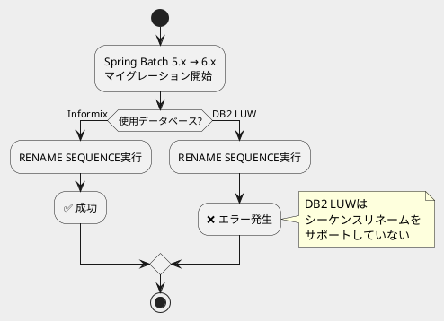

*（このドキュメントは生成AI(Claude Opus 4.5)によって2026年1月22日に生成されました）*

## 課題概要

Spring Batch 6.xへのデータベースマイグレーションスクリプト（`migration-db2.sql`）が、IBM DB2 LUW（Linux, UNIX, Windows版）では正しく動作しないという問題です。

### 背景知識

**シーケンス（Sequence）とは**: データベースで一意の連番を生成するためのオブジェクトです。Spring Batchでは、ジョブやステップの実行IDを生成するためにシーケンスを使用しています。

**DB2の種類**:

| DB2の種類 | 説明 | シーケンスリネームのサポート |
|-----------|------|------------------------------|
| Informix | IBM製の別系統データベース | ✅ サポート |
| DB2 LUW | Linux/UNIX/Windows版DB2（10.1以降） | ❌ 非サポート |

### 問題の詳細

Spring Batch 6.0のマイグレーションスクリプトには、以下のSQLが含まれています：

```sql
RENAME SEQUENCE BATCH_JOB_SEQ TO BATCH_JOB_INSTANCE_SEQ;
```

このRENAME文はInformixでは動作しますが、IBM DB2 LUW（10.1以降）では[サポートされていません](https://www.ibm.com/docs/en/db2/12.1.x?topic=statements-rename)。



## 原因

マイグレーションスクリプト（`migration-db2.sql`）のRENAME SEQUENCE文が、Informixサーバー専用の構文であり、IBM DB2 LUW（10.1以降）では使用できないにもかかわらず、その旨がドキュメント化されていなかったため。

## 対応方針

### diffファイル分析結果

コミット [b9a96a6](https://github.com/spring-projects/spring-batch/commit/b9a96a64386139f433881ffffe1895a616bdcce0) で、`migration-db2.sql`にDB2 LUWユーザー向けの注記が追加されました。

**変更前:**
```sql
-- IBM DB2 LUW (10.1+)
RENAME SEQUENCE BATCH_JOB_SEQ TO BATCH_JOB_INSTANCE_SEQ;
```

**変更後:**
```sql
-- The following is only applicable to Informix servers.
-- IBM DB2 LUW (10.1+) does not support sequence renaming: https://www.ibm.com/docs/en/db2/12.1.x?topic=statements-rename
-- To address this limitation, use a stored procedure or a Java-based program that retrieves
-- the last sequence number and creates a new sequence starting from that value.
RENAME SEQUENCE BATCH_JOB_SEQ TO BATCH_JOB_INSTANCE_SEQ;
```

### DB2 LUWユーザーへの回避策

DB2 LUWを使用している場合、以下のような代替手順を実施する必要があります：

1. 現在のシーケンス（`BATCH_JOB_SEQ`）の最後の値を取得
2. その値から開始する新しいシーケンス（`BATCH_JOB_INSTANCE_SEQ`）を作成
3. 古いシーケンス（`BATCH_JOB_SEQ`）を削除

この手順は、ストアドプロシージャまたはJavaプログラムで実装することが推奨されています。

### ドキュメント更新

- マイグレーションスクリプト自体に注記を追加
- [マイグレーションガイド](https://github.com/spring-projects/spring-batch/wiki/Spring-Batch-6.0-Migration-Guide/f46f3703ae89f7996be06d058883bdf6bb1fec06#database-schema-changes)にも同様の情報を追記

## バグの発生タイミング

- **発生バージョン**: Spring Batch 6.0（6.x系全般）
- **対象データベース**: IBM DB2 LUW 10.1以降
- **修正コミット**: [b9a96a6](https://github.com/spring-projects/spring-batch/commit/b9a96a64386139f433881ffffe1895a616bdcce0)

※ 本件はコードのバグではなく、ドキュメント・注記の不足に対する修正です。
