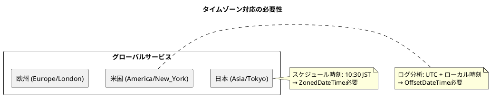

*（このドキュメントは生成AI(Claude Opus 4.5)によって2026年1月20日に生成されました）*

## 課題概要

`JobParametersConverter`に`ZonedDateTime`と`OffsetDateTime`のサポートを追加する機能リクエストです。

### JobParametersとは
Spring Batchでジョブを実行する際に渡すパラメータです。ジョブの識別や実行条件の設定に使用されます。`JobParametersConverter`はこれらのパラメータを文字列とオブジェクト間で変換する役割を担います。

### 問題の詳細

現在のSpring Batchでは、以下の日時型のみがサポートされています：

| サポート済み | 未サポート |
|--------------|------------|
| `LocalDateTime` | `ZonedDateTime` |
| `LocalDate` | `OffsetDateTime` |
| `LocalTime` | |



### ユースケース

1. **グローバルサービスでのタイムゾーン指定バッチ実行**
2. **ログ分析でのUTCとローカル時刻の両方が必要なケース**
3. **複数国対応サービスでの国別タイムゾーン情報の保持**

### 現状の回避策の問題点

| 回避策 | 問題点 |
|--------|--------|
| `LocalDateTime`に変換 | タイムゾーン情報が失われる |
| `String`型を使用 | 型安全性がない、エラーが発生しやすい |
| `Date`型を使用 | レガシーAPI、非推奨 |

## 原因

Spring Batchの`DefaultJobParametersConverter`に`ZonedDateTime`と`OffsetDateTime`用のコンバーターが登録されていなかったため。

## 対応方針

**修正コミット**: [077a332](https://github.com/spring-projects/spring-batch/commit/077a33238b8990e6993fb29a35dc9204b315a339)、[868849e](https://github.com/spring-projects/spring-batch/commit/868849e9911782899affd01d4a70b7b31d18c242)  
**修正PR**: [#5186](https://github.com/spring-projects/spring-batch/pull/5186)

Spring Frameworkの`DefaultFormattingConversionService`を活用するよう、アーキテクチャを改善しました：

1. **`ConversionServiceFactory`クラスの新規作成**
   - `DefaultFormattingConversionService`をベースにしたコンバージョンサービスを作成
   - `DateTimeFormatterRegistrar`でISO形式を設定
   - `Date`型用のカスタム`DateFormatter`も登録

2. **既存のカスタムコンバーターを非推奨化**
   - `DateToStringConverter`、`StringToDateConverter`など
   - 6.3以降で削除予定

3. **サポートされる日時型とフォーマット**

| 型 | フォーマット |
|----|--------------|
| `LocalDate` | `ISO_LOCAL_DATE` |
| `LocalTime` | `ISO_LOCAL_TIME` |
| `LocalDateTime` | `ISO_LOCAL_DATE_TIME` |
| `ZonedDateTime` | `ISO_ZONED_DATE_TIME` |
| `OffsetDateTime` | `ISO_OFFSET_DATE_TIME` |
| `Date` | `ISO_INSTANT` |

使用例：
```java
ZonedDateTime scheduleTime = ZonedDateTime.of(2023, 12, 25, 10, 30, 0, 0, ZoneId.of("Asia/Seoul"));
JobParameters parameters = new JobParametersBuilder()
    .addJobParameter("schedule.time", scheduleTime, ZonedDateTime.class, true)
    .toJobParameters();
```

---

## 更新履歴

- 2026-01-20: 初版作成
