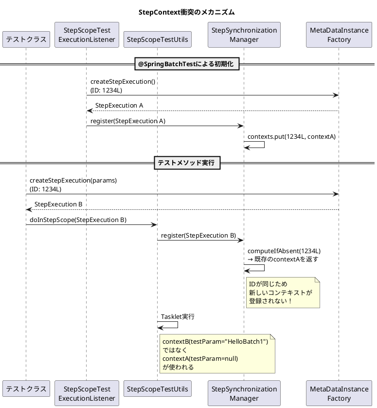
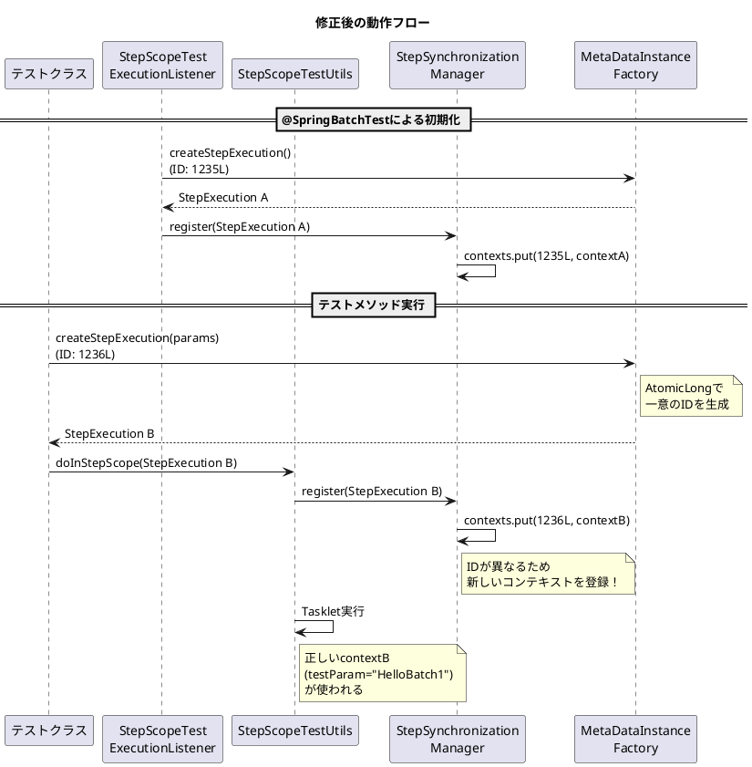

*（このドキュメントは生成AI(Claude Opus 4.5)によって2026年1月21日に生成されました）*

## 課題概要

### 背景知識

Spring Batchのテストにおいて、以下の2つのコンポーネントが重要な役割を果たします：

| コンポーネント | 役割 |
|----------------|------|
| `@SpringBatchTest` | Spring Batchのテスト用アノテーション。内部で`StepScopeTestExecutionListener`を有効化し、`StepExecution`のコンテキストを自動的に管理する |
| `StepScopeTestUtils` | `@StepScope`付きBeanをテストするためのユーティリティ。指定した`StepExecution`のスコープ内でコードを実行できる |
| `MetaDataInstanceFactory` | テスト用の`JobExecution`や`StepExecution`を簡単に作成するファクトリクラス |

### 問題の内容

`@SpringBatchTest`と`StepScopeTestUtils.doInStepScope()`を同時に使用すると、**StepContextの衝突**が発生し、テストで期待したコンテキスト（`JobParameters`など）が使用されないという問題です。



### 問題のポイント

1. `MetaDataInstanceFactory.createStepExecution(jobParameters)`は常に**固定のID（1234L）**を使用
2. `StepExecution.equals()`は`id`のみで等価性を判定
3. `StepSynchronizationManager`は`computeIfAbsent`で登録するため、同一IDは最初に登録されたコンテキストが使われ続ける

---

## 原因

`MetaDataInstanceFactory`が`StepExecution`を作成する際、以下のように**固定のデフォルト値**を使用していたことが原因です：

```java
// 修正前のコード
public static StepExecution createStepExecution(JobParameters jobParameters) {
    JobExecution jobExecution = createJobExecution(DEFAULT_JOB_NAME, DEFAULT_JOB_INSTANCE_ID,
            DEFAULT_JOB_EXECUTION_ID, jobParameters);  // 常に同じID
    StepExecution stepExecution = createStepExecution(jobExecution, DEFAULT_STEP_NAME, 
            DEFAULT_STEP_EXECUTION_ID);  // 常に1234L
    // ...
}
```

これにより、`@SpringBatchTest`の`StepScopeTestExecutionListener`と`StepScopeTestUtils`が作成する`StepExecution`のIDが衝突し、後から登録しようとしたコンテキストが無視されてしまいました。

---

## 対応方針

### 修正内容（PR [#5208](https://github.com/spring-projects/spring-batch/pull/5208)）

`MetaDataInstanceFactory`に**アトミックカウンター**を導入し、呼び出しごとに一意のIDを生成するよう修正しました。

#### 主な変更点

1. **アトミックカウンターの追加**
```java
// 新規追加
private static final AtomicLong jobExecutionIdCounter = new AtomicLong(DEFAULT_JOB_EXECUTION_ID);
private static final AtomicLong stepExecutionIdCounter = new AtomicLong(DEFAULT_STEP_EXECUTION_ID);
```

2. **`createStepExecution(JobParameters)`メソッドの修正**
```java
// 修正後
public static StepExecution createStepExecution(JobParameters jobParameters) {
    Long jobExecutionId = jobExecutionIdCounter.incrementAndGet();  // 1235, 1236, 1237...
    Long stepExecutionId = stepExecutionIdCounter.incrementAndGet();
    JobExecution jobExecution = createJobExecution(DEFAULT_JOB_NAME, DEFAULT_JOB_INSTANCE_ID, 
            jobExecutionId, jobParameters);
    StepExecution stepExecution = createStepExecution(jobExecution, DEFAULT_STEP_NAME, stepExecutionId);
    jobExecution.addStepExecution(stepExecution);
    return stepExecution;
}
```

3. **テストケースの追加**
```java
@Test
void testCreateStepExecutionWithJobParametersShouldGenerateUniqueIds() {
    StepExecution step1 = MetaDataInstanceFactory.createStepExecution(params1);
    StepExecution step2 = MetaDataInstanceFactory.createStepExecution(params2);

    assertNotEquals(step1.getId(), step2.getId());  // IDが異なることを検証
    assertNotEquals(step1.getJobExecutionId(), step2.getJobExecutionId());
    assertNotEquals(step1, step2);  // equals()も異なることを検証
}
```

### 修正後の動作フロー



---

## バグの発生タイミング

| 項目 | 内容 |
|------|------|
| バグ発生バージョン | Spring Batch 5.2.3以降（または6.x） |
| 報告時のバージョン | Spring Batch 6.0.1-SNAPSHOT |
| 修正バージョン | Spring Batch 6.0.2 |
| 修正コミット | [4f8609b](https://github.com/spring-projects/spring-batch/commit/4f8609bf5c7e65a7cb4eccf70730b8c33072d185) |
| 修正PR | [#5208](https://github.com/spring-projects/spring-batch/pull/5208) |

### 回避策（修正前のバージョンを使用する場合）

テストクラス内で`getStepExecution()`メソッドを定義し、一意のIDを持つ`StepExecution`を返すことで回避可能です：

```java
public StepExecution getStepExecution() {
    return MetaDataInstanceFactory.createStepExecution("uniqueStep", -1L);
}
```
