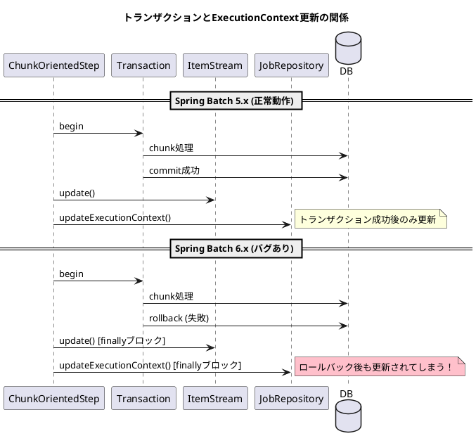
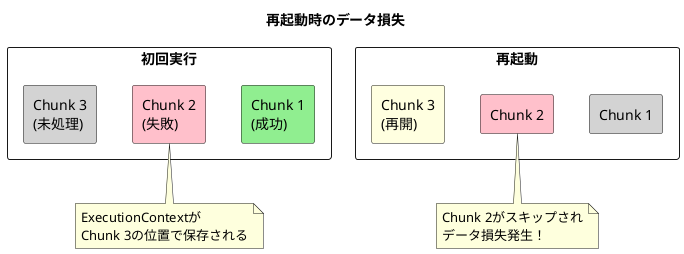

*（このドキュメントは生成AI(Claude Opus 4.5)によって2026年1月20日に生成されました）*

## 課題概要

Spring Batch 6.xの`ChunkOrientedStep`が、チャンク処理が失敗してロールバックした場合でも`ExecutionContext`を更新してしまい、再起動時にデータ損失が発生するバグです。

### ChunkOrientedStepとは
Spring Batch 6.0で新しく導入されたチャンク指向のステップ実装です。データをチャンク（まとまり）単位で読み込み、処理し、書き込むバッチ処理パターンを実現します。

### ExecutionContextとは
バッチ処理の実行状態（読み込み位置、処理済みアイテム数など）を保持するコンテキストです。再起動時にこの情報を使って前回の続きから処理を再開できます。

### 問題の詳細



| バージョン | 動作 |
|------------|------|
| Spring Batch 5.x (TaskletStep) | トランザクション成功後のみ`ExecutionContext`更新 |
| Spring Batch 6.x (ChunkOrientedStep) | finallyブロックで常に更新（バグ） |

### 影響

1. **トランザクションの不整合**: ビジネスデータはロールバックされるが、バッチメタデータ（インデックス/オフセット）は更新される
2. **データ損失**: 再起動時に失敗したチャンクの位置から再開されず、そのチャンクのデータが処理されない



## 原因

`ChunkOrientedStep`の`processChunkSequentially`および`processChunkConcurrently`メソッドで、`itemStream.update()`と`jobRepository.updateExecutionContext()`がfinallyブロック内で呼び出されているため、トランザクションがロールバックしても状態が更新されてしまいます。

## 対応方針

**修正PR**: [#5195](https://github.com/spring-projects/spring-batch/pull/5195)

`processChunkSequentially`と`processChunkConcurrently`のfinallyブロックから`ExecutionContext`更新処理を削除し、`doExecute`メソッド内でトランザクション成功後に更新するよう変更しました：

```java
// 修正前 (processChunkSequentially/processChunkConcurrently内)
finally {
    // apply contribution and update streams
    stepExecution.apply(contribution);
    compositeItemStream.update(stepExecution.getExecutionContext());
    getJobRepository().updateExecutionContext(stepExecution);
}
```

```java
// 修正後 (doExecute内、トランザクション完了後)
this.transactionTemplate.executeWithoutResult(transactionStatus -> {
    // process next chunk
});
getJobRepository().update(stepExecution);
// トランザクション成功後のみ更新
this.compositeItemStream.update(stepExecution.getExecutionContext());
getJobRepository().updateExecutionContext(stepExecution);
```

また、チャンクがロールバックした場合に`ItemStream.update()`が呼び出されないことを確認するテストケースも追加されました。

## バグの発生タイミング

- **バグが発生したSpring Batchのバージョン**: 6.0.0, 6.0.1

---

## 更新履歴

- 2026-01-20: 初版作成
