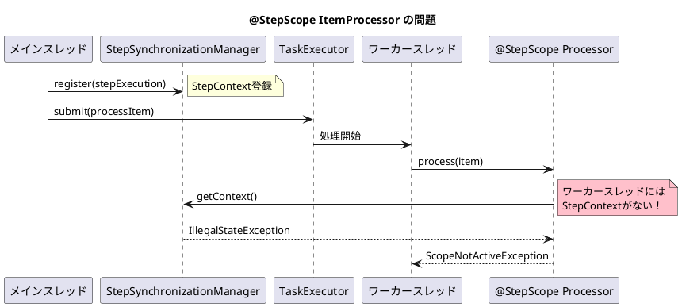

*（このドキュメントは生成AI(Claude Opus 4.5)によって2026年1月20日に生成されました）*

## 課題概要

Spring Batch 6.0のマルチスレッド`ChunkOrientedStep`で、`@StepScope`を付与した`ItemProcessor`を使用すると`ScopeNotActiveException`が発生するバグです。

### @StepScopeとは
Spring Batchが提供するスコープで、ステップ実行時にBeanをインスタンス化します。ジョブパラメータやステップ実行コンテキストにアクセスするために使用します。`@StepScope`付きBeanは実際にはプロキシとして作成され、実行時に`StepContext`から情報を取得します。

### 問題の詳細

`ChunkOrientedStep`が`TaskExecutor`を使ってマルチスレッドで処理する際、ワーカースレッドに`StepContext`が伝播されません。



### エラーメッセージ

```
org.springframework.beans.factory.support.ScopeNotActiveException: 
Error creating bean with name 'scopedTarget.issueReproductionProcessor': 
Scope 'step' is not active for the current thread

Caused by: java.lang.IllegalStateException: 
No context holder available for step scope
```

## 原因

`processChunkConcurrently`メソッドで、`TaskExecutor`にタスクを送信する際に`StepExecution`が`StepSynchronizationManager`に登録されていないため、ワーカースレッドで`StepContext`にアクセスできません。

## 対応方針

**修正コミット**: [2382908](https://github.com/spring-projects/spring-batch/commit/2382908f404a4de714b0be9aa0023f25716e63bd)、[5642911](https://github.com/spring-projects/spring-batch/commit/564291127752f0c107508f853131fc4d8acfd4bd)  
**修正PR**: [#5218](https://github.com/spring-projects/spring-batch/pull/5218)

ワーカースレッド内で`StepSynchronizationManager`に`StepExecution`を登録し、処理完了後にクローズするよう修正しました：

```java
// 修正前
Future<O> itemProcessingFuture = this.taskExecutor.submit(() -> processItem(item, contribution));
```

```java
// 修正後
Future<O> itemProcessingFuture = this.taskExecutor.submit(() -> {
    try {
        // ワーカースレッドにStepContextを登録
        StepSynchronizationManager.register(stepExecution);
        return processItem(item, contribution);
    }
    finally {
        // メモリリーク防止のためクリア
        StepSynchronizationManager.close();
    }
});
```

また、テスト設定の`itemProcessor`に`@StepScope`アノテーションを追加し、マルチスレッド環境でのステップスコープ動作を検証するテストも追加されました。

## バグの発生タイミング

- **バグが発生したSpring Batchのバージョン**: 6.0.0, 6.0.1

---

## 更新履歴

- 2026-01-20: 初版作成
