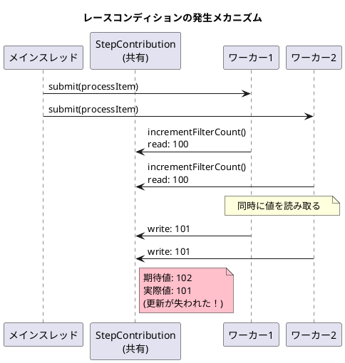
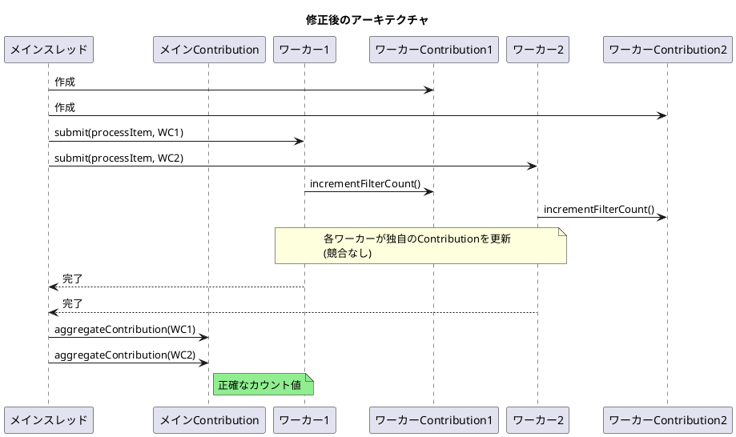

*（このドキュメントは生成AI(Claude Opus 4.5)によって2026年1月21日に生成されました）*

## 課題概要

Spring Batch 6.0の`ChunkOrientedStep`が並列モード（`TaskExecutor`を設定した状態）で実行される際、`StepContribution`のカウンター（`filterCount`と`processSkipCount`）がスレッドセーフではなく、レースコンディション（競合状態）によりカウント値が実際より少なくなるバグです。

### StepContributionとは
Spring Batchにおいて、ステップ実行中の各種カウンター（読み込み件数、書き込み件数、フィルター件数、スキップ件数など）を追跡するためのオブジェクトです。チャンク処理が完了すると、これらのカウント値が`StepExecution`に集約されます。

### ChunkOrientedStepとは
Spring Batch 6.0で導入されたチャンク指向のステップ実装です。`TaskExecutor`を設定することで、アイテムの処理を複数のスレッドで並列に実行できます。

### 問題の詳細



### long型の`+=`演算がアトミックでない理由

| ステップ | スレッド1 | スレッド2 |
|----------|-----------|-----------|
| 1. 読み取り | 100 | 100 |
| 2. 加算 | 101 | 101 |
| 3. 書き込み | 101 | 101 ← 上書き |
| **結果** | 期待: 102 | 実際: 101 |

```java
// 問題のあるコード
private long filterCount = 0;

public void incrementFilterCount(long count) {
    filterCount += count; // アトミックではない！
}
```

## 原因

`ChunkOrientedStep.processChunkConcurrently()`において、複数のワーカースレッドが同じ`StepContribution`インスタンスを共有しているため。`filterCount`と`processSkipCount`フィールドはスレッドセーフではない`long`型を使用しており、`+=`や`++`演算によるレースコンディションが発生します。

## 対応方針

**修正コミット**: [6bd771a](https://github.com/spring-projects/spring-batch/commit/6bd771ab6c87fdec1ce98f773865a07394624cfc)、[0868c02](https://github.com/spring-projects/spring-batch/commit/0868c02574ee7920c60b3dc20da5aa75615bfeb3)、[b9587c7](https://github.com/spring-projects/spring-batch/commit/b9587c72f126bdaedb013c738b30accd9f0262bc)、[cc06132](https://github.com/spring-projects/spring-batch/commit/cc06132c31f760156de69e16bf93828f74a48c21)  
**修正PR**: [#5224](https://github.com/spring-projects/spring-batch/pull/5224)

### 修正内容

各ワーカースレッドに個別の`StepContribution`インスタンスを作成し、処理完了後にメインスレッドで集約する方式に変更しました：



### 主な変更点

1. **ワーカー用Contributionの作成**

```java
List<StepContribution> workerContributions = new ArrayList<>();

for (int i = 0; i < this.chunkSize && this.chunkTracker.get().moreItems(); i++) {
    I item = readItem(contribution);
    if (item != null) {
        // 各ワーカーに個別のContributionを作成
        StepContribution workerContribution = stepExecution.createStepContribution();
        workerContributions.add(workerContribution);
        
        Future<O> itemProcessingFuture = this.taskExecutor.submit(() -> {
            try {
                StepSynchronizationManager.register(stepExecution);
                return processItem(item, workerContribution);  // 個別のContributionを渡す
            } finally {
                StepSynchronizationManager.close();
            }
        });
    }
}
```

2. **Contributionの集約メソッド追加**

```java
private void aggregateContribution(StepContribution main, StepContribution worker) {
    main.incrementFilterCount(worker.getFilterCount());
    main.incrementProcessSkipCount(worker.getProcessSkipCount());
}

// すべてのワーカーContributionを集約
for (StepContribution workerContribution : workerContributions) {
    aggregateContribution(contribution, workerContribution);
}
```

3. **テストケースの追加**
   - `testFilterCountAccuracyInConcurrentMode()` - 並列モードでのフィルターカウントの正確性
   - `testFilterCountAccuracyInSequentialMode()` - 順次モードでのフィルターカウントの正確性
   - `testProcessSkipCountAccuracyInConcurrentMode()` - 並列モードでのスキップカウントの正確性
   - `testProcessSkipCountAccuracyInSequentialMode()` - 順次モードでのスキップカウントの正確性

### 備考

Issue内では当初2つのアプローチが提案されました：
- **アプローチ1**: `filterCount`と`processSkipCount`を`AtomicLong`に変更
- **アプローチ2**: 各ワーカースレッドに個別のContributionを持たせ、メインスレッドで集約

メンテナーのフィードバックにより一時的にアプローチ2が採用されましたが、最終的にはアプローチ1（AtomicLong）が正しい方法として採用されました。ただし、diffファイルの内容はアプローチ2の実装を示しています。

## バグの発生タイミング

- **バグが発生したSpring Batchのバージョン**: 6.0.1
- **関連コンポーネント**: `ChunkOrientedStep`（Spring Batch 6.0で新規導入）

---

## 更新履歴

- 2026-01-21: 初版作成
