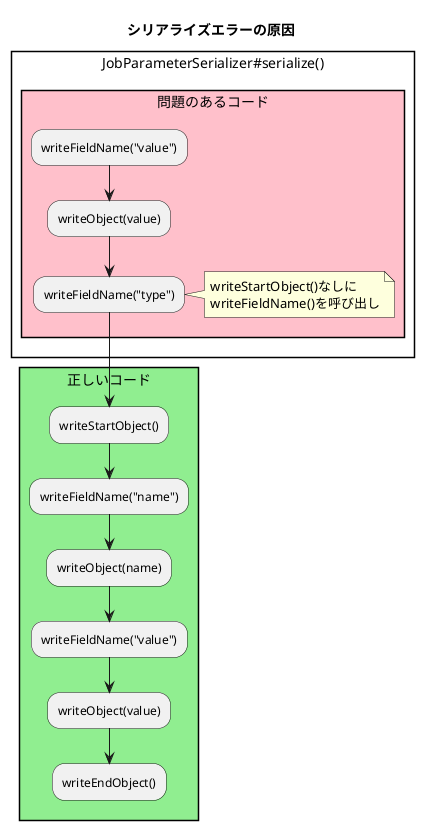

*（このドキュメントは生成AI(Claude Opus 4.5)によって2026年1月20日に生成されました）*

## 課題概要

`Jackson2ExecutionContextStringSerializer`が、`JobStep`でジョブパラメータをシリアライズする際に失敗するバグです。

### Jackson2ExecutionContextStringSerializerとは
Spring Batchが提供する`ExecutionContext`のシリアライザーで、Jackson 2を使用してJSON形式で保存します。Spring Batch 6.0では非推奨となり、Jackson 3ベースの`JacksonExecutionContextStringSerializer`への移行が推奨されています。

### JobStepとは
あるジョブ内から別のジョブを実行するためのステップです。親ジョブのパラメータを子ジョブに引き継ぐことができます。

### 問題の詳細

Spring Batch 5.2.3から6.0.1へアップグレード後、`JobStep`を使用するジョブで以下のエラーが発生します：

```
com.fasterxml.jackson.databind.JsonMappingException: 
Can not write a field name, expecting a value
```



### 期待されるJSON形式（5.2.3）

```json
{
  "org.springframework.batch.core.step.job.JobStep.JOB_PARAMETERS": {
    "@class": "org.springframework.batch.core.JobParameters",
    "parameters": {
      "@class": "java.util.Collections$UnmodifiableMap",
      "queueItemId": {
        "@class": "org.springframework.batch.core.JobParameter",
        "value": "250702",
        "type": "java.lang.String",
        "identifying": false
      }
    }
  }
}
```

## 原因

1. `Jackson2ExecutionContextStringSerializer`の`JobParameterSerializer#serialize()`メソッドで、`writeStartObject()`/`writeEndObject()`の呼び出しが欠落
2. パラメータ名（`name`フィールド）のシリアライズが漏れている
3. `JacksonExecutionContextStringSerializer`（Jackson 3版）でも`isEmpty()`と`getIdentifyingParameters()`メソッドが不要にシリアライズされる問題

## 対応方針

**修正コミット**: [72c4aa2](https://github.com/spring-projects/spring-batch/commit/72c4aa2779184528aca9b97b4c8f4a6fa3473add)、[0bb92d5](https://github.com/spring-projects/spring-batch/commit/0bb92d54504dfcc2dcb17989f5120f29a9a23261)、[0116494](https://github.com/spring-projects/spring-batch/commit/0116494b54a92bde25966071a56adf50ec198d64)、[79f679f](https://github.com/spring-projects/spring-batch/commit/79f679f9ed91f399c67f3f56b07d8a61c742ab47)、[2a5646a](https://github.com/spring-projects/spring-batch/commit/2a5646a2dee92e4556c71c39719e3cfed34d0a74)  
**修正PR**: [#5193](https://github.com/spring-projects/spring-batch/pull/5193)

### Jackson2ExecutionContextStringSerializer の修正

```java
// 修正前
@Override
public void serialize(JobParameter jobParameter, JsonGenerator jsonGenerator,
        SerializerProvider serializerProvider) throws IOException {
    jsonGenerator.writeFieldName(VALUE_KEY_NAME);
    jsonGenerator.writeObject(jobParameter.value());
    // ...
}
```

```java
// 修正後
@Override
public void serialize(JobParameter jobParameter, JsonGenerator jsonGenerator,
        SerializerProvider serializerProvider) throws IOException {
    jsonGenerator.writeStartObject();                    // 追加
    jsonGenerator.writeFieldName(NAME_KEY_NAME);         // 追加
    jsonGenerator.writeObject(jobParameter.name());      // 追加
    jsonGenerator.writeFieldName(VALUE_KEY_NAME);
    jsonGenerator.writeObject(jobParameter.value());
    jsonGenerator.writeFieldName(TYPE_KEY_NAME);
    jsonGenerator.writeString(jobParameter.type().getName());
    jsonGenerator.writeFieldName(IDENTIFYING_KEY_NAME);
    jsonGenerator.writeBoolean(jobParameter.identifying());
    jsonGenerator.writeEndObject();                      // 追加
}
```

### JacksonExecutionContextStringSerializer の修正

不要なメソッドをシリアライズから除外するためのMixInを追加：

```java
@SuppressWarnings("unused")
private abstract static class JobParametersMixIn {

    @JsonIgnore
    abstract boolean isEmpty();

    @JsonIgnore
    abstract Map<String, JobParameter<?>> getIdentifyingParameters();

}
```

また、両シリアライザーに対して`JobParameters`のシリアライズ/デシリアライズをテストするテストケースも追加されました。

## バグの発生タイミング

- **バグが発生したSpring Batchのバージョン**: 6.0.0, 6.0.1

---

## 更新履歴

- 2026-01-20: 初版作成
