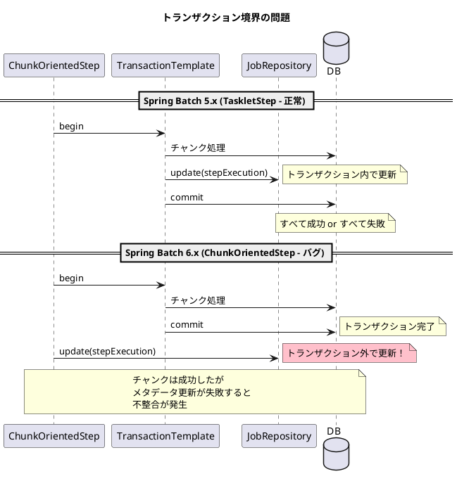

*（このドキュメントは生成AI(Claude Opus 4.5)によって2026年1月20日に生成されました）*

## 課題概要

Spring Batch 6.0の`ChunkOrientedStep#doExecute`が、チャンクトランザクション境界の外で`StepExecution`を更新してしまい、トランザクションの一貫性が保たれないバグです。

### 問題の詳細

`ChunkOrientedStep#doExecute`では、チャンク処理のトランザクションが完了した後に`JobRepository.update(stepExecution)`が呼び出されます。これにより、チャンク処理とステップ実行の永続化がアトミック（不可分）ではなくなります。



### 影響

| シナリオ | 結果 |
|----------|------|
| チャンク処理成功、メタデータ更新成功 | 正常 |
| チャンク処理失敗 | 正常にロールバック |
| チャンク処理成功、メタデータ更新失敗 | **不整合発生** |

チャンク処理は完了しているのにメタデータが更新されていない状態が発生し得ます。

## 原因

PR [#5165](https://github.com/spring-projects/spring-batch/pull/5165)の変更により、`JobRepository.update(stepExecution)`がトランザクション外に配置されたため。

## 対応方針

**修正コミット**: [563abdb](https://github.com/spring-projects/spring-batch/commit/563abdb29d26884c32f18e5d548fd079e6aad057)  
**修正PR**: [#5195](https://github.com/spring-projects/spring-batch/pull/5195)

※注：このIssueは[#5182](https://github.com/spring-projects/spring-batch/issues/5182)と関連しており、同じPR #5195で修正されています。

チャンク処理と`ExecutionContext`更新を含め、トランザクション成功後のみステップ実行状態を更新するよう変更しました：

```java
// 修正前
this.transactionTemplate.executeWithoutResult(transactionStatus -> {
    processNextChunk(transactionStatus, contribution, stepExecution);
});
// トランザクション外で更新
getJobRepository().update(stepExecution);
```

```java
// 修正後
this.transactionTemplate.executeWithoutResult(transactionStatus -> {
    processNextChunk(transactionStatus, contribution, stepExecution);
});
// トランザクション完了後に更新（チャンク成功時のみ）
getJobRepository().update(stepExecution);
this.compositeItemStream.update(stepExecution.getExecutionContext());
getJobRepository().updateExecutionContext(stepExecution);
```

また、finallyブロックから`ExecutionContext`更新処理を削除し、チャンク失敗時に状態が更新されないようにしました（[#5182](https://github.com/spring-projects/spring-batch/issues/5182)の修正と統合）。

## バグの発生タイミング

- **バグが発生したSpring Batchのバージョン**: 6.0.0, 6.0.1
- **バグが発生したコミット**: #5165に関連する変更

---

## 更新履歴

- 2026-01-20: 初版作成
