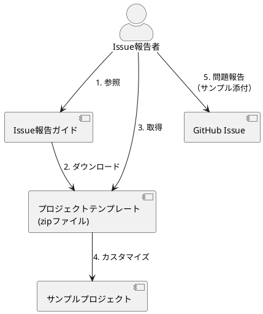

*（このドキュメントは生成AI(Claude Opus 4.5)によって2026年1月22日に生成されました）*

## 課題概要

Spring Batchプロジェクトの[Issue報告ガイド](https://github.com/spring-projects/spring-batch/blob/main/ISSUE_REPORTING.md)に掲載されているプロジェクトテンプレート（zipファイル）を、Spring Batch 6向けに更新するという内部チーム向けのタスクです。

### Issue報告ガイドとは

Spring Batchに問題を報告する際、再現手順を示すためのサンプルプロジェクトを添付することが推奨されています。このサンプルプロジェクトの雛形として、Issue報告ガイドにプロジェクトテンプレート（zipファイル）が用意されています。

### 現状の課題

| 項目 | 現状 | あるべき状態 |
|------|------|--------------|
| テンプレートのSpring Batchバージョン | 5.x | 6.x |
| メンテナンス方式 | 手動でzipファイルを更新・アップロード | より効率的な方法が必要 |

## 原因

Spring Batch 6がリリースされたにもかかわらず、Issue報告ガイドのプロジェクトテンプレートが古いバージョン（Spring Batch 5）のままになっていたため。

## 対応方針

### 即時対応

1. プロジェクトテンプレートの依存関係をSpring Batch 6に更新
2. 新しいzipファイルをアップロード

### 将来的な改善案（検討中）

メンテナンスを効率化するため、以下の方法が議論されました：

| 提案 | 説明 | 採否 |
|------|------|------|
| ソース管理下にテンプレートを配置 | Issue報告者がgit cloneで取得できるようにする | 検討中 |
| GitHubテンプレートリポジトリ | GitHubの[テンプレートリポジトリ機能](https://docs.github.com/en/repositories/creating-and-managing-repositories/creating-a-repository-from-a-template)を利用 | 不採用 |

**テンプレートリポジトリが不採用となった理由**: spring-projects Organization全体で[テンプレートリポジトリを使用していない](https://github.com/spring-projects?q=&type=template&language=&sort=)。使い始めると数が増えすぎて管理が困難になる可能性があるため。

---

**備考**: この課題は「type: task」「status: for-internal-team」ラベルが付いた内部チーム向けタスクであり、バグではありません。また、issues_diffディレクトリにdiffファイルが存在しないため、コード変更の詳細分析は行っていません。
