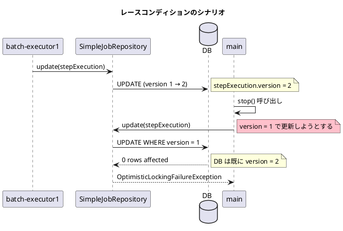
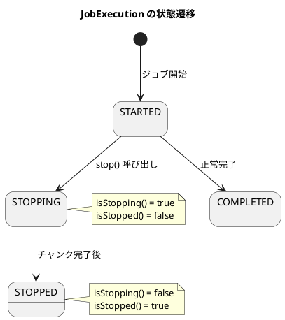

*（このドキュメントは生成AI(Claude Opus 4.5)によって2026年1月20日に生成されました）*

## 課題概要

グレースフルシャットダウン時にレースコンディション（競合状態）が発生し、`OptimisticLockingFailureException`がスローされる不安定なテスト（Flaky Test）のバグです。

### グレースフルシャットダウンとは
Spring Batchでジョブを停止する際、現在実行中のチャンク処理を完了させてから停止する機能です。`JobOperator.stop()`を呼び出すと、ジョブ実行ステータスが`STOPPING`に変わり、安全に停止できるタイミングで`STOPPED`になります。

### 問題の詳細

`GracefulShutdownFunctionalTests.testStopJob`が断続的に失敗します。発生頻度は非常に低く（環境によって異なりますが、約100回に1回程度）、CPUの負荷やスレッドスケジューリングのタイミングに依存します。



### エラーメッセージ

```
OptimisticLockingFailureException: Attempt to update step execution id=0
with wrong version (1), where current version is 2
```

### 状態遷移



## 原因

`SimpleJobRepository.update(StepExecution)`で、ステップ実行のバージョン同期のチェック条件が`isStopped()`のみで、`isStopping()`をチェックしていないため。

```java
// 問題のあるコード
if (latestStepExecution.getJobExecution().isStopped()) {
    stepExecution.setVersion(latestStepExecution.getVersion());
}
```

`stop()`が呼び出されると`JobExecution`のステータスは`STOPPING`になりますが、`isStopped()`は`STOPPED`状態でのみ`true`を返すため、`STOPPING`状態ではバージョン同期が行われません。

## 対応方針

**修正コミット**: [4034f26](https://github.com/spring-projects/spring-batch/commit/4034f269cb96c55ee1fd1a80666fb087d07b9526)、[7f742a5](https://github.com/spring-projects/spring-batch/commit/7f742a5933473e5a6768db583f78bf68aa942641)  
**修正PR**: [#5219](https://github.com/spring-projects/spring-batch/pull/5219)

バージョン同期のチェック条件に`isStopping()`を追加しました：

```java
// 修正前
if (latestStepExecution.getJobExecution().isStopped()) {
```

```java
// 修正後
if (latestStepExecution.getJobExecution().isStopped() 
    || latestStepExecution.getJobExecution().isStopping()) {
```

これにより、`STOPPING`状態でもバージョン同期が行われ、レースコンディションが防止されます。

## バグの発生タイミング

- **バグが発生したSpring Batchのバージョン**: 6.0.1

---

## 更新履歴

- 2026-01-20: 初版作成
