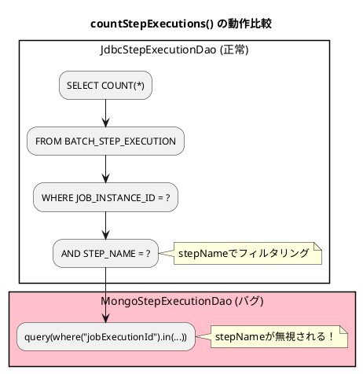
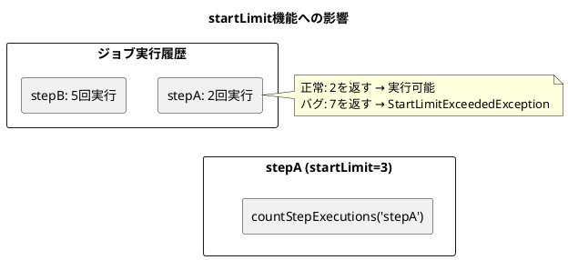

*（このドキュメントは生成AI(Claude Opus 4.5)によって2026年1月20日に生成されました）*

## 課題概要

`MongoStepExecutionDao.countStepExecutions()`メソッドが`stepName`パラメータを無視し、全ステップ実行のカウントを返してしまうバグです。

### MongoStepExecutionDaoとは
Spring BatchがMongoDBをジョブリポジトリとして使用する際の、ステップ実行情報を管理するDAOクラスです。

### 問題の詳細

| 期待される動作 | 実際の動作 |
|----------------|------------|
| 指定された`stepName`でフィルタリングしたステップ実行数を返す | `stepName`を無視し、`JobInstance`に関連するすべてのステップ実行数を返す |



### 影響

この問題は`startLimit`機能に影響を与えます。`SimpleStepHandler.shouldStart()`は`countStepExecutions()`を使用して、ステップの開始上限を検証します。



| ステップ | 実際の実行回数 | startLimit | バグ時の戻り値 | 結果 |
|----------|----------------|------------|----------------|------|
| stepA | 2 | 3 | 7（全ステップ合計） | `StartLimitExceededException`（誤） |
| stepB | 5 | 10 | 7（全ステップ合計） | 実行可能（偶然正しい） |

### 問題のコード

```java
// MongoStepExecutionDao.java（問題のあるコード）
return this.mongoOperations.count(
    query(where("jobExecutionId").in(jobExecutions.stream()
        .map(JobExecution::getJobExecutionId)
        .toList())),  // ← stepNameパラメータが使われていない
    StepExecution.class, STEP_EXECUTIONS_COLLECTION_NAME);
```

## 原因

コミット`ddbb6174c522999fc697a1603ac4e2c69a676a49`でのリグレッション（退行）。5.2.xでは`stepName`が使用されていましたが、この変更で欠落しました。

## 対応方針

**修正コミット**: [b0105f8](https://github.com/spring-projects/spring-batch/commit/b0105f8fd027aebf7a4e2afa29d1b249aa979794)、[fe421d0](https://github.com/spring-projects/spring-batch/commit/fe421d0dced93f8a05f5b09be8493f957fa2a0b7)  
**修正PR**: [#5221](https://github.com/spring-projects/spring-batch/pull/5221)

クエリに`.and("name").is(stepName)`を追加して、`stepName`でフィルタリングするよう修正しました：

```java
// 修正前
return this.mongoOperations.count(
    query(where("jobExecutionId").in(jobExecutions.stream()
        .map(JobExecution::getJobExecutionId)
        .toList())),
    StepExecution.class, STEP_EXECUTIONS_COLLECTION_NAME);
```

```java
// 修正後
return this.mongoOperations.count(
    query(where("jobExecutionId")
        .in(jobExecutions.stream()
            .map(JobExecution::getJobExecutionId)
            .toList())
        .and("name")
        .is(stepName)),  // stepNameでフィルタリング追加
    StepExecution.class, STEP_EXECUTIONS_COLLECTION_NAME);
```

また、`stepName`でフィルタリングが正しく機能することを確認するテストケースも追加されました：

```java
@Test
void testCountStepExecutionsFiltersByStepName() {
    // given
    dao.createStepExecution("stepA", jobExecution);
    dao.createStepExecution("stepA", jobExecution);
    dao.createStepExecution("stepB", jobExecution);
    dao.createStepExecution("stepC", jobExecution);

    // then
    assertEquals(2, dao.countStepExecutions(jobInstance, "stepA"));
    assertEquals(1, dao.countStepExecutions(jobInstance, "stepB"));
    assertEquals(1, dao.countStepExecutions(jobInstance, "stepC"));
    assertEquals(0, dao.countStepExecutions(jobInstance, "nonExistentStep"));
}
```

## バグの発生タイミング

- **バグが発生したSpring Batchのバージョン**: 6.0.0, 6.0.1
- **バグが発生したコミット**: [ddbb6174c522999fc697a1603ac4e2c69a676a49](https://github.com/spring-projects/spring-batch/commit/ddbb6174c522999fc697a1603ac4e2c69a676a49)

---

## 更新履歴

- 2026-01-20: 初版作成
