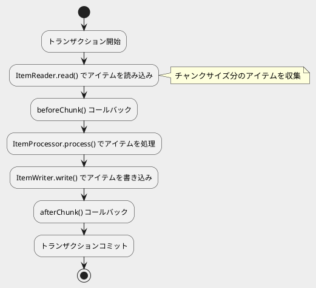
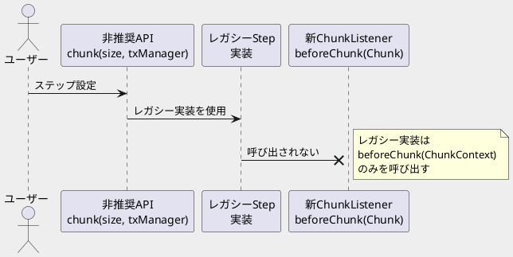

*（このドキュメントは生成AI(Claude Opus 4.5)によって2026年1月22日に生成されました）*

## 課題概要

Spring Batch 5.xから6.xへアップグレードした際に、`ChunkListener`のコールバックが呼び出されなくなったという問題です。これはバグではなく、ドキュメントの不備でした。

### 背景知識

**ChunkListenerとは**: Spring Batchのチャンク処理において、チャンクの処理前後に特定のロジックを実行するためのリスナーインターフェースです。

**チャンク処理の流れ**:



### v5 と v6 の ChunkListener の違い

| 項目 | v5.x（レガシー） | v6.x（新実装） |
|------|-----------------|----------------|
| メソッドシグネチャ | `beforeChunk(ChunkContext context)` | `beforeChunk(Chunk<I> chunk)` |
| beforeChunkの呼び出しタイミング | トランザクション開始後、読み込み開始前 | **チャンク読み込み後、処理開始前** |
| 引数の内容 | `ChunkContext`（実行コンテキスト） | `Chunk<I>`（読み込まれたアイテム） |
| 並行ステップでの動作 | 使用可能 | **使用不可** |

### 問題のシナリオ



**問題の本質**: ユーザーが非推奨のステップビルダーAPIを使用した場合、レガシーのStep実装が使われます。しかし、v6.xの新しい`ChunkListener`メソッドシグネチャ（`beforeChunk(Chunk<I>)`）はレガシー実装では呼び出されません。

## 原因

1. **ドキュメントの不備**: `ChunkListener`のv5→v6における変更点がリファレンスドキュメントやマイグレーションガイドに記載されていなかった（Javadocには記載あり）
2. **設計変更の理由**: 
   - `ChunkContext`の概念は[repeatフレームワーク](https://github.com/spring-projects/spring-batch/tree/main/spring-batch-infrastructure/src/main/java/org/springframework/batch/infrastructure/repeat)の一部としてレガシー実装でのみ使用
   - 新実装では`Chunk`オブジェクトを受け取る設計に変更
   - `beforeChunk`は「チャンク読み込み後、処理開始前」に呼び出される（チャンクが存在しないと渡せないため）

## 対応方針

### diffファイル分析結果

コミット [20eaa7b](https://github.com/spring-projects/spring-batch/commit/20eaa7b696c94a1432feb94e6d452cd959ad571f) で、以下の2ファイルが更新されました。

#### 1. ChunkListener.java（Javadoc修正）

| メソッド | 変更前 | 変更後 |
|---------|--------|--------|
| `beforeChunk` | "Callback before the chunk is processed" | "Callback **after a chunk is read but before it is processed**" |
| `afterChunk` | "Callback after the chunk is written" | 変更なし（強調表記を追加） |
| `afterChunkError` | 説明文末に注意書き | 強調表記（`<strong>`）を追加 |

**共通追加**: 「This method is not called in concurrent steps.」を`<strong>`タグで強調

#### 2. intercepting-execution.adoc（リファレンスドキュメント修正）

**インターフェース定義の更新**:
```java
// 変更前（v5スタイル）
public interface ChunkListener extends StepListener {
    void beforeChunk(ChunkContext context);
    void afterChunk(ChunkContext context);
    void afterChunkError(ChunkContext context);
}

// 変更後（v6スタイル）
public interface ChunkListener<I, O> extends StepListener {
    void beforeChunk(Chunk<I> chunk);
    void afterChunk(Chunk<O> chunk);
    void afterChunkError(Exception exception, Chunk<O> chunk);
}
```

**説明文の更新**:
- `beforeChunk`の呼び出しタイミングを「読み込み後、処理開始前」に訂正
- 「並行ステップでは`ChunkListener`は呼び出されない」というNOTEを追加

**削除された内容**:
- `TaskletStep`での`ChunkListener`適用に関する記述（v6では該当しなくなったため）

### ユーザーへの対処法

| 状況 | 推奨される対処 |
|------|---------------|
| 新規開発（v6） | 新しいステップビルダーAPIと`beforeChunk(Chunk<I>)`を使用 |
| v5から移行中 | 新しいステップビルダーAPIに移行するか、レガシーメソッド`beforeChunk(ChunkContext)`を使用 |
| 並行ステップを使用 | `ChunkListener`は使用不可。別の方法を検討 |

## バグの発生タイミング

- **発生バージョン**: Spring Batch 6.0（ドキュメントの記載漏れ）
- **関連Issue**: [#3950](https://github.com/spring-projects/spring-batch/issues/3950)（より大きな変更の一部）
- **修正コミット**: [20eaa7b](https://github.com/spring-projects/spring-batch/commit/20eaa7b696c94a1432feb94e6d452cd959ad571f)

※ 本件は実行時のバグではなく、ドキュメントが新しい`ChunkListener`の動作に対応していなかったというドキュメントバグです。
