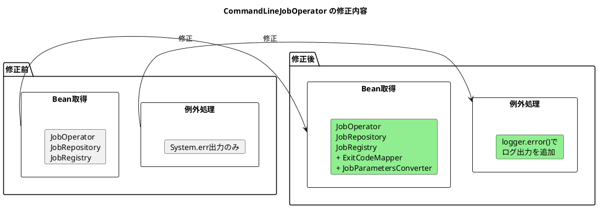

*（このドキュメントは生成AI(Claude Opus 4.5)によって2026年1月21日に生成されました）*

## 課題概要

### 背景知識

Spring Batchでは、コマンドラインからバッチジョブを実行するためのユーティリティクラスが提供されています：

| クラス | バージョン | 説明 |
|--------|------------|------|
| `CommandLineJobRunner` | v5以前 | 従来のコマンドライン実行クラス（v6で非推奨） |
| `CommandLineJobOperator` | v6以降 | 新しいコマンドライン実行クラス |

Spring Batch 6.0.0-M1から`CommandLineJobRunner`が非推奨となり、`CommandLineJobOperator`が導入されました。

### 問題の概要

`CommandLineJobRunner`から`CommandLineJobOperator`への移行時に、以下の4つの非互換性が発見されました：

| # | 問題 | CommandLineJobRunner (v5) | CommandLineJobOperator (v6) | 対応状況 |
|---|------|---------------------------|------------------------------|----------|
| 1 | 例外出力先 | ログに出力 | System.errに出力 | 🔴 修正済 |
| 2 | バリデーション例外 | ログに出力 | 出力されない | 🔴 修正済 |
| 3 | カスタマイズ | ExitCodeMapper等カスタマイズ可能 | カスタマイズ不可 | 🔴 修正済 |
| 4 | 停止・再起動 | jobName または jobExecutionId | jobExecutionId のみ | 🟡 意図的変更 |

> 🔴 バグとして修正済 / 🟡 意図的な変更（回避策あり）

### 各問題の詳細

#### 1. エラー出力先の違い（修正済）

例外が`System.err.printf`でコンソールにのみ出力され、ログに記録されなかった問題。

#### 2. バリデーション例外のログ出力（修正済）

`JobParametersValidator`によるバリデーション失敗時、例外がログに出力されなかった問題。

#### 3. カスタマイズ不可（修正済）

`ExitCodeMapper`や`JobParametersConverter`のカスタムBeanが無視されていた問題。

#### 4. 停止・再起動のパラメータ変更（意図的）

ジョブ名だけでは複数インスタンスがある場合に曖昧になるため、`jobExecutionId`のみに変更。`JobRepository#getLastJobInstance(jobName)`で対応可能。

---

## 原因

`CommandLineJobOperator`の新規設計時に、以下の点で旧`CommandLineJobRunner`との互換性が考慮されていませんでした：

1. **例外処理の設計**: ログ出力ではなく`System.err`を使用（見落とし）
2. **バリデーション例外の処理**: 例外をキャッチして握りつぶす設計（見落とし）
3. **DIコンテナとの統合**: アプリケーションコンテキスト外での使用を優先し、カスタムBeanの注入機能が省略された（意図的だが改善が必要）
4. **操作対象の特定方法**: 曖昧さを排除するため`jobExecutionId`のみに限定（意図的）

---

## 対応方針

### 修正内容（コミット [e6da29c](https://github.com/spring-projects/spring-batch/commit/e6da29c65c5654309a6625e862c8c1ca5e89ee21)）

#### 1. 例外のログ出力を追加

すべての操作メソッド（`start`, `startNextInstance`, `stop`, `restart`, `abandon`, `recover`）の`catch`ブロックに`logger.error()`を追加：

```java
catch (Exception e) {
    String message = "Job terminated in error: " + e.getMessage();
    logger.error(e, () -> message);  // 追加
    return JVM_EXITCODE_GENERIC_ERROR;
}
```

#### 2. mainメソッドのエラー出力をログに変更

`System.err.printf` → `logger.error()`に変更：

```java
// 修正前
System.err.printf(String.format(usage, CommandLineJobOperator.class.getName()));

// 修正後
logger.error(String.format(usage, CommandLineJobOperator.class.getName()));
```

```java
// 修正前
System.err.println("Job configuration class not found: " + jobConfigurationClassName);

// 修正後
logger.error(classNotFoundException,
    () -> "Job configuration class not found: " + jobConfigurationClassName);
```

#### 3. ExitCodeMapperとJobParametersConverterのカスタマイズ対応

`main`メソッドでアプリケーションコンテキストからカスタムBeanを検出し設定：

```java
CommandLineJobOperator operator = new CommandLineJobOperator(jobOperator, jobRepository, jobRegistry);

// ExitCodeMapperのカスタム設定
ExitCodeMapper exitCodeMapper;
try {
    exitCodeMapper = context.getBean(ExitCodeMapper.class);
    operator.setExitCodeMapper(exitCodeMapper);
}
catch (NoSuchBeanDefinitionException e) {
    logger.debug(() -> "No ExitCodeMapper bean found in the application context. Using the default one.");
}

// JobParametersConverterのカスタム設定
JobParametersConverter jobParametersConverter;
try {
    jobParametersConverter = context.getBean(JobParametersConverter.class);
    operator.setJobParametersConverter(jobParametersConverter);
}
catch (NoSuchBeanDefinitionException e) {
    logger.debug(() -> "No JobParametersConverter bean found in the application context. Using the default one.");
}
```

### 修正の全体像



### 問題4の回避策

ジョブ名から実行IDを取得して再起動する方法：

```java
// JobRepository APIを使用してジョブ名から最新のインスタンスを取得
JobInstance lastInstance = jobRepository.getLastJobInstance(jobName);
// 失敗した実行を取得して再起動
```

---

## バグの発生タイミング

| 項目 | 内容 |
|------|------|
| バグ発生バージョン | Spring Batch 6.0.0-M1（`CommandLineJobOperator`導入時） |
| 修正バージョン | Spring Batch 6.0.2 |
| 修正コミット | [e6da29c](https://github.com/spring-projects/spring-batch/commit/e6da29c65c5654309a6625e862c8c1ca5e89ee21) |
| 関連Issue | [#4899](https://github.com/spring-projects/spring-batch/issues/4899)（`CommandLineJobRunner`の制限に関する議論） |
