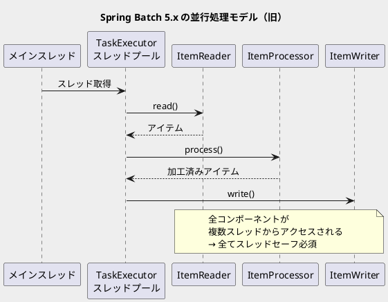
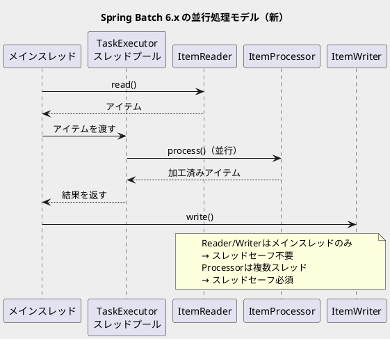

*（このドキュメントは生成AI(Claude Opus 4.5)によって2026年1月22日に生成されました）*

## 課題概要

Spring Batch 6の新しい並行処理モデルに関するドキュメントが古い情報のまま更新されていなかったという問題です。

### 背景知識

**マルチスレッドステップとは**: Spring Batchでは、`taskExecutor`を設定することで、チャンク処理を複数スレッドで並行実行できます。これにより、大量データの処理スループットを向上させることができます。

### Spring Batch 5.x と 6.x の並行処理モデルの違い

### v5 vs v6 の比較表

| コンポーネント | v5.x（旧モデル） | v6.x（新モデル） |
|--------------|-----------------|-----------------|
| `ItemReader` | 複数スレッドからアクセス（スレッドセーフ必須） | メインスレッドのみ（スレッドセーフ不要） |
| `ItemProcessor` | 複数スレッドからアクセス（スレッドセーフ必須） | 複数スレッドからアクセス（スレッドセーフ必須） |
| `ItemWriter` | 複数スレッドからアクセス（スレッドセーフ必須） | メインスレッドのみ（スレッドセーフ不要） |

## 原因

Spring Batch 6.xで並行処理モデルが変更されたにもかかわらず、リファレンスドキュメント（[scalability.adoc](https://docs.spring.io/spring-batch/reference/scalability.html#multithreadedStep)）がv5.x時代の記述のまま残っていたため。

## 対応方針

### diffファイル分析結果

コミット [9ccbafa](https://github.com/spring-projects/spring-batch/commit/9ccbafa0cf387b36e22462921c53aab055f9cd64) で、`scalability.adoc`ドキュメントが更新されました。

**主な変更内容:**

1. **サンプルコードの修正**
   - `processor(itemProcessor())`を追加（並行処理のサンプルとしてより適切に）

2. **説明文の書き換え**

   **変更前（v5.x向けの記述）:**
   - 各チャンクの読み込み・処理・書き込みが別スレッドで実行される
   - アイテムの処理順序は固定されない
   - Reader/Writerを含むほとんどのコンポーネントはスレッドセーフである必要がある
   - `SynchronizedItemStreamReader`で同期ラッパーを使用する方法を説明

   **変更後（v6.x向けの記述）:**
   - `ItemProcessor`のみが複数スレッドから同時に呼び出される
   - `ItemProcessor`はスレッドセーフである必要がある
   - **読み込み・書き込みはメインスレッドで直列に実行**されるため、`ItemReader`と`ItemWriter`はスレッドセーフである必要がない
   - 読み書き速度がボトルネックになる場合は、ローカルチャンキングやローカルパーティショニングなど別の並行処理技術を検討

3. **削除された内容**
   - 旧モデル向けの「リーダー・ライターのスレッドセーフ要件」に関する詳細説明
   - `SynchronizedItemStreamReader`の使用例

### 補足事項（Issue内コメントより）

- 同期ラッパー（`SynchronizedItemStreamReader`等）は、カスタムステップ実装でリーダー・ライターをラップする必要がある場合のために残されている
- 単純な読み書きのみ（加工・変換なし）のステップでは、並行処理を導入してもスループット向上は期待できない可能性がある（ベンチマーク推奨）

## バグの発生タイミング

- **発生バージョン**: Spring Batch 6.0（ドキュメントの記載漏れ）
- **修正コミット**: [9ccbafa](https://github.com/spring-projects/spring-batch/commit/9ccbafa0cf387b36e22462921c53aab055f9cd64)

※ 本件は実行時のバグではなく、ドキュメントが新しい並行処理モデルに対応していなかったというドキュメントバグです。
