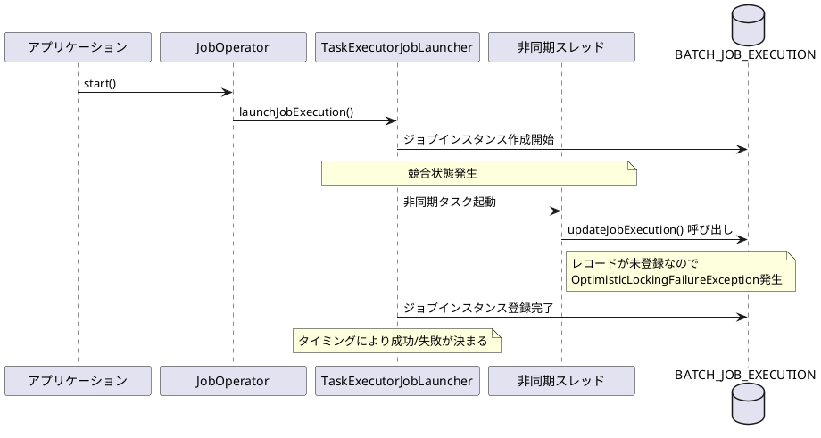
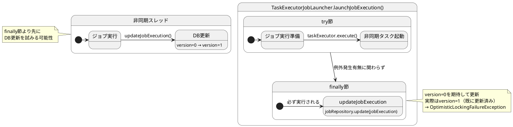
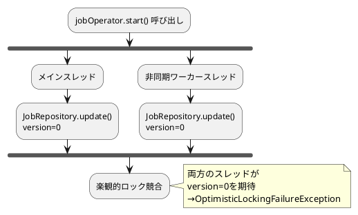
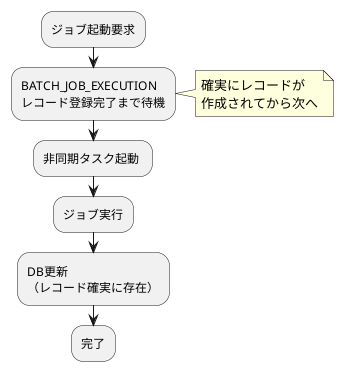

*（このドキュメントは生成AI(Claude Sonnet 4.5)によって2026年1月6日に生成されました）*

## 課題概要

`JobOperator.start()`と非同期タスクエグゼキューターを併用してジョブを起動する際、`OptimisticLockingFailureException`が断続的に発生する問題です。

**OptimisticLockingFailureExceptionとは**: Spring Frameworkのデータアクセス層で使用される楽観的ロック機能において、レコードのバージョンが期待値と異なる場合にスローされる例外です。通常、複数のトランザクションが同じレコードを同時に更新しようとした際に発生します。

### 問題の状況



### 発生パターン

| 状況 | レコード登録 | 非同期スレッド起動 | 結果 |
|------|------------|-----------------|------|
| 正常ケース | 先に完了 | 後に実行 | ✓ 成功 |
| 異常ケース | 実行中 | 先に実行 | ✗ OptimisticLockingFailureException |

**影響範囲**:
- Spring Batch 6.0.0以降
- Spring Boot 4.0.0以降
- 非同期タスクエグゼキューター使用時

## 原因

`TaskExecutorJobLauncher.launchJobExecution()`メソッド内での競合状態が根本原因です。

### コード構造の問題点



### Spring Batch 5.xとの違い

**Spring Batch 5.x**:
- 非同期タスクのスケジュール設定が失敗した場合のみジョブ実行を更新
- `finally`節でのDB更新処理なし

**Spring Batch 6.x**:
- `finally`節で必ずジョブ実行を更新
- 非同期タスク内での更新と競合する可能性

具体的なスタックトレース:
```
org.springframework.dao.OptimisticLockingFailureException: 
  Attempt to update job execution id=1 with wrong version (0), 
  where current version is 1
  at JdbcJobExecutionDao.updateJobExecution()
  at SimpleJobRepository.update()
  at AbstractJob.updateStatus()
  at AbstractJob.execute()
  at TaskExecutorJobLauncher$1.run()
```

### 問題の本質



## 対応方針

現時点では開発チームからの公式な修正はリリースされていませんが、コミュニティから以下の回避策が提案されています。

### 回避策1: シングルスレッドエグゼキューター使用

`ThreadPoolTaskExecutor`のスレッド数を1に制限することで、競合状態を回避します。

```java
@Bean
public JobOperatorFactoryBean jobOperator(JobRepository jobRepository) {
    ThreadPoolTaskExecutor taskExecutor = new ThreadPoolTaskExecutor();
    taskExecutor.setCorePoolSize(1);
    taskExecutor.setMaxPoolSize(1);
    taskExecutor.afterPropertiesSet();

    JobOperatorFactoryBean jobOperatorFactoryBean = new JobOperatorFactoryBean();
    jobOperatorFactoryBean.setJobRepository(jobRepository);
    jobOperatorFactoryBean.setTaskExecutor(taskExecutor);
    return jobOperatorFactoryBean;
}
```

**メリット**: 簡単に実装可能
**デメリット**: 並行実行の利点が失われる

### 想定される根本修正アプローチ



### 期待される修正内容

1. **`TaskExecutorJobLauncher`の修正**:
   - `finally`節での無条件更新ロジックを見直し
   - 非同期タスク起動前にジョブ実行レコードの登録を完了
   - Spring Batch 5.xの動作（スケジュール失敗時のみ更新）に戻す

2. **同期ポイントの追加**:
   - ジョブ実行レコードの登録完了を確認してから非同期タスクを起動
   - カウントダウンラッチなどの同期機構の導入

### 影響するコンポーネント

| コンポーネント | 影響内容 |
|--------------|---------|
| `TaskExecutorJobLauncher` | finally節のDB更新ロジック |
| `JobOperator` | 非同期タスクエグゼキューター設定 |
| JDBCベースのJobRepository | 楽観的ロック機構 |
| MongoDBベースのJobRepository | データ整合性制約 |

### 関連する課題とディスカッション

- [Discussion #5121](https://github.com/spring-projects/spring-batch/discussions/5121) - 関連する問題の議論
- 最小再現環境: https://github.com/phactum-mnestler/spring-batch-reproducer
- MongoDB環境での再現: https://github.com/kizombaDev/spring-batch-async-bug-reproducer

**現在のステータス**: Spring Batch 6.0.1でも未解決。開発チームの修正待ちの状態です。
