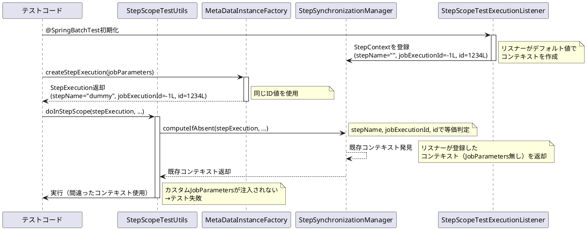
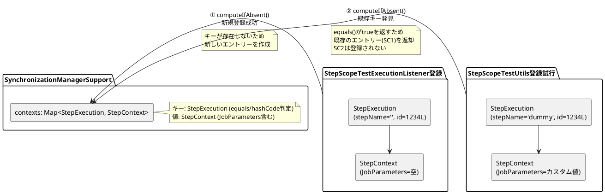
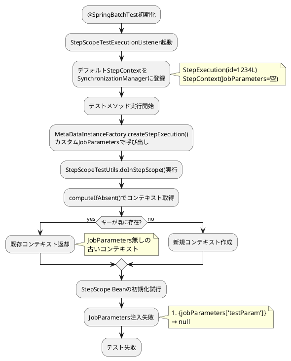
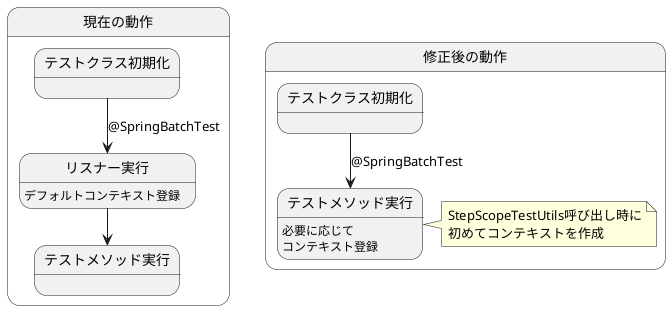
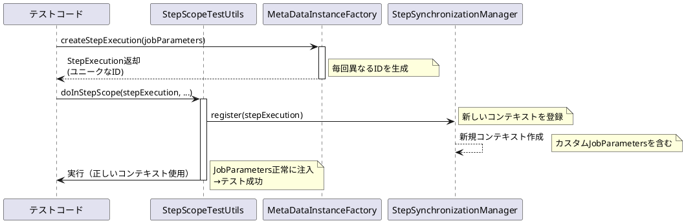

*（このドキュメントは生成AI(Claude Sonnet 4.5)によって2026年1月6日に生成されました）*

## 課題概要

`@SpringBatchTest`アノテーションを使用したテスト環境において、`StepScopeTestUtils`を利用する際に`StepContext`の競合が発生し、カスタム`JobParameters`が正しく注入されない問題です。

**@SpringBatchTestとは**: Spring Batch 4.0から導入されたテスト支援機能で、`StepScope`や`JobScope`のBeanを簡単にテストできるよう、必要なコンポーネント（`JobLauncherTestUtils`、`JobRepositoryTestUtils`など）を自動的にセットアップするアノテーションです。

### 問題の発生状況



### 問題の核心

| コンポーネント | 使用する値 | stepName | jobExecutionId | id |
|--------------|----------|----------|---------------|-----|
| StepScopeTestExecutionListener | デフォルト値 | "" | -1L | 1234L |
| MetaDataInstanceFactory | デフォルト値 | "dummy" | -1L | 1234L |
| 等価性判定 | - | ✓ 一致 | ✓ 一致 | ✓ 一致 |

**結果**: `SynchronizationManagerSupport.contexts`マップ内で同一キーとして扱われる

## 原因

### 1. StepExecutionの等価性判定

`StepExecution`クラスは、以下の3つのフィールドで等価性を判断します：

```java
public class StepExecution {
    private String stepName;
    private Long jobExecutionId;
    private Long id;
    
    @Override
    public boolean equals(Object obj) {
        // stepName、jobExecutionId、idの3つで判定
        // ...
    }
}
```

### 2. MetaDataInstanceFactoryの静的デフォルト値

`MetaDataInstanceFactory`は、すべてのフィールドに静的なデフォルト値を提供します：

```java
public class MetaDataInstanceFactory {
    public static StepExecution createStepExecution(JobParameters jobParameters) {
        return new StepExecution(
            "dummy",  // 固定値
            new JobExecution(
                new JobInstance(-1L, "job"), // 固定値
                jobParameters
            )
        );
        // stepExecution.setId(1234L); // 固定値
    }
}
```

### 3. コンテキストマップの動作



### 問題の流れ



## 対応方針

### 提案される修正アプローチ

現時点では開発チームからの公式な修正はありませんが、以下の修正方法が考えられます：

#### 修正案1: MetaDataInstanceFactoryのID生成をランダム化

```java
public class MetaDataInstanceFactory {
    public static StepExecution createStepExecution(JobParameters jobParameters) {
        StepExecution stepExecution = new StepExecution(
            "test-step-" + UUID.randomUUID().toString(), // ユニーク化
            new JobExecution(
                new JobInstance(System.nanoTime(), "test-job"), // ユニーク化
                jobParameters
            )
        );
        stepExecution.setId(System.nanoTime()); // ユニーク化
        return stepExecution;
    }
}
```

**メリット**: 
- ID競合が確実に回避される
- 各テストケースで独立したコンテキストが作成される

**デメリット**:
- 既存のテストコードへの影響が大きい可能性

#### 修正案2: StepScopeTestUtilsでコンテキストを強制上書き

```java
public class StepScopeTestUtils {
    public static <T> T doInStepScope(StepExecution stepExecution, Callable<T> callable) {
        // 既存コンテキストを削除してから新規登録
        StepSynchronizationManager.close();
        StepSynchronizationManager.register(stepExecution);
        try {
            return callable.call();
        } finally {
            StepSynchronizationManager.close();
        }
    }
}
```

**メリット**:
- テストコードへの影響が少ない
- 意図したJobParametersが確実に使用される

**デメリット**:
- 既存のコンテキストが破棄される動作が副作用として残る

#### 修正案3: StepScopeTestExecutionListenerの登録タイミング変更



**メリット**:
- 根本的な競合を回避
- より柔軟なテスト設定が可能

**デメリット**:
- `@SpringBatchTest`の動作変更が大きい
- 既存テストへの影響が不明

### 回避策（ユーザー側での対処）

開発チームの修正を待つ間、以下の回避策が利用できます：

```java
@SpringBatchTest
@SpringBootTest
public class WorkaroundTest {
    
    @Autowired
    private Tasklet myTasklet;
    
    @Test
    void workaroundTest() throws Exception {
        // 回避策: StepScopeTestExecutionListenerを使わず、
        // 手動でコンテキストを管理
        
        JobParameters jobParameters = new JobParametersBuilder()
                .addString("testParam", "HelloBatch")
                .toJobParameters();
        
        StepExecution stepExecution = new StepExecution(
                "test-step-" + System.nanoTime(), // ユニークな名前
                new JobExecution(
                        new JobInstance(System.nanoTime(), "test-job"),
                        jobParameters
                )
        );
        stepExecution.setId(System.nanoTime()); // ユニークなID
        
        // 既存コンテキストをクリアしてから登録
        StepSynchronizationManager.close();
        StepSynchronizationManager.register(stepExecution);
        
        try {
            myTasklet.execute(stepExecution.createStepContribution(), null);
            String result = stepExecution.getExecutionContext().getString("result");
            assertEquals("HelloBatch", result);
        } finally {
            StepSynchronizationManager.close();
        }
    }
}
```

### 影響範囲の比較

| 修正案 | 影響コンポーネント | 既存テストへの影響 | 実装難易度 |
|-------|-----------------|-----------------|----------|
| 修正案1: ID生成ランダム化 | MetaDataInstanceFactory | 中 | 低 |
| 修正案2: コンテキスト強制上書き | StepScopeTestUtils | 低 | 低 |
| 修正案3: リスナー登録タイミング変更 | StepScopeTestExecutionListener | 高 | 中 |
| 回避策: 手動コンテキスト管理 | ユーザーコード | なし | 低 |

### 期待される最終的な動作



**現在のステータス**: 開発チームへの問題報告済み。修正方針の決定待ちの状態です。
