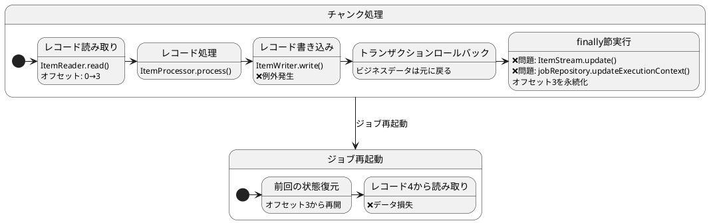
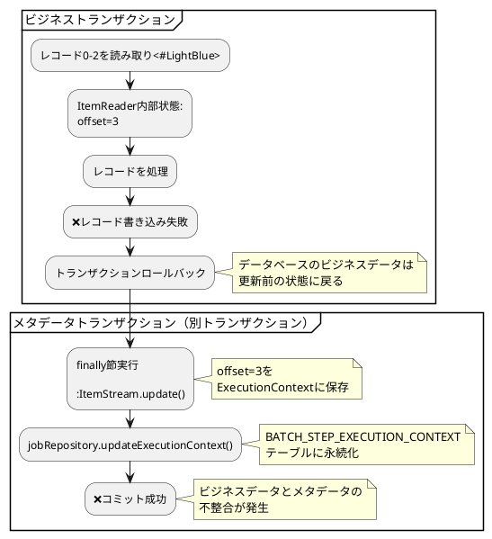
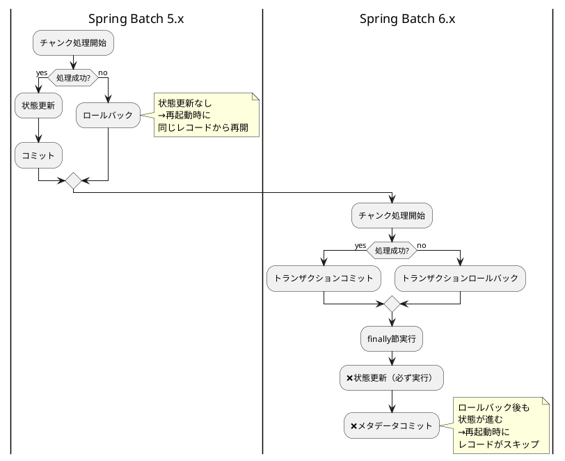
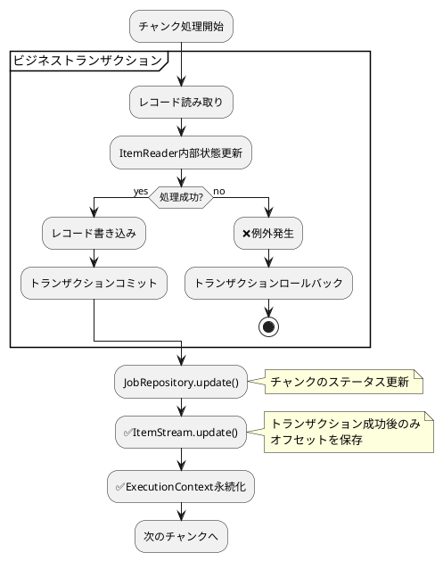
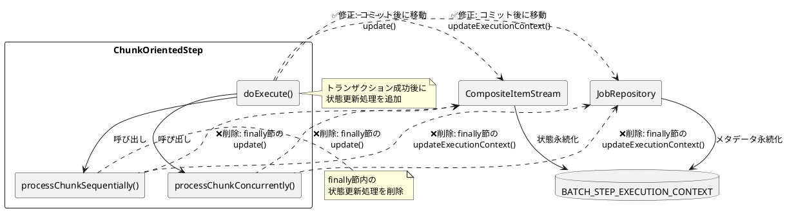
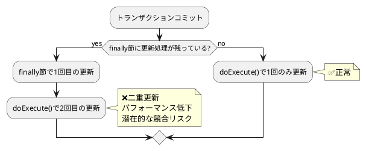

*（このドキュメントは生成AI(Claude Sonnet 4.5)によって2026年1月6日に生成されました）*

## 課題概要

Spring Batch 6.xで新たに導入された`ChunkOrientedStep`において、チャンクの処理がトランザクションでロールバックされた場合でも、`ItemStream`の状態と`ExecutionContext`が永続化されてしまう問題です。この結果、ジョブを再起動した際に、失敗したチャンク内のレコードがスキップされ、**データ損失**が発生します。

**ItemStreamとは**: Spring Batchでリソース（ファイル、データベースカーソルなど）のライフサイクル管理を行うインターフェースです。`open()`、`update()`、`close()`メソッドを持ち、現在の読み取り位置やオフセットなどの状態を`ExecutionContext`に保存します。

**ExecutionContextとは**: ステップ実行間で状態を永続化するためのキー・バリュー形式のストレージです。ジョブの再起動時に前回の状態を復元するために使用されます。

### 問題の具体例



### データ損失のシナリオ

| タイミング | チャンク | 読み取り範囲 | 処理結果 | オフセット保存 | 再起動後の動作 |
|----------|--------|-----------|---------|-------------|--------------|
| 初回実行 | チャンク1 | レコード0-2 | ❌例外発生→ロールバック | ✓ オフセット3保存（問題） | - |
| 再起動 | チャンク1 | レコード3-5 | 処理継続 | ✓ オフセット6保存 | レコード0-2が**永久にスキップ** |

## 原因

### コード構造の変更（Spring Batch 5.x → 6.x）

#### Spring Batch 5.x (TaskletStep.java) - 正常な動作

```java
// TaskletStep.java (Line 452)
// 成功した処理フロー内でのみ状態更新
if (chunk.isComplete()) {
    stream.update(stepExecution.getExecutionContext());
    getJobRepository().updateExecutionContext(stepExecution);
    stepExecution.incrementCommitCount();
}
```

**ポイント**: トランザクションが成功した場合にのみ状態を更新

#### Spring Batch 6.x (ChunkOrientedStep.java) - 問題のある動作

```java
// ChunkOrientedStep.java
private void processChunkSequentially(...) {
    try {
        // チャンクの読み取り/処理/書き込みロジック
        // トランザクション内で実行
    } catch (Exception e) {
        // 例外処理
        throw e; // トランザクションロールバック
    } finally {
        // ❌バグ: トランザクションがロールバックされても必ず実行される
        this.compositeItemStream.update(stepExecution.getExecutionContext());
        getJobRepository().updateExecutionContext(stepExecution);
    }
}
```

**ポイント**: `finally`節で無条件に状態を更新→トランザクションの一貫性が失われる

### トランザクションの不整合



### 処理フローの比較



## 対応方針

### 提案される修正案

`ChunkOrientedStep.doExecute()`メソッドで、トランザクションコミット成功後にのみ状態を更新するよう変更します。

#### 修正前のコード構造

```java
@Override
protected void doExecute(StepExecution stepExecution) throws Exception {
    while (this.chunkTracker.get().moreItems() && !interrupted(stepExecution)) {
        this.transactionTemplate.executeWithoutResult(transactionStatus -> {
            // processChunkSequentially() または processChunkConcurrently()
            // ↓↓↓ finally節で必ず実行される ↓↓↓
            // this.compositeItemStream.update(stepExecution.getExecutionContext());
            // getJobRepository().updateExecutionContext(stepExecution);
        });
        getJobRepository().update(stepExecution);
    }
}
```

#### 修正後のコード構造（提案）

```java
@Override
protected void doExecute(StepExecution stepExecution) throws Exception {
    stepExecution.getExecutionContext().put(STEP_TYPE_KEY, this.getClass().getName());
    
    while (this.chunkTracker.get().moreItems() && !interrupted(stepExecution)) {
        // 次のチャンクを独自のトランザクションで処理
        this.transactionTemplate.executeWithoutResult(transactionStatus -> {
            // processChunkSequentially()またはprocessChunkConcurrently()
            // finally節から状態更新処理を削除
        });
        
        getJobRepository().update(stepExecution);
        
        // ✅修正: トランザクションコミット成功後にのみItemStreamとExecutionContextを更新
        this.compositeItemStream.update(stepExecution.getExecutionContext());
        getJobRepository().updateExecutionContext(stepExecution);
    }
}
```

#### processChunkSequentiallyの修正

```java
private void processChunkSequentially(...) {
    try {
        // チャンクの読み取り/処理/書き込みロジック
    } catch (Exception e) {
        // 例外処理
        throw e;
    }
    // ✅修正: finally節を削除
    // 状態更新はdoExecute()で行う
}
```

### 修正後の動作フロー



### 期待される効果

| 項目 | 修正前 | 修正後 |
|-----|-------|-------|
| トランザクション成功時 | 状態更新 | 状態更新 |
| トランザクション失敗時 | ❌状態更新（不整合） | ✓ 状態更新なし |
| 再起動時の動作 | 失敗チャンクをスキップ | 失敗チャンクから再開 |
| データ整合性 | ❌不整合 | ✓ 整合性維持 |
| データ損失リスク | ❌高い | ✓ なし |

### 修正の影響範囲



### 注意点

**重複更新の防止**: `processChunkSequentially()`と`processChunkConcurrently()`の`finally`節から状態更新呼び出しを削除する必要があります。削除しない場合、以下の問題が発生します：



### 関連課題

この修正により、以下の副次的な問題も解決されます：

- トランザクション境界とメタデータ永続化のタイミングが一致
- 楽観的ロック例外のリスク低減
- ジョブ再起動時の予測可能性向上

**現在のステータス**: 開発チームへの問題報告済み。コミュニティから具体的な修正案が提示されており、修正実装待ちの状態です。
