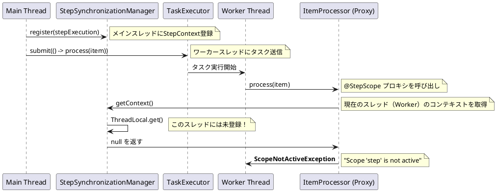
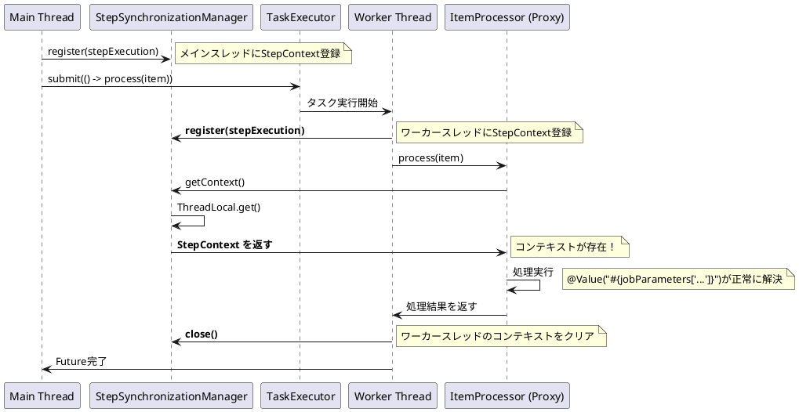

*このドキュメントは生成AI(Claude Sonnet 4.5)によって2026年1月6日に生成されました。*

## 課題概要

Spring Batch 6.0の新しい`ChunkOrientedStep`において、マルチスレッド処理と`@StepScope`の`ItemProcessor`を組み合わせると、`ScopeNotActiveException`が発生する問題です。

**`@StepScope`とは**: Spring BatchにおけるSpringのスコープの一つで、ステップ実行中のみ有効なBeanを定義します。`JobParameters`や`StepExecution`などのステップ実行時の情報にアクセスできます。

**マルチスレッド処理とは**: Spring Batchでチャンク処理を並列化する機能です。`TaskExecutor`を設定することで、複数のスレッドで同時にアイテムを処理できます。

**ItemProcessorとは**: 読み取ったデータ（item）を加工・変換するコンポーネントです。ビジネスロジックの実行、データの検証・変換などを行います。

**問題の状況**:
- ステップに`TaskExecutor`（例：`SimpleAsyncTaskExecutor`）を設定してマルチスレッド処理を有効化
- `ItemProcessor`を`@StepScope`で定義
- 処理実行時にワーカースレッドで`ScopeNotActiveException`が発生

**具体的な事象**:
```bash
Caused by: org.springframework.beans.factory.support.ScopeNotActiveException: 
Error creating bean with name 'scopedTarget.issueReproductionProcessor': 
Scope 'step' is not active for the current thread
```

**再現環境**:
```java
@Bean
public Step issueReproductionStep(
        JobRepository jobRepository,
        ItemReader<TestItem> reader,
        ItemProcessor<TestItem, TestItem> processor, // @StepScope Bean
        ItemWriter<TestItem> writer
) {
    return new StepBuilder(jobRepository)
            .<TestItem, TestItem>chunk(1)
            .reader(reader)
            .processor(processor)
            .writer(writer)
            .taskExecutor(new SimpleAsyncTaskExecutor()) // マルチスレッド有効
            .build();
}

@Bean
@StepScope
public ItemProcessor<TestItem, TestItem> issueReproductionProcessor() {
    return item -> {
        log.info("Processing item: {}", item.getName());
        return item;
    };
}
```

## 原因

`ChunkOrientedStep`のマルチスレッド処理実装（`processChunkConcurrently`メソッド）において、`TaskExecutor`によって管理されるワーカースレッドに`StepContext`が伝播されていないことが原因です。

**詳細な原因分析**:

1. **StepScopeの仕組み**:
```java
// StepScopeでBeanを取得する際の流れ
1. Spring: @StepScope Beanのプロキシを生成
2. プロキシ: 実際のBeanを取得するため、StepScope.getContext()を呼び出す
3. StepScope: StepSynchronizationManager.getContext()でコンテキストを取得
4. StepSynchronizationManager: 現在のスレッドのThreadLocalからコンテキストを取得
```

2. **問題の発生メカニズム**:



3. **なぜワーカースレッドにコンテキストがないのか**:

| スレッド | StepContext登録 | 説明 |
|----------|----------------|------|
| メインスレッド | ✅ 登録済み | `ChunkOrientedStep`の起動時に`StepSynchronizationManager.register()`を呼び出し |
| ワーカースレッド | ❌ 未登録 | `TaskExecutor.submit()`で新しいスレッドが作成されるが、コンテキストの伝播処理がない |

**ThreadLocalの特性**: `StepSynchronizationManager`は`ThreadLocal`を使用してコンテキストを管理します。`ThreadLocal`は各スレッド固有のデータを保持するため、**親スレッドの値は子スレッドに自動的には伝播されません**。

4. **ChunkOrientedStep.processChunkConcurrentlyの問題箇所**:
```java
// ChunkOrientedStep.java
private void processChunkConcurrently(...) {
    while (...) {
        I item = chunkProvider.provide(contribution);
        
        // 問題: StepContextの登録なしにワーカースレッドでタスク実行
        Future<O> itemProcessingFuture = this.taskExecutor.submit(() -> {
            // このスレッドにはStepContextが登録されていない！
            return processItem(item, contribution);
            // ↑ @StepScopeのItemProcessorを呼び出すと例外発生
        });
        
        // ...
    }
}
```

**Spring Batch 5.xとの比較**:
Spring Batch 5.xの`TaskletStep`では、マルチスレッドチャンク処理において`StepContext`の伝播が適切に実装されていた可能性があります（具体的な実装の比較は報告書に記載されていませんが、この問題が6.xで新たに発生していることから推測されます）。

## 対応方針

報告者が提案する修正内容は、`processChunkConcurrently`メソッドにおいて、ワーカースレッドの開始時に`StepContext`を登録し、終了時にクリーンアップすることです。

**提案される修正** (KILL9-NO-MERCY氏):

```java
// ChunkOrientedStep.processChunkConcurrently メソッド内
private void processChunkConcurrently(...) {
    while (...) {
        I item = chunkProvider.provide(contribution);
        
        Future<O> itemProcessingFuture = this.taskExecutor.submit(() -> {
            try {
                // 修正: 現在のワーカースレッドのStepSynchronizationManagerに
                //       ステップ実行を登録
                StepSynchronizationManager.register(stepExecution);
                
                // アイテムを処理（@StepScope Beanにアクセス可能）
                return processItem(item, contribution);
                
            } finally {
                // 修正: メモリリークを防ぐため、処理後にコンテキストをクリア
                StepSynchronizationManager.close();
            }
        });
        
        // 残りのロジック...
    }
}
```

**修正のポイント**:

1. **ワーカースレッドでのStepContext登録**:
```java
StepSynchronizationManager.register(stepExecution);
```
   - ワーカースレッドの`ThreadLocal`に`StepContext`を登録
   - `@StepScope` Beanが現在の`StepExecution`情報にアクセス可能になる

2. **処理後のクリーンアップ**:
```java
finally {
    StepSynchronizationManager.close();
}
```
   - `ThreadLocal`から`StepContext`を削除
   - メモリリークを防止（特にスレッドプールを使用する場合、スレッドが再利用されるため重要）

**修正後の動作**:



**考慮事項**:

1. **スレッドセーフティ**: 
   - 各ワーカースレッドが独自の`StepExecution`参照を持つため、スレッド間の競合はありません
   - `ThreadLocal`を使用しているため、スレッドセーフです

2. **メモリリーク防止**:
   - `finally`節で`StepSynchronizationManager.close()`を呼び出すことで、スレッドプール内のスレッドが再利用される際に古いコンテキストが残らないようにします

3. **既存のコードへの影響**:
   - シングルスレッド処理（`processChunkSequentially`）には影響なし
   - マルチスレッド処理のみに修正を適用

**代替案**:

もし`StepExecution`のクローンが必要な場合（並行アクセスによる状態変更を避けるため）、以下のような実装も考えられます：

```java
Future<O> itemProcessingFuture = this.taskExecutor.submit(() -> {
    try {
        // StepExecutionのコピーを作成して登録
        StepExecution workerStepExecution = new StepExecution(
            stepExecution.getStepName(),
            stepExecution.getJobExecution()
        );
        workerStepExecution.setExecutionContext(stepExecution.getExecutionContext());
        
        StepSynchronizationManager.register(workerStepExecution);
        return processItem(item, contribution);
    } finally {
        StepSynchronizationManager.close();
    }
});
```

ただし、この場合は`ExecutionContext`の並行アクセスに注意が必要です。

**まとめ**:
この問題は、Spring Batch 6.xの`ChunkOrientedStep`における新しいマルチスレッド実装において、`StepContext`の伝播が欠落していることが原因です。提案された修正により、`@StepScope` Beanがマルチスレッド環境でも正常に動作するようになります。
