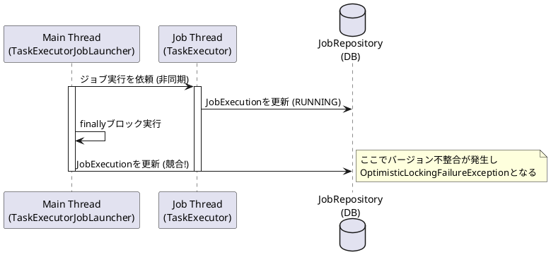

*（このドキュメントは生成AI(Gemini 3 Pro (Preview))によって2026年1月7日に生成されました）*

## 課題概要

`JobOperator.start()` を使用して、非同期処理（`asyncTaskExecutor`）でジョブを起動した際に、`OptimisticLockingFailureException`（楽観的ロックの失敗を示す例外）が時々発生するというバグです。

**用語解説**:
- **OptimisticLockingFailureException**: データベース更新時に、他の誰かが先にデータを更新してしまったために、自分の更新が競合して失敗したことを示すエラーです。
- **JobOperator**: Spring Batchのジョブを起動・管理するためのインターフェースです。
- **TaskExecutor**: タスク（処理）を別スレッドで実行するための仕組みです。

### 発生状況のイメージ（シーケンス図）

メインスレッド（ランチャー）と、ジョブを実行する別スレッドの間で、データベース上のジョブ実行情報（JobExecution）の更新が競合しています。

## 原因

`TaskExecutorJobLauncher` クラスの実装において、ジョブ起動処理の `finally` ブロック内で、無条件に `JobExecution`（ジョブ実行情報）の更新を行っていることが原因です。

非同期実行の場合、ジョブ自体が別スレッドで進行し、独自にステータス更新を行います。そのため、ランチャー側のスレッドが `finally` ブロックで重ねて更新を行おうとすると、タイミングによっては競合が発生してしまいます。

## 対応方針

`TaskExecutorJobLauncher.launchJobExecution` メソッドを修正し、タスクの送信が成功した場合は、ランチャー側での `JobExecution` の更新を行わないようにします。

- **変更点**:
  - `taskExecutor` への送信成功時は、ジョブスレッドに更新を任せる（ランチャー側では更新しない）。
  - `TaskRejectedException`（タスク拒否）が発生した場合のみ、ランチャー側でステータスを更新するように変更する。

これにより、不要な競合更新がなくなり、例外の発生を防ぐことができます。
