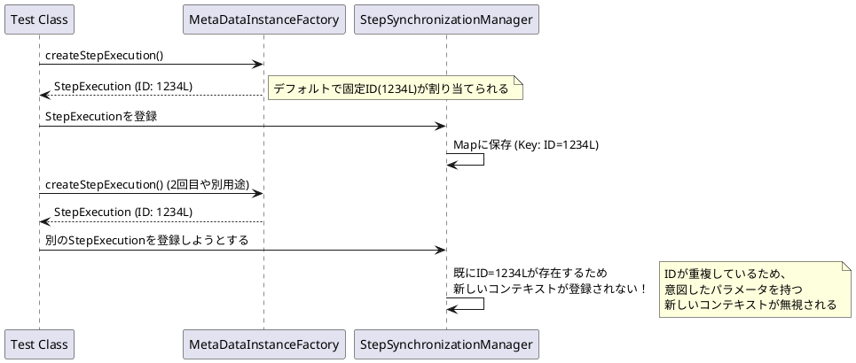

*（このドキュメントは生成AI(Gemini 3 Pro (Preview))によって2026年1月7日に生成されました）*

## 課題概要

`@SpringBatchTest` を使用したテスト環境において、テストユーティリティである `StepScopeTestUtils` が正しく動作しないという問題です。

具体的には、テスト用インスタンス生成ファクトリ（`MetaDataInstanceFactory`）が常に同じIDを持つオブジェクトを生成するため、内部で管理されているコンテキスト（`StepContext`）が競合してしまいます。

**用語解説**:
- **@SpringBatchTest**: Spring Batchのテストをサポートするアノテーションです。
- **StepScope**: ステップの実行期間中だけ有効なスコープ（有効範囲）です。
- **MetaDataInstanceFactory**: テスト用のダミーデータ（StepExecutionなど）を作成するクラスです。

### 問題の発生メカニズム



## 原因

`MetaDataInstanceFactory` が作成する `StepExecution` オブジェクトのIDなどのフィールドが、デフォルトで静的な固定値（例: IDが常に `1234L`）になっているためです。

Spring BatchはIDを使ってオブジェクトの同一性を判断するため、別々のインスタンスとして作成したつもりでも、システム上は「同じもの」として扱われ、情報の登録時に競合が発生してしまいます。

## 対応方針

### ユーザー側の回避策（現状）
テストクラス内で、一意なIDや名前を持つ `StepExecution` を生成するメソッドを自作して使用します。これによりIDの重複を防ぎます。

```java
// 回避策の例
public StepExecution getStepExecution() {
    // 固定IDではなく、一意な値(-1Lなど)を指定する
    return MetaDataInstanceFactory.createStepExecution("uniqueStep", -1L);
}
```

### フレームワーク側の修正（検討中）
`MetaDataInstanceFactory` のID生成ロジックを変更するか、`StepSynchronizationManager` 側でテスト環境での重複登録を許容するように調整することが検討されます。
