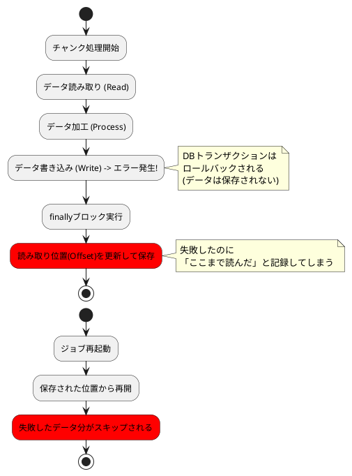

*（このドキュメントは生成AI(Gemini 3 Pro (Preview))によって2026年1月7日に生成されました）*

## 課題概要

Spring Batch 6.xで導入された新しいステップ実行方式（`ChunkOrientedStep`）において、処理が失敗してロールバック（取り消し）された場合でも、進捗状況（読み取り位置など）が更新されて保存されてしまうという重大なバグです。

これにより、ジョブを再起動した際に、失敗したデータの処理がスキップされてしまい、データ損失（処理漏れ）が発生します。

**用語解説**:
- **ChunkOrientedStep**: データを一定量（チャンク）ごとにまとめて読み書きする処理方式です。
- **ExecutionContext**: ジョブやステップの実行状態（どこまで読んだか等）を保存するコンテキストです。
- **ロールバック**: エラー発生時に、データベースなどの状態を処理前の状態に戻すことです。

### データ損失のフロー

## 原因

`ChunkOrientedStep` クラスの実装において、進捗状況の更新処理（`update`）が `finally` ブロック内に記述されていることが原因です。

Javaの `finally` ブロックは、処理が成功しても失敗（例外発生）しても必ず実行されます。そのため、チャンク処理がエラーで失敗し、データの書き込みがロールバックされた場合でも、「処理が進んだ」という記録だけがデータベースに残ってしまいます。

## 対応方針

進捗状況の更新処理を、`finally` ブロックから移動し、**トランザクションが正常にコミット（確定）された後**にのみ実行されるように修正します。

具体的には、`processChunkSequentially` や `processChunkConcurrently` メソッド内の `finally` 句から更新処理を削除し、`doExecute` メソッド内のトランザクション成功後の箇所に移動させる修正案が提示されています。
