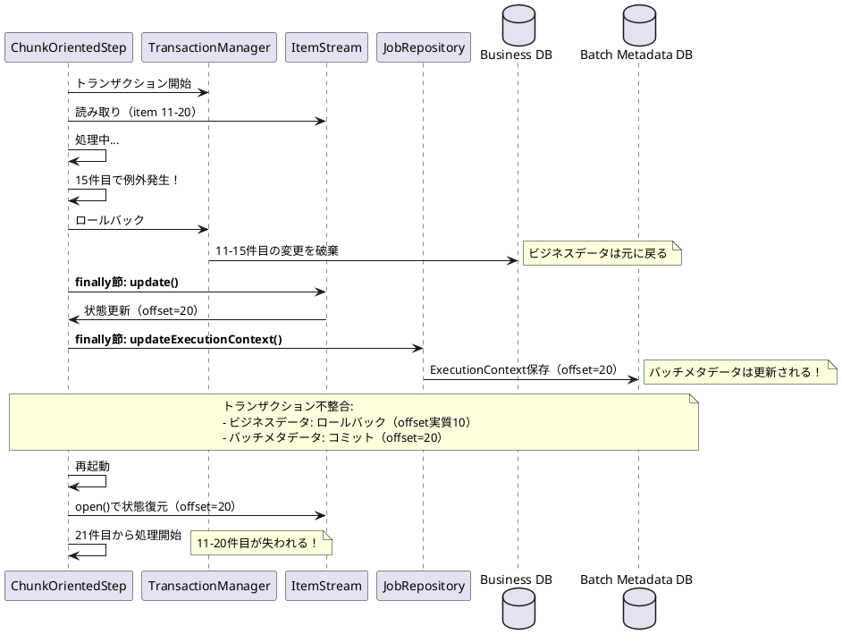

*このドキュメントは生成AI(Claude Sonnet 4.5)によって2026年1月6日に生成されました。*

## 課題概要

Spring Batch 6.xの新しい`ChunkOrientedStep`実装において、チャンクの処理中に例外が発生してトランザクションがロールバックされた場合でも、`ExecutionContext`（実行コンテキスト）が更新されてしまう問題です。これにより、再起動時に失敗したチャンク内のデータが失われます。

**チャンク処理とは**: Spring Batchの基本的な処理パターンで、大量のデータを一定数（チャンクサイズ）ごとにまとめて処理（読み取り→処理→書き込み）し、チャンクごとにトランザクションをコミットする方式です。

**ExecutionContextとは**: ステップやジョブの実行状態を保存するための領域です。チャンク処理では、現在の読み取り位置（オフセット）などがここに保存され、失敗時の再起動に使用されます。

**ItemStreamとは**: 読み取り位置などの状態を管理するインターフェースです。`update()`メソッドで状態を`ExecutionContext`に保存します。

**問題の状況**:
- チャンク処理中に例外が発生
- トランザクションがロールバックされる（ビジネスデータは元に戻る）
- しかし、`ItemStream`の状態（読み取り位置など）は更新されてしまう
- 再起動すると、失敗したチャンクの後から処理が再開される
- 結果: 失敗したチャンク内のレコードが処理されない（データ損失）

**具体的な影響**:
```
例: チャンクサイズ=10、100件のデータを処理
1. 1-10件目: 成功（コミット、オフセット=10）
2. 11-20件目: 15件目で例外発生
   - ビジネスデータ: ロールバック（11-15件目の変更は破棄）
   - バッチメタデータ: 更新される（オフセット=20）← 問題！
3. 再起動時: オフセット=20から再開
4. 結果: 11-20件目のデータが失われる
```

## 原因

Spring Batch 6.xの`ChunkOrientedStep`において、状態更新ロジックが`finally`節に配置されているため、トランザクションがロールバックされた場合でも強制的に実行されることが原因です。

**コード比較による詳細な原因分析**:

### Spring Batch 5.x (TaskletStep.java)

5.xでは、チャンクが正常に処理された後、つまり**トランザクションコミットが成功した場合のみ**状態を更新していました。

```java
// TaskletStep.java (Line 452)
// このロジックは「成功した処理フロー内」にあります
try {
    // チャンクの読み取り/処理/書き込み
    chunkProvider.provide(contribution);
    chunkProcessor.process(contribution, chunk);
    
    // 正常に処理された場合のみ、この部分が実行される
    stream.update(stepExecution.getExecutionContext());
    getJobRepository().updateExecutionContext(stepExecution);
    stepExecution.incrementCommitCount();
} catch (Exception e) {
    // 例外時は状態を更新しない
    throw e;
}
```

### Spring Batch 6.x (ChunkOrientedStep.java)

6.xでは、更新ロジックが`finally`節に移動されたため、**例外が発生した場合でも必ず実行**されます。

```java
// ChunkOrientedStep.java
private void processChunkSequentially(...) {
    try {
        // チャンクの読み取り/処理/書き込み
        while (...) {
            I item = chunkProvider.provide(contribution);
            O processedItem = chunkProcessor.process(item, contribution);
            chunkConsumer.consume(processedItem, contribution);
        }
    } catch (Exception e) {
        // 例外処理
        throw e; // トランザクションはロールバック
    } finally {
        // バグ: トランザクションがロールバックされても必ず実行される！
        this.compositeItemStream.update(stepExecution.getExecutionContext());
        getJobRepository().updateExecutionContext(stepExecution);
    }
}
```

**問題の流れ**:



**根本原因**: 
`finally`節は、例外の有無にかかわらず必ず実行されます。そのため、トランザクションがロールバックされた後でも状態更新が実行され、データベース上の実際のデータ位置と`ExecutionContext`に保存された位置が不整合になります。

## 対応方針

報告者が提案する修正内容は、状態更新ロジックを`finally`節から移動し、**トランザクションが正常に完了した後にのみ実行**するようにすることです。

**提案される修正** (KILL9-NO-MERCY氏):

```java
// ChunkOrientedStep.java
@Override
protected void doExecute(StepExecution stepExecution) throws Exception {
    stepExecution.getExecutionContext().put(STEP_TYPE_KEY, this.getClass().getName());
    
    while (this.chunkTracker.get().moreItems() && !interrupted(stepExecution)) {
        // 次のチャンクを独自のトランザクションで処理
        this.transactionTemplate.executeWithoutResult(transactionStatus -> {
            try {
                // 次のチャンクを処理（既存のロジック）
                if (multithreaded) {
                    processChunkConcurrently(...);
                } else {
                    processChunkSequentially(...);
                }
            } catch (Exception e) {
                // 例外時はトランザクションがロールバック
                throw new RuntimeException(e);
            }
            // try節内のfinally節は削除（重要！）
        });
        
        // ステップ実行情報を更新
        getJobRepository().update(stepExecution);
        
        // 修正: トランザクションコミット成功後にのみ、
        //       ItemStreamとExecutionContextを更新
        this.compositeItemStream.update(stepExecution.getExecutionContext());
        getJobRepository().updateExecutionContext(stepExecution);
    }
}

// processChunkSequentially と processChunkConcurrently の変更
private void processChunkSequentially(...) {
    try {
        // チャンクの読み取り/処理/書き込みロジック
    } catch (Exception e) {
        throw e;
    }
    // finally節での状態更新を削除（重要！）
}
```

**修正のポイント**:

| 場所 | 変更内容 | 理由 |
|------|----------|------|
| `doExecute()` | `transactionTemplate.executeWithoutResult()`の外側に状態更新を配置 | トランザクションコミット後にのみ実行されることを保証 |
| `processChunkSequentially()` | `finally`節の状態更新を削除 | 重複更新を防止 |
| `processChunkConcurrently()` | `finally`節の状態更新を削除 | 重複更新を防止 |

**修正後の動作**:

```
例: チャンクサイズ=10、100件のデータを処理
1. 1-10件目: 成功
   - ビジネスデータ: コミット
   - バッチメタデータ: 更新（オフセット=10）
2. 11-20件目: 15件目で例外発生
   - ビジネスデータ: ロールバック
   - バッチメタデータ: 更新されない（オフセット=10のまま）← 修正！
3. 再起動時: オフセット=10から再開
4. 結果: 11件目から再処理され、データ損失なし
```

**考慮事項**:
- この修正により、Spring Batch 5.xと同様の動作に戻ります
- トランザクションの一貫性が保たれ、再起動時のデータ損失が防止されます
- マルチスレッド処理（`processChunkConcurrently`）でも同様の修正が必要です

**まとめ**:
この問題は、Spring Batch 6.xでのアーキテクチャ変更に伴って発生したリグレッション（退行バグ）と考えられます。提案された修正により、トランザクションの一貫性が保たれ、チャンク処理の信頼性が向上します。
