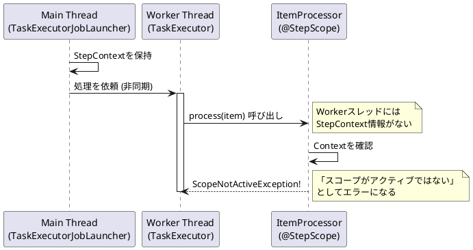

*（このドキュメントは生成AI(Gemini 3 Pro (Preview))によって2026年1月7日に生成されました）*

## 課題概要

Spring Batch 6.0のマルチスレッド処理（`ChunkOrientedStep`）において、`@StepScope` が付与されたBean（`ItemProcessor`など）を使用すると、`ScopeNotActiveException` というエラーが発生する問題です。

これは、メインスレッドが持っている「現在のステップ情報（StepContext）」が、実際に処理を行うワーカースレッド（別スレッド）に引き継がれていないために起こります。

**用語解説**:
- **@StepScope**: ステップ実行ごとに新しいインスタンスを作成し、そのステップ内でのみ有効にする設定です。
- **ItemProcessor**: データの加工を行うコンポーネントです。
- **マルチスレッド処理**: 複数のスレッドで並行してデータを処理し、高速化を図る仕組みです。

### エラー発生の仕組み



## 原因

`ChunkOrientedStep` の並行処理メソッド（`processChunkConcurrently`）において、タスクを別スレッドに渡す際、`StepContext`（ステップの文脈情報）の伝播処理が欠けていることが原因です。

Springの `@StepScope` は、実行中のスレッドに紐付いた `StepContext` を参照して動作します。ワーカースレッド上でコンテキストが登録されていないため、Beanの生成や取得に失敗します。

## 対応方針

`processChunkConcurrently` メソッドを修正し、ワーカースレッド内で処理を開始する前に、明示的に `StepSynchronizationManager.register(stepExecution)` を呼び出してコンテキストを登録するようにします。

また、処理終了後（`finally`ブロック）には、メモリリークを防ぐために `StepSynchronizationManager.close()` を呼び出してコンテキストを破棄するようにします。

```java
// 修正イメージ
taskExecutor.submit(() -> {
    try {
        // コンテキストをスレッドに登録
        StepSynchronizationManager.register(stepExecution);
        // 処理実行
        return processItem(item, contribution);
    } finally {
        // コンテキストを解除
        StepSynchronizationManager.close();
    }
});
```
