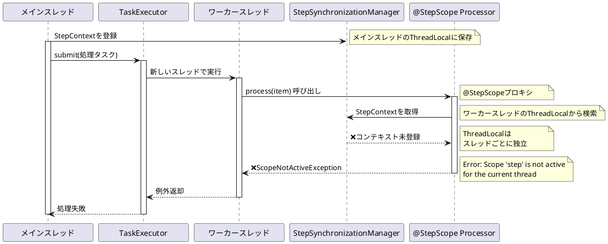
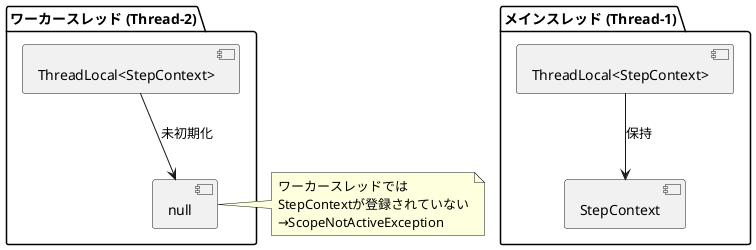
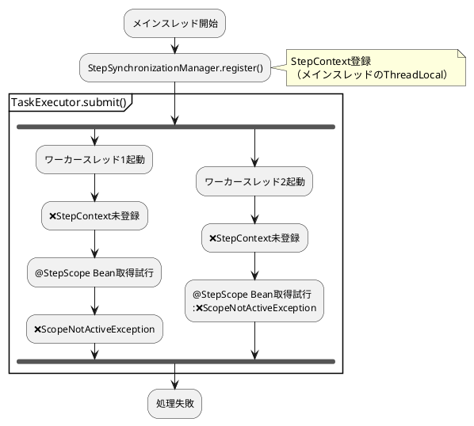
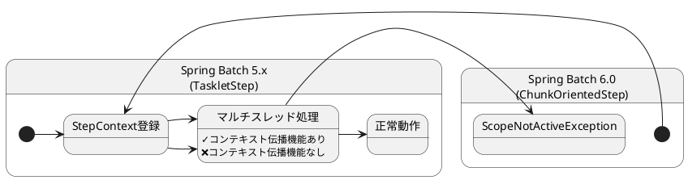
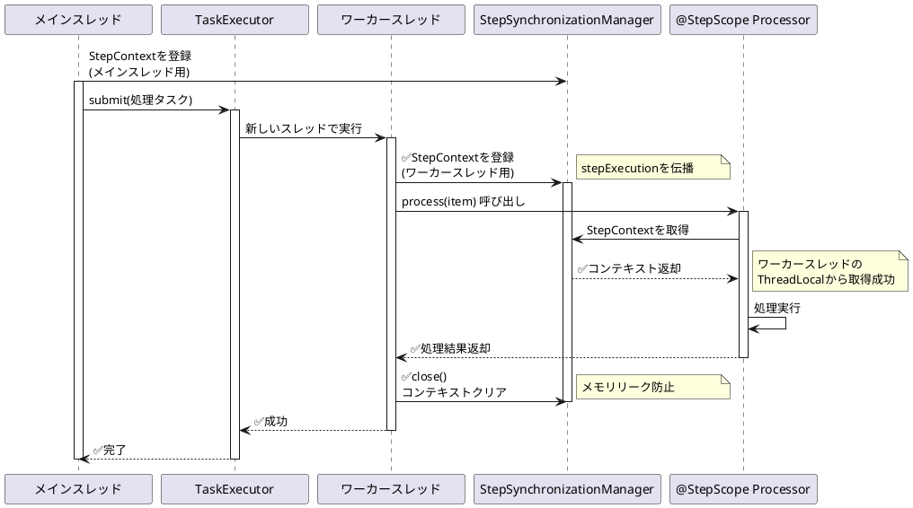
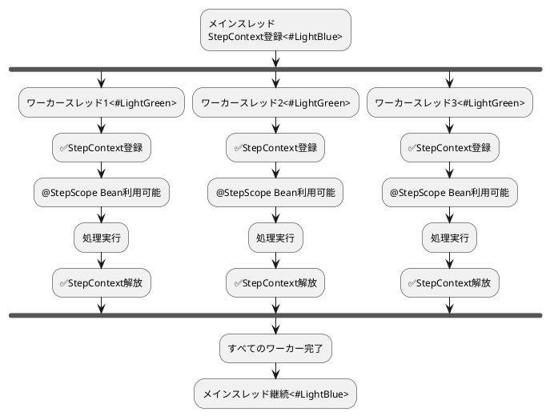
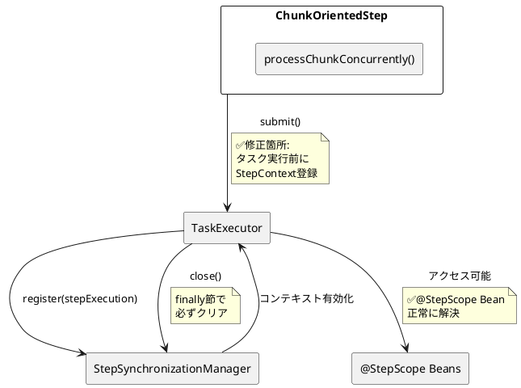
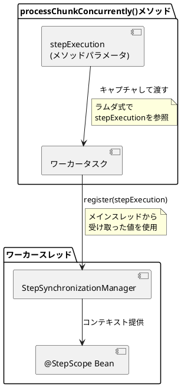
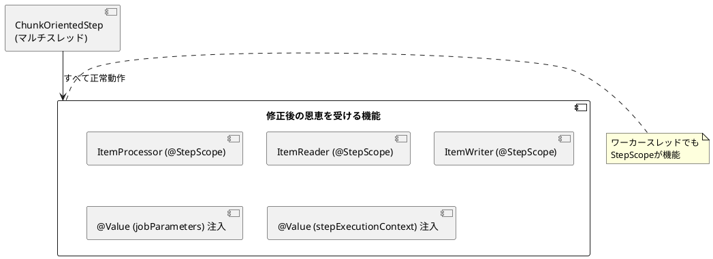

*（このドキュメントは生成AI(Claude Sonnet 4.5)によって2026年1月6日に生成されました）*

## 課題概要

Spring Batch 6.0で導入された`ChunkOrientedStep`において、マルチスレッド（`TaskExecutor`）設定を使用する際、`@StepScope`で定義された`ItemProcessor`がワーカースレッド内で正しく解決されず、`ScopeNotActiveException`が発生する問題です。

**@StepScopeとは**: Spring Batchが提供するカスタムスコープで、ステップ実行ごとにBeanのインスタンスを作成します。`JobParameters`や`ExecutionContext`の値を遅延評価で注入できるため、動的な設定が可能になります。

**TaskExecutorとは**: Spring Frameworkが提供する非同期タスク実行の抽象化インターフェースです。マルチスレッド処理を実現するために使用され、Spring Batchではチャンク処理の並列化に利用されます。

### 問題の発生状況



### エラーの詳細

```
Caused by: org.springframework.beans.factory.support.ScopeNotActiveException: 
  Error creating bean with name 'scopedTarget.issueReproductionProcessor': 
  Scope 'step' is not active for the current thread
  at AbstractBeanFactory.doGetBean()
  at $Proxy134.process()
  at ChunkOrientedStep.doProcess()

Caused by: java.lang.IllegalStateException: 
  No context holder available for step scope
  at StepScope.getContext()
```

### マルチスレッド設定の例

```java
@Bean
public Step issueReproductionStep(
        JobRepository jobRepository,
        ItemReader<TestItem> reader,
        ItemProcessor<TestItem, TestItem> itemProcessor, // @StepScope
        ItemWriter<TestItem> writer
) {
    return new StepBuilder(jobRepository)
            .<TestItem, TestItem>chunk(1)
            .reader(reader)
            .processor(itemProcessor)
            .writer(writer)
            .taskExecutor(new SimpleAsyncTaskExecutor()) // マルチスレッド有効
            .build();
}

@Bean
@StepScope
public ItemProcessor<TestItem, TestItem> issueReproductionProcessor() {
    return item -> {
        log.info("[Thread: {}] Processing item: {}", 
                 Thread.currentThread().getName(), item.getName());
        return item;
    };
}
```

## 原因

### ThreadLocalの仕組み

`StepSynchronizationManager`は、`StepContext`を`ThreadLocal`変数に保存します。`ThreadLocal`は各スレッドごとに独立した値を保持するため、別スレッドからはアクセスできません。



### ChunkOrientedStep.processChunkConcurrentlyの実装

```java
private void processChunkConcurrently(Chunk<I> chunk, 
                                     StepContribution contribution) throws Exception {
    List<Future<O>> futures = new ArrayList<>();
    
    for (I item : chunk.getItems()) {
        // ❌問題: StepContextを伝播せずにタスクを投入
        Future<O> future = this.taskExecutor.submit(() -> {
            return processItem(item, contribution);
            // ↑ここで@StepScope Beanにアクセス
            // →StepSynchronizationManager.getContext()が呼ばれる
            // →ワーカースレッドにはコンテキストが無い
            // →ScopeNotActiveException
        });
        futures.add(future);
    }
    
    // 結果を収集
    for (Future<O> future : futures) {
        O processedItem = future.get(); // 例外が伝播される
        // ...
    }
}
```

### コンテキスト伝播の不足



### Spring Batch 5.xとの違い

Spring Batch 5.xでは`TaskletStep`が使用されており、マルチスレッド処理時のスコープ伝播が考慮されていました。Spring Batch 6.0で導入された`ChunkOrientedStep`では、この伝播メカニズムが実装されていません。



## 対応方針

### 提案される修正案

`ChunkOrientedStep.processChunkConcurrently()`メソッドで、ワーカースレッドに`StepContext`を伝播させるよう修正します。

#### 修正前のコード

```java
Future<O> itemProcessingFuture = this.taskExecutor.submit(() -> {
    return processItem(item, contribution);
    // ❌StepContextが無い
});
```

#### 修正後のコード（提案）

```java
Future<O> itemProcessingFuture = this.taskExecutor.submit(() -> {
    try {
        // ✅現在のワーカースレッドのStepSynchronizationManagerにステップ実行を登録
        StepSynchronizationManager.register(stepExecution);
        return processItem(item, contribution);
    } finally {
        // ✅メモリリークを防ぐため、処理後にコンテキストをクリア
        StepSynchronizationManager.close();
    }
});
```

### 修正後の動作フロー



### コンテキスト伝播のライフサイクル



### 修正の影響範囲



### 注意点とベストプラクティス

#### 1. メモリリークの防止

```java
Future<O> future = this.taskExecutor.submit(() -> {
    try {
        StepSynchronizationManager.register(stepExecution);
        return processItem(item, contribution);
    } finally {
        // ✅重要: 必ずclose()を呼ぶ
        // ThreadLocalに残ったStepContextを解放しないと
        // スレッドプールのスレッドが再利用される際に
        // 古いコンテキストが残り続ける
        StepSynchronizationManager.close();
    }
});
```

#### 2. StepExecutionの伝播



#### 3. 例外処理

```java
Future<O> future = this.taskExecutor.submit(() -> {
    try {
        StepSynchronizationManager.register(stepExecution);
        return processItem(item, contribution);
    } catch (Exception e) {
        // 例外が発生してもfinallyでcloseされる
        throw e;
    } finally {
        StepSynchronizationManager.close();
    }
});

try {
    O result = future.get(); // 例外は再スローされる
    // ...
} catch (ExecutionException e) {
    // ワーカースレッドでの例外を処理
    throw (Exception) e.getCause();
}
```

### 代替アプローチ: TaskDecorator使用

より汎用的な解決策として、`TaskDecorator`を使用してコンテキスト伝播を自動化する方法もあります：

```java
public class StepContextTaskDecorator implements TaskDecorator {
    private final StepExecution stepExecution;
    
    public StepContextTaskDecorator(StepExecution stepExecution) {
        this.stepExecution = stepExecution;
    }
    
    @Override
    public Runnable decorate(Runnable runnable) {
        return () -> {
            try {
                StepSynchronizationManager.register(stepExecution);
                runnable.run();
            } finally {
                StepSynchronizationManager.close();
            }
        };
    }
}

// TaskExecutor設定
ThreadPoolTaskExecutor executor = new ThreadPoolTaskExecutor();
executor.setTaskDecorator(new StepContextTaskDecorator(stepExecution));
```

**メリット**: 各タスクで個別にregister/closeを呼ぶ必要がない
**デメリット**: `ChunkOrientedStep`の内部実装に依存

### 期待される最終的な動作

| 項目 | 修正前 | 修正後 |
|-----|-------|-------|
| シングルスレッド | ✓ 動作 | ✓ 動作 |
| マルチスレッド | ❌ ScopeNotActiveException | ✓ 動作 |
| @StepScope Bean | ❌ 解決失敗 | ✓ 正常に解決 |
| JobParameters注入 | ❌ 失敗 | ✓ 成功 |
| メモリリーク | - | ✓ 防止 |

### 関連機能への影響



**現在のステータス**: 開発チームへの問題報告済み。具体的な修正案が提示されており、実装待ちの状態です。コミュニティから動作する再現リポジトリの提供も可能との申し出があります。
