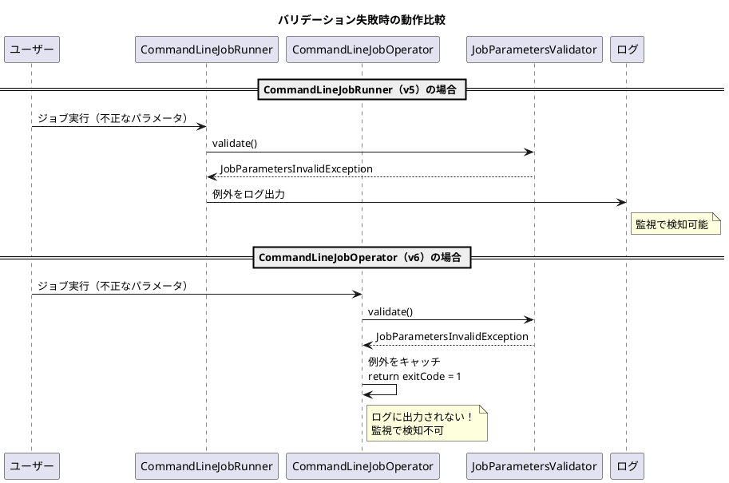

*（このドキュメントは生成AI(Claude Opus 4.5)によって2026年1月21日に生成されました）*

## 課題概要

### 背景知識

Spring Batchでは、コマンドラインからバッチジョブを実行するためのユーティリティクラスが提供されています：

| クラス | バージョン | 説明 |
|--------|------------|------|
| `CommandLineJobRunner` | v5以前 | 従来のコマンドライン実行クラス（v6で非推奨） |
| `CommandLineJobOperator` | v6以降 | 新しいコマンドライン実行クラス |

Spring Batch 6.0.0-M1から`CommandLineJobRunner`が非推奨となり、`CommandLineJobOperator`が導入されました。

### 問題の概要

`CommandLineJobRunner`から`CommandLineJobOperator`への移行時に、以下の4つの非互換性が発見されました：

| 項目 | CommandLineJobRunner (v5以前) | CommandLineJobOperator (v6以降) | 状態 |
|------|-------------------------------|----------------------------------|------|
| 1. 例外出力先 | ログに出力 | System.errに出力 | 🔴 修正予定 |
| 2. バリデーション例外 | ログに出力 | 出力されない | 🔴 修正予定 |
| 3. カスタマイズ | ExitCodeMapper等カスタマイズ可能 | カスタマイズ不可 | 🔴 修正予定 |
| 4. 停止・再起動 | jobName または jobExecutionId | jobExecutionId のみ | 🟡 意図的変更 |

> 🔴 バグとして修正予定 / 🟡 意図的な変更（回避策あり）

### 各問題の詳細

#### 1. エラー出力先の違い

| 項目 | CommandLineJobRunner | CommandLineJobOperator |
|------|----------------------|------------------------|
| 例外の出力先 | ログ（Logger） | 標準エラー出力（`System.err`） |
| 監視への影響 | ログ監視で検知可能 | 別途対応が必要 |

**メンテナーの回答**: 見落としであり、修正予定。

#### 2. バリデーション例外のログ出力

`JobParametersValidator`によるバリデーションが失敗した場合：



**メンテナーの回答**: 修正予定。

#### 3. カスタマイズ不可

以下のコンポーネントが`CommandLineJobOperator`ではカスタマイズできません：

| コンポーネント | 用途 |
|----------------|------|
| `ExitCodeMapper` | ジョブ終了ステータスをJVM終了コードにマッピング |
| `JobParametersConverter` | コマンドライン引数を`JobParameters`に変換 |

**原因**: 実装方式の違い

```java
// CommandLineJobRunner - DIコンテナからBeanを取得
context.getAutowireCapableBeanFactory()
    .autowireBeanProperties(this, AutowireCapableBeanFactory.AUTOWIRE_BY_TYPE, false);

// CommandLineJobOperator - 3つのBeanのみ取得
jobOperator = context.getBean(JobOperator.class);
jobRepository = context.getBean(JobRepository.class);
jobRegistry = context.getBean(JobRegistry.class);
```

**メンテナーの回答**: 意図的な変更。理由は`CommandLineJobRunner`がアプリケーションコンテキスト外で使用できないという制限を解消するため。ただし、カスタム`ExitCodeMapper`等の存在確認と設定機能を次のリリースで追加予定。

#### 4. 停止・再起動のパラメータ変更

| 操作 | CommandLineJobRunner | CommandLineJobOperator |
|------|----------------------|------------------------|
| 停止 | `jobName` または `jobExecutionId` | `jobExecutionId` のみ |
| 再起動 | `jobName` または `jobExecutionId` | `jobExecutionId` のみ |

**メンテナーの回答**: 意図的な変更。理由は、ジョブ名だけでは複数のインスタンスがある場合にどれを操作するか曖昧になるため。`JobRepository#getLastJobInstance(jobName)`を使用して`jobExecutionId`を取得することで対応可能。

---

## 原因

`CommandLineJobOperator`の新規設計時に、以下の点で旧`CommandLineJobRunner`との互換性が考慮されていませんでした：

1. **例外処理の設計**: ログ出力ではなく標準エラー出力を使用（見落とし）
2. **バリデーション例外の処理**: 例外をキャッチして握りつぶす設計（見落とし）
3. **DIコンテナとの統合**: アプリケーションコンテキスト外での使用を優先した結果、カスタムBeanの注入機能が省略された（意図的）
4. **操作対象の特定方法**: 曖昧さを排除するため`jobExecutionId`のみに限定（意図的）

---

## 対応方針

メンテナー（fmbenhassine）による回答を基にした対応方針：

| 問題 | 対応 | 時期 |
|------|------|------|
| 1. エラー出力先 | ログ出力を追加 | 次回リリース |
| 2. バリデーション例外 | ログ出力を追加 | 次回リリース |
| 3. カスタマイズ不可 | `ExitCodeMapper`等のBean検出・設定機能を追加 | 次回リリース |
| 4. 停止・再起動パラメータ | 変更なし（`JobRepository` APIで`jobExecutionId`取得可能） | - |

### 現時点での回避策

**問題4の回避策**: ジョブ名から実行IDを取得して再起動する方法

```java
// JobRepository APIを使用してジョブ名から最新のインスタンスを取得
JobInstance lastInstance = jobRepository.getLastJobInstance(jobName);
// 失敗した実行を取得して再起動
```

---

## バグの発生タイミング

| 項目 | 内容 |
|------|------|
| バグ発生バージョン | Spring Batch 6.0.0-M1（`CommandLineJobOperator`導入時） |
| 関連Issue | [#4899](https://github.com/spring-projects/spring-batch/issues/4899)（`CommandLineJobRunner`の制限に関する議論） |
| 現在の状態 | open（修正予定） |

**注意**: このIssueは現在open状態であり、diffファイルが存在しないため、修正コードの分析はできませんでした。
