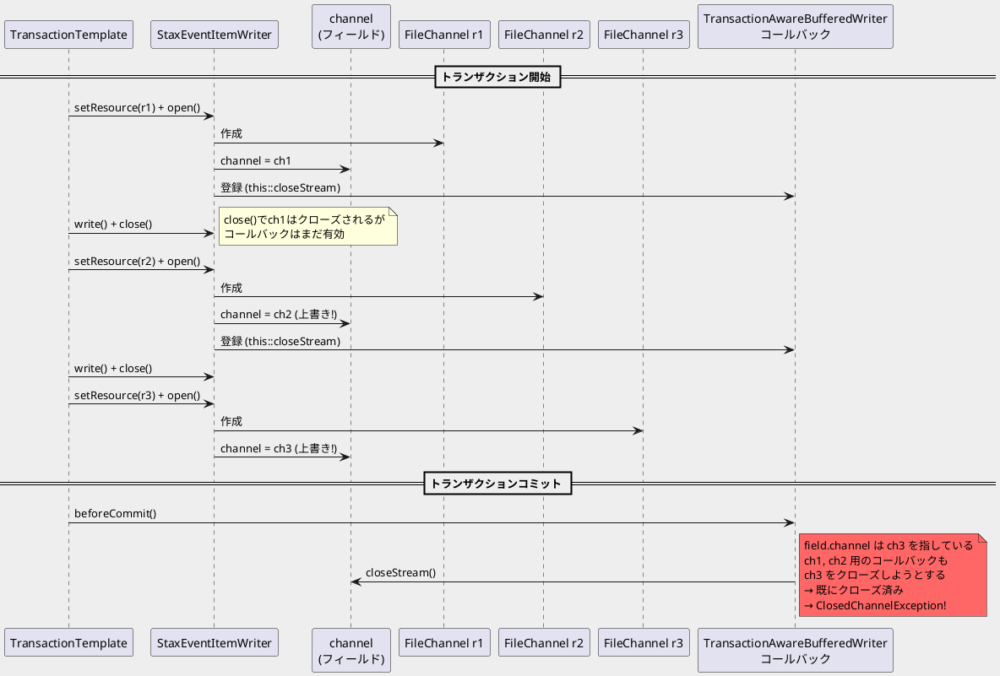
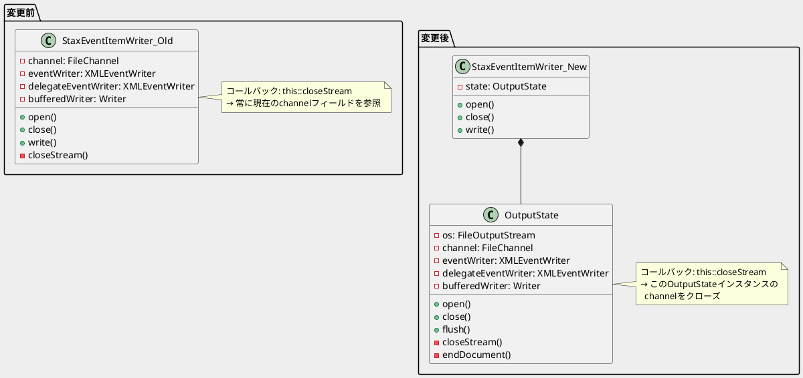
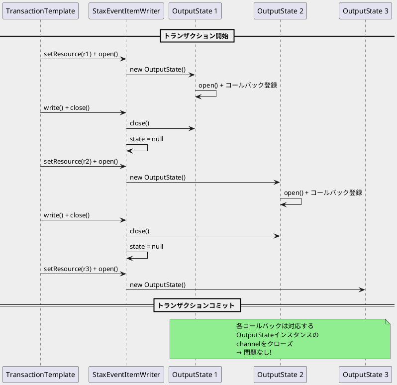

*（このドキュメントは生成AI(Claude Opus 4.5)によって2026年1月26日に生成されました）*

## 課題概要

`StaxEventItemWriter`と`MultiResourceItemWriter`を組み合わせて使用した際に、同一トランザクション内で複数回リソースを切り替えると、`ClosedChannelException`が発生したり、`FileChannel`がリークする問題です。

### 背景知識

| コンポーネント | 説明 |
|--------------|------|
| `StaxEventItemWriter` | XMLファイルにデータを書き込むItemWriter。StAX（Streaming API for XML）を使用 |
| `MultiResourceItemWriter` | 複数ファイルに分割して書き込むラッパー。指定件数ごとに新しいファイルを作成 |
| `TransactionAwareBufferedWriter` | トランザクション対応バッファ。コミット時にファイルへ書き込みを実行 |
| `FileChannel` | ファイルへの読み書きを行うNIO（Java New I/O）のチャネル |

### 問題のシナリオ



### 観測される問題

| 問題 | 説明 |
|------|------|
| `ClosedChannelException` | トランザクションコミット時に、既にクローズされたチャネルへの書き込みを試みる |
| `FileChannel`リーク | 古いチャネル（r1, r2用）が開いたまま残る |

## 原因

`StaxEventItemWriter`のファイル出力関連の状態（`channel`、`eventWriter`、`delegateEventWriter`、`bufferedWriter`）がクラスのフィールドとして管理されていたため、以下の問題が発生しました：

1. **フィールドの上書き**: 同一トランザクション内で`open()`が呼ばれるたびに、`channel`フィールドが新しいチャネルで上書きされる
2. **コールバックの参照先**: `TransactionAwareBufferedWriter`のクローズコールバック（`this::closeStream`）は、登録時のチャネルではなく、現在の`channel`フィールドを参照する
3. **結果**: トランザクションコミット時、すべてのコールバックが同じ（最後の）チャネルをクローズしようとし、2回目以降は`ClosedChannelException`が発生

## 対応方針

### diffファイル分析結果

PR [#5177](https://github.com/spring-projects/spring-batch/pull/5177) で、`StaxEventItemWriter`のアーキテクチャが`AbstractFileItemWriter`と同様のパターンにリファクタリングされました。

#### 主な変更内容

**1. 新しい内部クラス`OutputState`の導入**

ファイル出力に関連するすべての状態を専用クラスにカプセル化：

```java
protected class OutputState {
    private @Nullable FileOutputStream os;
    private @Nullable FileChannel channel;
    private @Nullable Writer bufferedWriter;
    private @Nullable XMLEventWriter eventWriter;
    private @Nullable XMLEventWriter delegateEventWriter;
    private boolean initialized = false;
    private boolean restarted = false;
    
    // メソッド
    public void open(long position, boolean restart) { ... }
    public void close(...) { ... }
    public void flush() { ... }
    public long position() { ... }
    public Result createStaxResult() { ... }
    private void closeStream() { ... }
    private void endDocument() { ... }
    private void setPosition(long newPosition) { ... }
}
```

**2. 状態管理の変更**

| 変更前 | 変更後 |
|--------|--------|
| `channel`, `eventWriter`, `delegateEventWriter`, `bufferedWriter`がクラスフィールド | `OutputState state`フィールドのみ |
| `close()`後もフィールドが残存 | `close()`で`state = null`に設定 |
| `this::closeStream`をコールバックに登録 | `state::closeStream`（特定インスタンスにバインド） |

**3. コールバックのバインド方法の改善**

```java
// 変更前: クラスのフィールドを参照
TransactionAwareBufferedWriter writer = new TransactionAwareBufferedWriter(fileChannel, this::closeStream);

// 変更後: OutputStateインスタンスのメソッドを参照
TransactionAwareBufferedWriter writer = new TransactionAwareBufferedWriter(fileChannel, this::closeStream);
// ↑ OutputState内で定義されているため、そのインスタンスのchannelをクローズ
```

**4. リソースクローズの改善**

`closeStream()`メソッドで`FileOutputStream`も明示的にクローズ：

```java
private void closeStream() {
    try {
        channel.close();
    }
    catch (IOException ioe) {
        log.error(...);
    }
    finally {
        try {
            if (os != null) {
                os.close();  // 追加
            }
        }
        catch (IOException ioe) {
            log.error(...);
        }
    }
}
```

### 修正後のアーキテクチャ



### 修正後の動作



## バグの発生タイミング

- **発生バージョン**: Spring Batch 5.2.x、6.0.x
- **関連Issue**: [#5098](https://github.com/spring-projects/spring-batch/issues/5098)（元のバグ報告）
- **修正PR**: [#5177](https://github.com/spring-projects/spring-batch/pull/5177)
- **ステータス**: この課題 [#5176](https://github.com/spring-projects/spring-batch/issues/5176) は詳細分析として作成され、[#5098](https://github.com/spring-projects/spring-batch/issues/5098) の重複としてクローズ

※ 本課題は`StaxEventItemWriter`を`MultiResourceItemWriter`と組み合わせてトランザクション対応モードで使用した場合に発生します。
