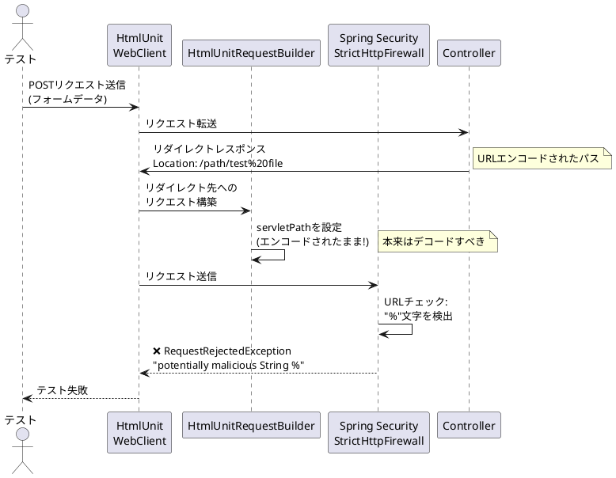
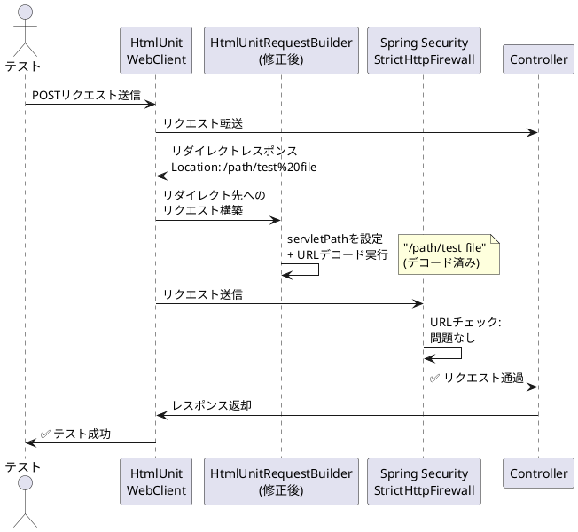

# Issue #27837: HtmlUnit WebClientでエンコードされたURLを使用するとStrictHttpFirewallがリクエストを拒否する - 課題サマリー

## 課題概要

### 背景知識
- **HtmlUnit**: Javaで書かれたブラウザシミュレーター。Webアプリケーションのテストで実際のブラウザを起動せずにHTMLページの操作をテストできるツール
- **URLエンコーディング**: URLに日本語やスペースなどの特殊文字を含める場合、`%20`（スペース）や`%E3%81`（日本語の一部）のような形式に変換すること
- **StrictHttpFirewall**: Spring Securityが提供するセキュリティ機能で、悪意のあるURLパターン（例: `%`を含むURL）をブロックしてアプリケーションを保護する
- **Servlet API**: Java Webアプリケーションの標準API。リクエストパスを取得する複数のメソッドがある
  - `getRequestURI()`: エンコードされたフルパス（例: `/app/test%20file`）
  - `getServletPath()`: アプリケーション内のパス（通常はデコードされているべき）
  - `getPathInfo()`: 追加のパス情報

### 問題の詳細
Spring BootアプリケーションでHtmlUnit WebClientを使ってテストを実行する際、以下のシナリオで問題が発生します:

1. テストがPOSTリクエストを送信してデータを作成
2. サーバーがリダイレクトレスポンスを返す（Location headerにエンコードされたURL）
3. HtmlUnit WebClientがそのリダイレクトを自動的にフォローしようとする
4. **Spring SecurityのStrictHttpFirewallが`%`文字を含むURLを「悪意のある文字列」として拒否**

興味深いことに、実際のブラウザでは同じ操作が正常に動作します。

### 問題の発生フロー



### 技術的な詳細

**HtmlUnit WebClientとMockMvcの動作の違い**

| 項目 | HtmlUnit WebClient | MockMvc |
|------|-------------------|---------|
| `getServletPath()` | エンコードされたパス<br>（例: `/test%20file`）| 空文字列 |
| `getPathInfo()` | - | デコードされたパス<br>（例: `/test file`） |
| `getRequestURI()` | エンコードされたパス | エンコードされたパス |
| StrictHttpFirewallの判定 | ❌ 拒否（%を検出） | ✅ 通過（デコード済み） |

## 原因

### 根本原因
`HtmlUnitRequestBuilder`クラスの実装に問題があります:

1. **servletPathの設定が不適切**: `HtmlUnitRequestBuilder.buildRequest()`メソッドで、servletPathをフルパスからcontextPathを引いた値で設定している
2. **URLデコード処理の欠如**: その際にURLデコード処理を行っていないため、`%20`などのエンコード文字列がそのまま残る
3. **Servlet API仕様との不一致**: Servlet API仕様では、`getServletPath()`はデコードされた値を返すべきだが、実装がそれに従っていない

### なぜMockMvcでは問題が起きないのか
Spring BootアプリケーションはデフォルトでJDK 11+を使用するため、`alwaysUseFullPath`がtrueに設定されています。これにより:
- `servletPath`はマッピング目的では使用されない
- `requestURI`や`pathInfo`が使用される
- MockMvcではこの動作により問題が回避される

しかし、Spring SecurityのStrictHttpFirewallは`servletPath`もチェックするため、HtmlUnit WebClientでは問題が顕在化します。

### コード上の問題箇所
```java
// HtmlUnitRequestBuilder.java (修正前のイメージ)
String servletPath = fullPath.substring(contextPath.length());
// ↑ここでURLデコードが必要だが実施されていない
request.setServletPath(servletPath);
```

## 対応方針

### 修正内容（コミット [9346c89](https://github.com/spring-projects/spring-framework/commit/9346c89f5c215456167799159ca5a8150762855d) および [3477ec0](https://github.com/spring-projects/spring-framework/commit/3477ec0a35c5d19d55431f756cc9c6056ee788da)）

#### 1. HtmlUnitRequestBuilderの修正
**修正箇所**: `org.springframework.test.web.servlet.htmlunit.HtmlUnitRequestBuilder`

**対応内容**:
- servletPathを設定する際に、URLデコード処理を追加
- `URLDecoder.decode()`を使用してエンコードされたパスをデコード
- Servlet API仕様に準拠した実装に修正

**修正イメージ**:
```java
// 修正後
String servletPath = fullPath.substring(contextPath.length());
servletPath = URLDecoder.decode(servletPath, StandardCharsets.UTF_8);
request.setServletPath(servletPath);
```

#### 2. テストケースの追加
- エンコードされたURLを含むリダイレクトをフォローするテストケースを追加
- 日本語や特殊文字を含むパスでの動作確認
- HtmlUnit WebClientとMockMvcの両方で一貫した動作を保証

### 影響範囲
- **テストコードへの影響**: HtmlUnit WebClientを使用したテストが正常に動作するようになる
- **本番環境への影響**: なし（テストフレームワークの修正のため）
- **互換性**: servletPathはマッピング目的で頻繁に使用されないため、既存コードへの影響は最小限

### 期待される効果
✅ エンコードされたURLを含むリダイレクトのテストが正常に実行できる
✅ Spring SecurityのStrictHttpFirewallとの互換性が確保される
✅ HtmlUnit WebClientとMockMvcの動作が一貫性を持つ
✅ 実際のブラウザの動作とテストの動作が一致する

### 修正後の動作フロー


